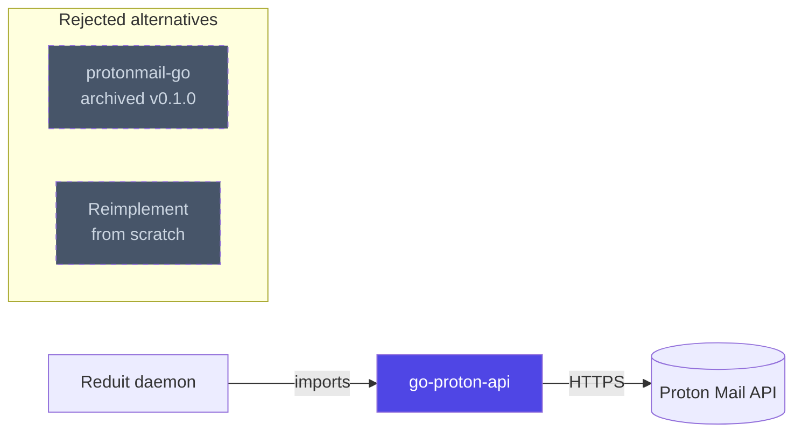

# ADR-0001: Use go-proton-api as the Proton Mail client

- **Status:** accepted
- **Date:** 2026-04-25
- **Deciders:** Joe Stump

## Context and Problem Statement

Reduit needs a Go library to talk to the Proton Mail HTTP API on behalf
of each configured user. The choice of client determines how much of
the Proton-specific complexity (SRP login, OpenPGP, refresh-token
rotation, CAPTCHA / human verification, FIDO2, encryption v2) we own
versus inherit.

## Decision Drivers

- Reduit must work against Proton's *current* API, not a snapshot from a
  reverse-engineering effort years ago.
- API drift maintenance must not be on Reduit's critical path. We are
  building a relay; we are not in the business of tracking Proton's
  back-end.
- The client must support what Proton Bridge supports: full auth flow
  including 2FA, mailbox-password unlock, message send/receive,
  attachment streaming, event polling.
- Library license must be compatible with MIT (Reduit's license).

## Considered Options

1. **`github.com/ProtonMail/go-proton-api`** — Proton AG's official Go
   client, MIT-licensed, used by Proton Bridge in production.
2. **`github.com/joestump/protonmail-go`** — a modernized fork of the
   `protonmail/` directory from `emersion/hydroxide`. Smaller surface,
   no resty dependency, but does not track current Proton API drift.
   Archived at v0.1.0.
3. **Reimplement from scratch** — write a fresh client matching current
   Proton endpoints.

## Decision Outcome

**Chosen: option 1 — `github.com/ProtonMail/go-proton-api`.**

This puts the Proton API surface under Proton's own maintenance. When
Proton ships changes (new auth endpoints, error codes, encryption
versions, FIDO2 features), Reduit gets them as upstream updates rather
than as breakage we have to chase.

### Consequences

**Positive**

- Reduit inherits Proton's test coverage, retry logic, error code
  tables, FIDO2 support, and event-stream semantics.
- The same client Bridge depends on means the same battle-testing in
  production deployments.
- Ongoing maintenance burden for the Proton API integration is near
  zero on our end.

**Negative**

- Pulls in `resty`, `logrus`, `gluon`, `go-cmp`, and other transitive
  dependencies. Larger binary, broader supply chain.
- Proton AG states the library is "not actively looking for
  contributors" — bug fixes and feature requests may sit upstream
  longer than ideal. We will need a workaround strategy (vendoring,
  patches, fork-and-rebase) for any breakage.
- Pre-v1.0 release; no API stability guarantee. We pin a version and
  test on upgrade.
- Some surface (Drive, Calendar) is unused by Reduit but compiled in.
  Acceptable cost.

**Neutral**

- The client uses `resty.Logger` interface for logging rather than
  `log/slog` directly. A small adapter (~10 lines) lets Reduit's
  `*slog.Logger` plug in.

## Pros and Cons of the Options

### `go-proton-api`

- **Good:** Maintained by Proton AG; current API; comprehensive (auth,
  mail, contacts, calendar, drive, events); MIT-licensed; FIDO2
  support; built-in `Retry-After` handling.
- **Good:** Bridge depends on it — proves it handles edge cases at
  scale.
- **Neutral:** `resty.Logger` interface (slog adapter trivial).
- **Bad:** Heavier dep tree; "not seeking contributors"; pre-v1.0.

### `protonmail-go`

- **Good:** Smaller surface; no `resty` dep; auditable.
- **Bad:** Does not track current Proton API. Versioned endpoints
  (`/auth/v4`, `/mail/v4/`), CAPTCHA / HV detection, FIDO2,
  `Retry-After` retry — none implemented. Each is a sprint of work to
  add.
- **Bad:** Joe is the only maintainer.
- **Bad:** Archived as v0.1.0; not accepting further work.

### Reimplement from scratch

- **Good:** Total control; minimum dep tree.
- **Bad:** Months of work to reach parity. Same maintenance burden as
  `protonmail-go` from then on. No benefit for a relay project where
  the API client is not the value-add.

## Architecture Diagram

The chosen path inherits Proton's API drift maintenance through
`go-proton-api`. The dashed boxes are evaluated alternatives that
were rejected for the reasons in the body above.

## References

- [`github.com/ProtonMail/go-proton-api`](https://github.com/ProtonMail/go-proton-api)
- [`github.com/joestump/protonmail-go`](https://github.com/joestump/protonmail-go) (archived v0.1.0)
- Proton Mail Bridge — uses `go-proton-api` in production
