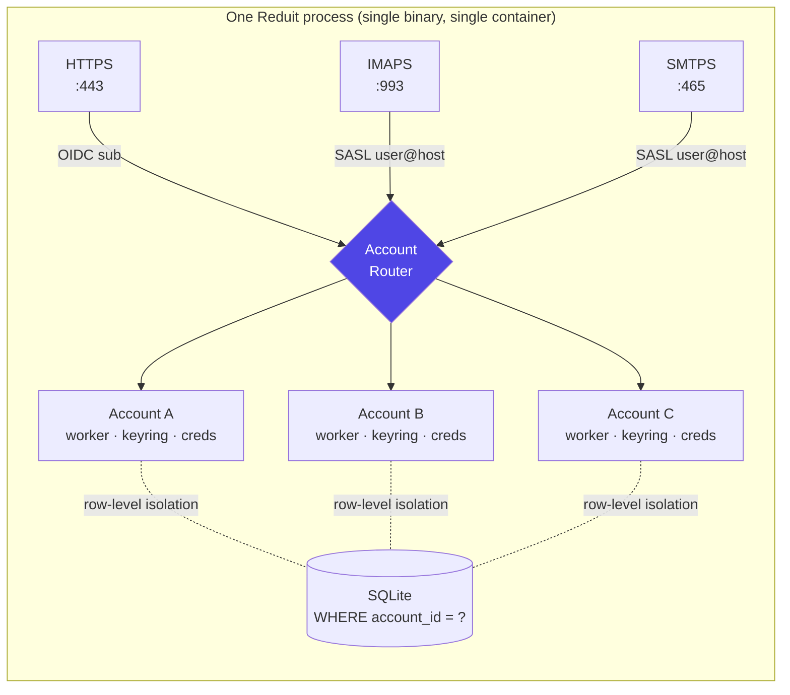

# ADR-0002: Multi-tenant from day one

- **Status:** superseded by [ADR-0012](ADR-0012-single-user-local-first.md) (2026-06-29)
- **Date:** 2026-04-25
- **Deciders:** Joe Stump

> **Superseded by [ADR-0012](ADR-0012-single-user-local-first.md) (2026-06-29).**
> Reduit is no longer a shared, multi-tenant daemon. It is a single-user,
> local-first, per-person binary; "multi-user on one host" is replaced by "one
> binary per person." The real requirement this ADR served — several people, and
> each person possibly several Proton mailboxes — is preserved as **multi-mailbox
> for the one local user** (ADR-0012, SPEC-0001 rewrite), without the shared
> daemon or central secret vault. Retained for historical context.

## Context and Problem Statement

Reduit serves several Proton accounts (Joe's family) on a single
host. Every architectural decision below — storage, IMAP/SMTP routing,
sync workers, OIDC, MCP — is shaped by whether multi-tenancy is a
first-class concern or an afterthought retrofitted later.

Both Proton Bridge (single-user, GUI) and `emersion/hydroxide`
(single-user, headless) treat single-user as the default and
multi-user as an unsupported hack. Reduit must not.

## Decision Drivers

- The use case is multi-user from the start (family deployment, eventual
  team / friends-of-Joe deployments).
- Per-user isolation is required at every layer: storage, sync workers,
  IMAP login, SMTP submission, MCP scope.
- Operational simplicity for self-hosters — running one Reduit serving
  N users beats running N copies of Bridge.
- Scaling target is small (≤50 accounts on a single host). We are not
  designing for thousands.

## Considered Options

1. **Per-instance, single-user.** Run one Reduit process per Proton
   account. Each gets its own port, config file, SQLite store.
2. **Single-process, multi-tenant.** One Reduit process, one HTTP/IMAP/
   SMTP listener per protocol, account routing via SASL identity at the
   protocol layer.
3. **Multi-process per account, shared control plane.** Control plane
   spawns a child process per account; child handles IMAP/SMTP for that
   user.

## Decision Outcome

**Chosen: option 2 — single-process, multi-tenant.**

One Reduit process. One IMAPS listener, one SMTPS listener, one HTTPS
admin/MCP listener. Each user authenticates via SASL PLAIN
(`account@reduit` form) on IMAPS/SMTPS, and the request is routed to
the right account's state.

### Consequences

**Positive**

- Single binary, single Docker container, single systemd unit. Trivial
  for self-hosters to deploy.
- One IMAPS port (993) and one SMTPS port (465) facing the network.
- Account state, sync workers, and MCP tools all coexist in one process
  with a single shared store.
- Restart, upgrade, observability are unified.

**Negative**

- Per-account isolation must be designed into every layer. A bug in one
  account's sync worker can affect others if not bulkheaded properly.
- Memory footprint scales with active accounts (one keyring, one event
  cursor, one outbox per account).
- Crash in one account's goroutine must not crash the process. Need
  panic-recovery boundaries per worker.

**Neutral**

- Account ↔ resource mapping is explicit at the data layer (every row
  in every table carries `account_id`).

## Pros and Cons of the Options

### Single-process, multi-tenant (chosen)

- **Good:** One deployment unit; shared observability; minimal port
  exposure.
- **Good:** Per-account isolation enforced at the data layer (always a
  `WHERE account_id = ?` away).
- **Bad:** Crash boundary discipline (per-goroutine panic recovery)
  required.

### Per-instance, single-user

- **Good:** Maximum isolation; one bad account can't affect others.
- **Bad:** Operationally heavy for self-hosters — N config files, N
  ports, N TLS terminations, N unit files. No shared admin UI.
- **Bad:** No natural place to wire OIDC across accounts.

### Multi-process per account

- **Good:** Crash isolation by OS process.
- **Bad:** Massive operational complexity; IPC between control plane
  and child workers; container-in-container if Dockerized.
- **Bad:** No clear win over option 2 for the target scale (≤50
  accounts).

## Architecture Diagram

Every protocol entry point resolves an authenticated identity into an
account ID, then dispatches to the per-account context. Isolation is
enforced at the data layer: every per-account table requires
`WHERE account_id = ?`.

## References

- ADR-0006 (SQLite store) — every table schema carries `account_id`.
- SPEC-0001 (Account model) — formal definition of the account record
  and lifecycle.
