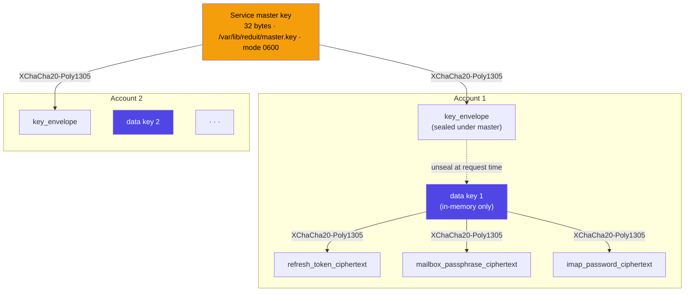

# ADR-0003: Service-master-key envelope encryption for at-rest secrets

- **Status:** accepted
- **Date:** 2026-04-25
- **Deciders:** Joe Stump

## Context and Problem Statement

Reduit holds secrets at rest for every configured Proton account:

- **Proton refresh tokens** — renew the access token without re-auth.
- **Proton mailbox passphrase** — required to decrypt private OpenPGP
  keys for read/send. Effectively a long-lived passphrase.
- **Per-user generated IMAP/SMTP passwords** — the credentials each
  user configures in their email client.

Plaintext storage is unacceptable; the relay is network-exposed and
the SQLite file is on disk that may be backed up, snapshotted, or
mounted by a host with broader access.

## Decision Drivers

- Headless. The relay must restart unattended (boot, container
  restart). It cannot rely on a human typing a passphrase to unlock the
  store at startup.
- Multi-user. One key compromise must not cascade. Each account's
  secrets should be encrypted with a unique data key.
- No HSM dependency. Self-hosters won't have a hardware security
  module; pure-software solution required.
- Compatibility with Linux file-permission and disk-encryption hygiene.

## Considered Options

1. **Plaintext** — store secrets as-is in SQLite. Rely on filesystem
   permissions and disk encryption. **Rejected** — single layer of
   defense; backup leakage = total compromise.
2. **Per-user passphrase** — derive a key from a passphrase the user
   re-enters each session. **Rejected** — incompatible with headless
   operation. Sync workers can't run after the user's web session ends.
3. **Service master key + per-user data key envelope** — a single
   master key file held by the daemon (mode 0600, OS-level access
   control). Each account row gets a freshly random 256-bit data key;
   the data key is encrypted under the master key (envelope) and stored
   alongside the account. Account secrets (refresh token, mailbox
   passphrase, per-user IMAP password) are then encrypted under the
   per-account data key.
4. **OS keyring** (libsecret / DBus) — store keys in the host's
   keyring. **Rejected** — requires a desktop session; awkward in
   headless containers.

## Decision Outcome

**Chosen: option 3 — service master key + per-user envelope.**

Implementation:

- **Master key:** 256-bit random, stored as
  `/var/lib/reduit/master.key` (path configurable). File mode 0600,
  owner = service user. The path is configured; the file is *not*
  committed. **Bootstrap is fail-closed:** `serve` does NOT silently
  auto-generate the key on first run. If the key file is missing at
  startup, `serve` hard-errors and the operator MUST run
  `reduit master-key generate` first. This avoids a silently-generated
  key that the operator never backed up (which would be a latent
  total-data-loss trap — see Negatives).
- **Per-account data key:** 256-bit random, generated when an account
  is created. Stored encrypted-under-master-key in the `accounts.key_envelope`
  column.
- **Secret fields:** every encrypted column (`accounts.refresh_token_ciphertext`,
  `accounts.mailbox_passphrase_ciphertext`, `accounts.imap_password_ciphertext`)
  is XChaCha20-Poly1305 sealed under the data key; the nonce is
  prepended to the ciphertext.
- **Library:** [`filippo.io/age`](https://filippo.io/age) for the
  envelope (X25519 mode using a key file), or
  `golang.org/x/crypto/chacha20poly1305` direct for the per-field
  sealing. Concrete library choice deferred to implementation.

### Consequences

**Positive**

- Restart is unattended. Reduit reads the master key file at startup,
  derives per-account data keys on demand, decrypts secrets in-memory.
- Compromise of one account's data key (extremely unlikely without
  also compromising the master key) does not expose other accounts.
- Backups of the SQLite file alone are useless without the master key
  file.
- Standard, well-understood AEAD primitives. Auditable.

**Negative**

- **Master key loss = total data loss.** Self-hosters MUST back the
  master key up out of band (password manager, 1Password, vault). This
  is documented loudly.
- Master key rotation is a non-trivial procedure (re-wrap every
  account's data-key envelope). Shipped as the `reduit master-key
  rotate` command — see the **Key rotation** subsection below.
- The master key being on the same filesystem as the SQLite store is a
  weak boundary. Stronger: master key on a separate volume, mounted
  read-only at startup. Documented as a recommendation, not enforced.

**Neutral**

- Decrypted secrets live in process memory while sync workers run.
  This is acceptable; the threat model assumes the process can be
  trusted while running.

### Key rotation

Master-key rotation ships as `reduit master-key rotate` (PR #59,
issues #50 / #53). Rotation re-wraps the *envelope* and nothing else:

- It generates a new 256-bit master key and, in a single DB
  transaction, re-encrypts every account's `key_envelope` under the
  new key. The per-account data keys are unchanged, so every secret
  ciphertext (`refresh_token_ciphertext`,
  `mailbox_passphrase_ciphertext`, `imap_password_ciphertext`) is
  left untouched — only the envelope that seals each data key is
  re-encrypted.
- Durability ordering is chosen to make an interrupted rotation
  non-destructive. After the transaction commits, rotation runs
  `PRAGMA wal_checkpoint(TRUNCATE)` to force the re-wrapped envelopes
  to the main database file *before* the new master-key file is put
  in place. The key file is then swapped atomically (write temp +
  `fsync` + `rename`). If the process dies at any point, either the
  old key still matches the on-disk envelopes or the new key does;
  there is no window where the persisted key and the persisted
  envelopes disagree.
- The previous key is preserved as a timestamped `.bak` alongside the
  key file, so a botched rotation is recoverable out of band.
- Rotation refuses to run against a 0-account database unless
  `--allow-empty` is passed (a guard against silently "rotating" a
  store the operator believes is populated).
- The supplied old key is verified before any re-wrap; a wrong old
  key is rejected with `ErrMasterKeyMismatch`.
- Rotation takes the same exclusive file lock that `serve` holds, so
  rotation and the running daemon are mutually exclusive: the daemon
  MUST be stopped before rotating.

## Pros and Cons of the Options

### Service master key + envelope (chosen)

- **Good:** Headless-compatible; well-understood crypto; per-account
  isolation.
- **Good:** Disposable backup story (file + key file, both encrypted
  in transit / at rest).
- **Bad:** Master key loss = data loss. Operator burden to back it up.

### Plaintext

- **Good:** Trivially simple.
- **Bad:** A single layer of defense. Backup leakage = total
  compromise. Unacceptable.

### Per-user passphrase

- **Good:** Strongest threat model — never decrypted at rest.
- **Bad:** Headless-incompatible. Sync workers stop when user logs out.

### OS keyring

- **Good:** Standard pattern for desktop apps.
- **Bad:** Requires DBus / libsecret session; doesn't work cleanly
  in containers or headless servers.

## Architecture Diagram

Two-layer envelope: one master key seals the per-account data keys;
each data key seals the account's secrets. Compromise of one
account's data key (extremely unlikely without also compromising
master) does not affect siblings. Loss of the master key is
catastrophic — operators MUST back it up out of band.

## References

- ADR-0001 (go-proton-api) — refresh tokens come from the auth flow.
- ADR-0002 (multi-tenant) — per-user isolation requirement drives
  per-user data keys.
- SPEC-0001 (Account model) — exact column definitions.
- [filippo.io/age](https://filippo.io/age) for envelope reference.
