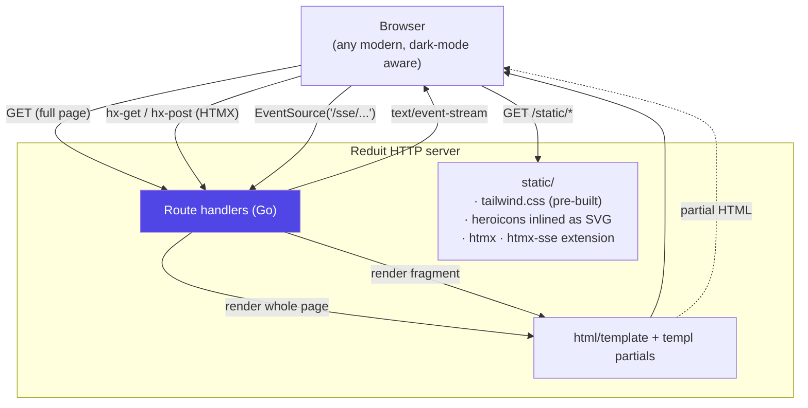

# ADR-0005: Frontend stack — HTMX, SSE, Tailwind 4, DaisyUI, Hero Icons

- **Status:** accepted (reframed 2026-06-29 by [ADR-0012](ADR-0012-single-user-local-first.md))
- **Date:** 2026-04-25
- **Deciders:** Joe Stump

> **Reframed 2026-06-29 by the local-first pivot ([ADR-0012](ADR-0012-single-user-local-first.md)).**
> The stack stands — HTMX + Tailwind 4 + DaisyUI + Hero Icons, server-rendered, no
> build step at runtime; it matches the sibling `msgbrowse` UI exactly. What
> changed is the UI's *role and posture*: it is no longer an OIDC-gated admin
> surface for a relay but an **optional, loopback-only, no-auth browse/search UI**
> over the local cache, **secondary to the stdio MCP** (ADR-0017). The OIDC-login
> and add-account-over-the-web flows in the Decision Outcome are gone; onboarding
> is a local CLI flow (`reduit auth`). SSE is retained only if a screen needs live
> updates (e.g. sync progress); it is no longer load-bearing. See the rewritten
> Local UI spec (SPEC-0005).

## Context and Problem Statement

Reduit ships a small admin / setup UI used for:

- OIDC login redirect.
- Account list and add-Proton-account flow (multi-step: email →
  password → optional 2FA → mailbox passphrase → success).
- Per-account sync status (live updating).
- Per-user IMAP/SMTP credential management.
- Manual ops actions (re-auth, suspend, delete account).

The UI is **not the product** — it's the configuration surface for an
IMAPS/SMTPS daemon. Engineering effort spent here directly displaces
effort spent on sync workers, IMAP UID stability, etc.

## Decision Drivers

- Server-rendered HTML preferred. The team owns Go on the server; we do
  not want to maintain a separate frontend toolchain (npm, bundlers,
  TypeScript) for what is fundamentally a CRUD interface.
- Real-time updates required for at least one screen (sync status:
  per-account event-stream cursor, last-sync time, current operation).
- Match Joe's other Go projects — `joe-links`, `spotter`, `claude-ops`,
  `runtime-ai`, `nestor` all use HTMX + DaisyUI. Consistency reduces
  context-switch cost.
- Accessibility and progressive enhancement are nice-to-haves; the UI
  must work without JS for the auth bootstrap path.

## Considered Options

1. **HTMX + SSE + Tailwind 4 + DaisyUI + Hero Icons.** Server-rendered
   HTML, hypermedia interactions, SSE for live updates.
2. **Plain HTML + Tailwind 4 + Hero Icons.** No HTMX, no SSE — pure
   form posts and full page refreshes.
3. **SPA (React + Vite + Tailwind).** Modern frontend, but requires a
   full JS toolchain and a separate API contract.
4. **htmx + Alpine.js + Tailwind.** Slightly more reactive than HTMX
   alone for client-side state.

## Decision Outcome

**Chosen: option 1 — HTMX + SSE + Tailwind 4 + DaisyUI + Hero Icons.**

- **HTMX 2.x** for partial-page updates: form submissions,
  step transitions in the add-account wizard, list refreshes.
- **SSE** (`text/event-stream`) for sync-status updates. Each user's
  sync-status page subscribes to `/sse/accounts/{id}/status`; the
  server pushes updates as events fire (event-cursor advanced,
  message-fetch in progress, error encountered).
- **Tailwind CSS 4.x** as the styling system, served as a single
  pre-built static CSS file (no bundler required at runtime).
- **DaisyUI** as the Tailwind component layer (buttons, cards,
  modals, tables, alerts). Same set used in `joe-links` / `spotter` /
  `claude-ops`.
- **Hero Icons** as inline SVG, embedded via Go template helpers (no
  separate icon font). Matches Joe's preference.
- **No SPA framework, no JS bundler, no build step at runtime.**
  Tailwind CSS is pre-built and committed (or built in CI); HTMX and
  SSE are loaded via CDN (or vendored — TBD per implementation).

### Consequences

**Positive**

- One language (Go) for the server, one templating system
  (`html/template` or `templ`), one dep tree.
- All routing, validation, authorization happens server-side. No
  parallel frontend representation of auth state.
- Live sync status is straightforward — emit SSE events from the sync
  worker over a buffered channel.
- Consistency across Joe's stumpcloud-deployed services.

**Negative**

- Client-side interactivity ceiling is lower than a full SPA. For the
  admin-UI use case, this is acceptable.
- Tailwind 4 is recent (2024). Some DaisyUI versions may lag. Track
  DaisyUI 5 (which targets Tailwind 4) at implementation time;
  fallback to Tailwind 3 + DaisyUI 4 if needed.
- SSE is fragile through some proxies (buffering). Documented
  recommendation: Caddy / nginx config with `proxy_buffering off` for
  the `/sse/*` routes.

**Neutral**

- Templating engine (`html/template` vs `a-h/templ` vs `templ`) is an
  implementation detail deferred to scaffolding. `templ` matches Joe's
  other projects and gives compile-time template checking.

## Pros and Cons of the Options

### HTMX + SSE + Tailwind + DaisyUI + Hero Icons (chosen)

- **Good:** No separate frontend toolchain; consistent with Joe's
  other projects; live updates via SSE; minimal JS.
- **Good:** Partial-page updates (HTMX) cover 90% of the interactivity
  needs.
- **Bad:** Tailwind 4 + DaisyUI version pairing requires care.

### Plain HTML + Tailwind

- **Good:** Maximum simplicity.
- **Bad:** No live sync status without polling or full-page refreshes.

### SPA

- **Good:** Maximum interactivity ceiling; standard frontend patterns.
- **Bad:** Separate toolchain; doubles the surface area; bigger
  binary; runtime JS bundle to ship and update.

### HTMX + Alpine.js

- **Good:** Slightly more reactive than HTMX alone.
- **Bad:** Adds a second JS library for marginal benefit. HTMX alone
  is sufficient.

## Architecture Diagram

No JavaScript bundler. No SPA. The server returns either a full
HTML page (first load), a partial fragment (HTMX swap), or a stream
of events (SSE). Tailwind CSS is built once and committed/served
statically; DaisyUI provides component primitives; Heroicons inline
as SVG.

## References

- [HTMX](https://htmx.org/)
- [Tailwind CSS](https://tailwindcss.com/)
- [DaisyUI](https://daisyui.com/)
- [Hero Icons](https://heroicons.com/)
- ADR-0002 (multi-tenant) — per-user state in the UI.
- ADR-0004 (OIDC) — login flow.
- SPEC-0005 (Admin UI flows).
