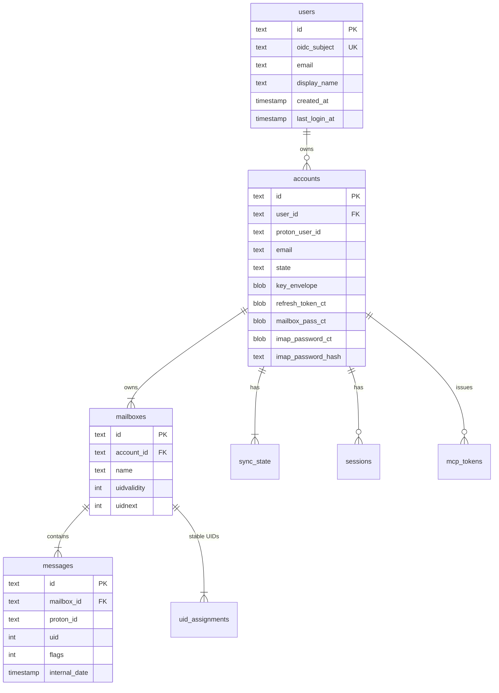

# ADR-0006: SQLite as the persistent store

- **Status:** accepted (refined by ADR-0010, 2026-05-03)
- **Date:** 2026-04-25
- **Deciders:** Joe Stump

> **Refined by [ADR-0010](ADR-0010-multi-account-per-user.md) (2026-05-03).**
> The schema sketch in this ADR's Architecture Diagram predates the
> users/accounts split. The `accounts` entity in the diagram below
> shows `oidc_subject UK` and `bool is_admin` columns that the
> rewritten migrations no longer carry; OIDC subject now lives on a
> new `users` table and admin status is a session-bind-time computed
> attribute, never persisted. The diagram in this ADR has been
> updated in place to reflect the post-ADR-0010 shape; the
> Decision Outcome (SQLite + WAL + goose, single file, app-layer
> envelope encryption) is unchanged. See ADR-0010 and SPEC-0001 for
> the canonical schema contract.

## Context and Problem Statement

Reduit needs a persistent store for:

- User records (OIDC subject) and account records (Proton user ID,
  encrypted secrets, FK to users). *(ADR-0010 split — original
  bullet read "Account records (OIDC subject, Proton user ID,
  encrypted secrets)".)*
- IMAP UID assignments and UIDVALIDITY values per (account, mailbox).
- Local message cache metadata (Proton message ID ↔ IMAP UID, flags,
  labels, sizes).
- Sync cursors (Proton event ID per account).
- Per-user IMAP/SMTP password records.
- OIDC session state.

The store is read and written constantly by the sync workers, IMAP
backend, SMTP submission server, and admin UI. It does not need to
scale to thousands of concurrent users — the target is a family /
small team (≤50 accounts).

## Decision Drivers

- Self-hosted simplicity. One file. No separate database service to
  install, backup, monitor, upgrade.
- Strong consistency required (per-account state must not drift
  between sync worker writes and IMAP reads).
- Backup story: copy a single file (or use SQLite's online-backup API).
- Concurrency model: many readers, few writers — fits SQLite's WAL
  mode well.
- Operational footprint: container should not need to depend on a
  postgres / mariadb sidecar.

## Considered Options

1. **SQLite + WAL + goose migrations.**
2. **PostgreSQL.** Industry-standard relational store.
3. **MariaDB.** Same niche as Postgres.
4. **BoltDB / bbolt.** Embedded key-value store.
5. **JSON files on disk.** Plaintext config-file approach.

## Decision Outcome

**Chosen: option 1 — SQLite + WAL + goose migrations.**

- **Driver:** `modernc.org/sqlite` (pure Go, no CGO) preferred for
  cross-compilation simplicity. Fall back to `mattn/go-sqlite3` if
  performance demands.
- **Mode:** WAL with `synchronous=NORMAL`, `journal_mode=WAL`,
  `foreign_keys=ON`, `busy_timeout=5000`.
- **Migrations:** `pressly/goose` with `.sql` migrations under
  `migrations/`. Same pattern Joe's `joe-links` uses.
- **Access:** `jmoiron/sqlx` for typed scanning. (Not `ent` — overkill
  for the schema size.)
- **Encryption at rest:** application-layer (per ADR-0003), not
  SQLCipher. SQLite file itself is unencrypted; sensitive columns are
  envelope-encrypted before insert.
- **Path:** `/var/lib/reduit/reduit.db` (configurable). File mode 0600,
  owner = service user.

### Consequences

**Positive**

- Single-file deployment. `docker-compose down && tar -cf backup.tar
  reduit.db master.key` is a complete backup.
- No separate database container, no DB credentials to manage.
- WAL mode supports concurrent readers (sync workers, IMAP backend,
  HTTP handlers all reading at once).
- `goose up` is the only migration step on upgrade.
- `modernc.org/sqlite` keeps the binary statically linkable.

**Negative**

- Concurrent writers are serialized. At family scale (≤50 accounts,
  each with ≤a-few-events-per-second), this is a non-issue. Larger
  deployments (hundreds of accounts) might hit write contention; if
  that ever happens, the migration to PostgreSQL is mechanical
  (sqlx is dialect-agnostic for our query shape).
- No native row-level encryption; we do envelope encryption in app
  code per ADR-0003.
- VACUUM and integrity-checks must be scheduled (cron / systemd timer).

**Neutral**

- Replication / HA is out of scope. The relay is single-host. Backup
  + restore is the disaster recovery story.

## Pros and Cons of the Options

### SQLite + WAL (chosen)

- **Good:** Embedded; one file; trivial backups; no operational
  overhead; matches Joe's `joe-links` pattern.
- **Bad:** Single-writer; not horizontally scalable.

### PostgreSQL

- **Good:** Industry standard; concurrent writers; rich feature set.
- **Bad:** Operational overhead — separate process, credentials,
  backups, upgrades. Overkill for ≤50-account scale.

### MariaDB

- **Good/Bad:** Same as PostgreSQL.

### BoltDB / bbolt

- **Good:** Embedded; faster for pure key-value.
- **Bad:** No SQL — every cross-cutting query (e.g., "find all
  in-flight messages older than X") becomes manual scans + maintained
  indexes. SQLite's relational model is a better fit.

### JSON files

- **Good:** Trivially auditable.
- **Bad:** No transactional integrity; no concurrent writes; the
  schema for IMAP UID maps and message flags is too rich for flat
  files.

## Architecture Diagram

One SQLite file. WAL mode for concurrent readers. `goose` drives
migrations. The `users` table is the OIDC-sourced identity root
(per ADR-0010); `accounts.user_id` is the FK that scopes the 1:N
ownership relation. Every per-account table carries `account_id` so
isolation is a `WHERE` clause away; per-user lookups go through
`accounts.user_id` either directly or transitively. The
`(user_id, proton_user_id)` UNIQUE on `accounts` enforces "a user
MUST NOT add the same Proton account twice" (per SPEC-0001). Admin
status is NOT a column — it is computed at session-bind time from
`OIDC_ADMIN_SUBS` (per SPEC-0001 "Admin Status"). Sensitive columns
are envelope-encrypted per ADR-0003 before insert.

## References

- ADR-0002 (multi-tenant) — every table carries `account_id`.
- ADR-0003 (encryption-at-rest) — sensitive columns encrypted before
  insert.
- ADR-0010 (multi-Proton-account per user) — refines the schema in
  this ADR: introduces the `users` table and the `accounts.user_id`
  FK; drops `oidc_subject` and `is_admin` from `accounts`.
- SPEC-0001 (Account model) — concrete schema.
- [`pressly/goose`](https://github.com/pressly/goose)
- [`jmoiron/sqlx`](https://github.com/jmoiron/sqlx)
- [`modernc.org/sqlite`](https://gitlab.com/cznic/sqlite)
