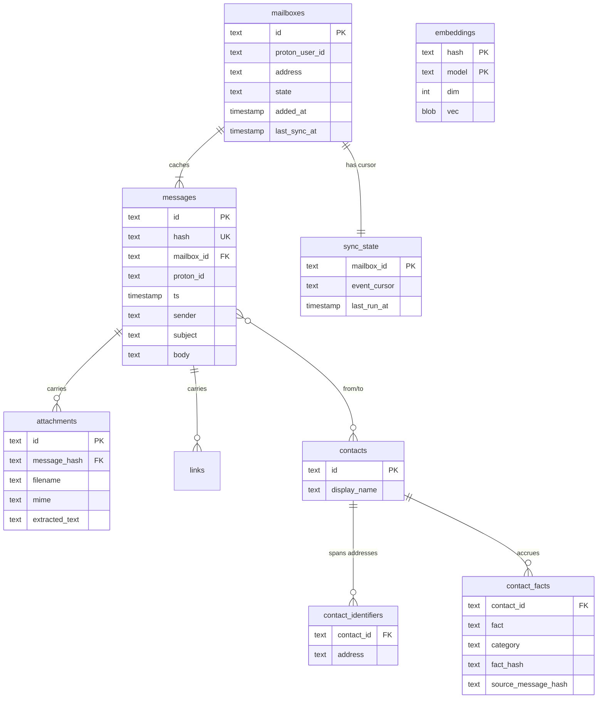

# ADR-0006: SQLite as the persistent store

- **Status:** accepted (rewritten 2026-06-29 for the local-first pivot, [ADR-0012](ADR-0012-single-user-local-first.md))
- **Date:** 2026-04-25
- **Deciders:** Joe Stump

> **Rewritten 2026-06-29 for the local-first pivot.** The *engine* decision —
> SQLite + WAL + goose + `sqlx` on the pure-Go `modernc.org/sqlite` driver, one
> file — is unchanged and was always right. What changed is everything the schema
> held: there is no `users`/OIDC table, no relay UID/UIDVALIDITY state, no
> envelope-encrypted secret columns (secrets are in the OS keychain, ADR-0013),
> and no session/MCP-token tables. The store is now a **local RAG cache** of
> decrypted mail plus its derived indexes — messages, attachments, links,
> contacts, FTS5, embeddings, and contact facts — namespaced per mailbox. The
> superseded ADR-0010 refinement (the `users` split) no longer applies. The
> Considered Options / Pros-and-Cons below are unchanged; the Context, the
> encryption/path bullets, and the Architecture Diagram are rewritten.

## Context and Problem Statement

Reduit needs a single local persistent store (one SQLite file in `data_dir`) for
the per-person, multi-mailbox tool described in ADR-0012:

- **Mailbox configs** — one row per configured Proton mailbox (local UUIDv7,
  Proton user id, address, state). Secrets are **not** here; the row only
  references the OS-keychain entries (ADR-0013).
- **Cached messages** — decrypted body + headers, keyed by a stable content
  identity (Proton message id + content hash) for idempotent re-sync (ADR-0014).
- **Attachments and links** — structured records per message; attachment-derived
  extracted text for RAG (ADR-0016).
- **Contacts and identifiers** — the correspondent identity layer (one person
  spanning several addresses) that contact facts hang off (ADR-0019).
- **Embeddings** — per-message / per-chunk vectors, keyed by stable hash + model
  (ADR-0015).
- **Contact facts + fact cursors** — cited, deduped per-contact facts and their
  incremental state (ADR-0019).
- **Sync state** — per-mailbox Proton event cursor + per-run bookkeeping
  (ADR-0014).
- **FTS5** — an external-content full-text index kept in sync by triggers.

The store is read and written by the CLI, the sync pipeline, the embed/facts
passes, the stdio MCP server (ADR-0017), and the optional loopback UI (ADR-0005).
Scale is one person's mail on one machine — large enough to index well, far from
needing a server database.

## Decision Drivers

- Self-hosted simplicity. One file. No separate database service to
  install, backup, monitor, upgrade.
- Strong consistency required (per-account state must not drift
  between sync worker writes and IMAP reads).
- Backup story: copy a single file (or use SQLite's online-backup API).
- Concurrency model: many readers, few writers — fits SQLite's WAL
  mode well.
- Operational footprint: container should not need to depend on a
  postgres / mariadb sidecar.

## Considered Options

1. **SQLite + WAL + goose migrations.**
2. **PostgreSQL.** Industry-standard relational store.
3. **MariaDB.** Same niche as Postgres.
4. **BoltDB / bbolt.** Embedded key-value store.
5. **JSON files on disk.** Plaintext config-file approach.

## Decision Outcome

**Chosen: option 1 — SQLite + WAL + goose migrations.**

- **Driver:** `modernc.org/sqlite` (pure Go, no CGO) preferred for
  cross-compilation simplicity. Fall back to `mattn/go-sqlite3` if
  performance demands.
- **Mode:** WAL with `synchronous=NORMAL`, `journal_mode=WAL`,
  `foreign_keys=ON`, `busy_timeout=5000`.
- **Migrations:** `pressly/goose` with `.sql` migrations under
  `migrations/`. Same pattern Joe's `joe-links` uses.
- **Access:** `jmoiron/sqlx` for typed scanning. (Not `ent` — overkill
  for the schema size.)
- **Vectors + FTS:** an `embeddings` table (BLOB vectors, brute-force cosine by
  default; optional `sqlite-vec`, ADR-0015) and an FTS5 external-content index
  with sync triggers.
- **Encryption at rest:** **none at the app layer.** Secrets live in the OS
  keychain (ADR-0013), not in the DB; the cached mail is plaintext and relies on
  OS full-disk encryption (accepted, ADR-0012). No SQLCipher, no envelope columns.
- **Path:** under `data_dir` (configurable; e.g. `./data/reduit.db`), owned by the
  local user. `data_dir` is local state, not a system service directory.

### Consequences

**Positive**

- Single-file store. Backing up `data_dir` (the one `reduit.db`) is a complete
  backup of derived state; the irreplaceable secrets live in the OS keychain, and
  the source of truth is Proton itself.
- No separate database service, no DB credentials to manage.
- WAL mode supports concurrent readers (the sync pipeline, MCP server, and UI
  reading at once).
- `goose up` is the only migration step on upgrade.
- `modernc.org/sqlite` keeps the binary statically linkable.

**Negative**

- Concurrent writers are serialized. At family scale (≤50 accounts,
  each with ≤a-few-events-per-second), this is a non-issue. Larger
  deployments (hundreds of accounts) might hit write contention; if
  that ever happens, the migration to PostgreSQL is mechanical
  (sqlx is dialect-agnostic for our query shape).
- The cached mail is plaintext on disk; confidentiality of the cache rests on OS
  full-disk encryption, not the app (accepted, ADR-0012). Secrets are never in the
  DB (ADR-0013).
- VACUUM and integrity-checks should be run periodically (a CLI maintenance verb
  or a user-scheduled timer).

**Neutral**

- Replication / HA is out of scope. The relay is single-host. Backup
  + restore is the disaster recovery story.

## Pros and Cons of the Options

### SQLite + WAL (chosen)

- **Good:** Embedded; one file; trivial backups; no operational
  overhead; matches Joe's `joe-links` pattern.
- **Bad:** Single-writer; not horizontally scalable.

### PostgreSQL

- **Good:** Industry standard; concurrent writers; rich feature set.
- **Bad:** Operational overhead — separate process, credentials,
  backups, upgrades. Overkill for ≤50-account scale.

### MariaDB

- **Good/Bad:** Same as PostgreSQL.

### BoltDB / bbolt

- **Good:** Embedded; faster for pure key-value.
- **Bad:** No SQL — every cross-cutting query (e.g., "find all
  in-flight messages older than X") becomes manual scans + maintained
  indexes. SQLite's relational model is a better fit.

### JSON files

- **Good:** Trivially auditable.
- **Bad:** No transactional integrity; no concurrent writes; the
  schema for IMAP UID maps and message flags is too rich for flat
  files.

## Architecture Diagram

One SQLite file in `data_dir`. WAL mode for concurrent readers; `goose` drives
migrations. **No `users` table** — the OS user is the identity (ADR-0012); a
`mailbox` is just a local config row referencing OS-keychain secrets (ADR-0013).
Cached rows carry `mailbox_id` so per-mailbox scoping is a `WHERE` clause away,
and a global search simply omits it. Derived data — `embeddings` (ADR-0015),
`contact_facts` (ADR-0019), attachment `extracted_text` (ADR-0016) — is keyed by
**stable content hash, not message row id, with no FK to `messages`**, so
idempotent re-sync (ADR-0014) never wipes or orphans it. `messages_fts` is an
FTS5 external-content table kept current by triggers. No column is encrypted;
secrets are in the keychain and the cache relies on OS full-disk encryption.

## References

- ADR-0012 (single-user local-first) — no `users`; per-mailbox scoping; the cache is derived.
- ADR-0013 (secrets in OS keychain) — no secret columns in the DB.
- ADR-0014 (sync-and-cache) — stable-hash keying for idempotent re-sync.
- ADR-0015 (embeddings) — `embeddings` table, brute-force default / optional sqlite-vec.
- ADR-0016 (attachments) — attachment extracted-text for RAG.
- ADR-0019 (contact facts) — `contacts`/`contact_facts`/`fact_state`.
- SPEC-0001 (Mailbox model, rewrite) — concrete schema.
- [`pressly/goose`](https://github.com/pressly/goose)
- [`jmoiron/sqlx`](https://github.com/jmoiron/sqlx)
- [`modernc.org/sqlite`](https://gitlab.com/cznic/sqlite)
