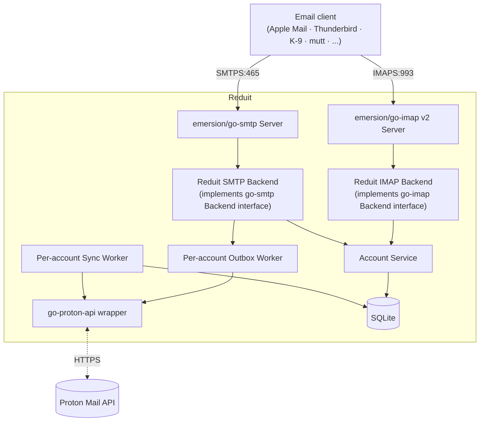

# ADR-0007: emersion/go-imap (v2) and emersion/go-smtp for protocol servers

- **Status:** superseded by [ADR-0012](ADR-0012-single-user-local-first.md) (2026-06-29)
- **Date:** 2026-04-25
- **Deciders:** Joe Stump

> **Superseded by [ADR-0012](ADR-0012-single-user-local-first.md) (2026-06-29).**
> Reduit no longer serves IMAPS/SMTPS — the relay is dropped in favor of running
> Proton Bridge alongside Reduit. The `emersion/go-imap` and `emersion/go-smtp`
> dependencies are removed. Outbound mail now goes through `go-proton-api`
> directly (ADR-0020), not an SMTP submission server. Retained for historical
> context.

## Context and Problem Statement

Reduit serves IMAPS (port 993) and SMTPS submission (port 465) on the
network for users' email clients. We need to choose between
implementing the IMAP and SMTP protocols ourselves or pulling in an
existing Go library.

IMAP is a substantial protocol with a long history (RFC 3501 → 9051),
significant edge cases (UID stability, IDLE, LIST extensions, MOVE),
and many client implementations with non-trivial quirks. SMTP
submission is much simpler in scope (auth + queue + relay) but still
non-trivial.

## Decision Drivers

- Time-to-functional. Reimplementing IMAP from scratch is months of
  work that does not differentiate Reduit.
- Battle-tested against real email clients (Apple Mail, Outlook,
  Thunderbird, K-9, mutt, Aerc, etc.).
- Active maintenance. The Go email-server space is small; we want a
  library that the maintainer is still updating.
- Compatibility with our backend model: per-user routing via SASL
  identity, custom storage backend (SQLite + go-proton-api), no
  on-disk maildir.

## Considered Options

1. **`github.com/emersion/go-imap` v2 + `github.com/emersion/go-smtp`.**
   By the same author who built `hydroxide` (the original third-party
   Proton bridge) and `go-message`, `go-vcard`, `go-webdav`, etc.
2. **`mxmail/imapserver` (or other less-maintained Go IMAP servers).**
3. **Implement from scratch.**
4. **Wrap an existing C/C++ IMAP server (Dovecot, Cyrus) via FFI.**

## Decision Outcome

**Chosen: option 1 — `emersion/go-imap` v2 + `emersion/go-smtp`.**

- **`go-imap` v2:** the v2 API is the current actively maintained
  version. v1 is in maintenance mode. We implement the `Backend` and
  `Session` interfaces.
- **`go-smtp`:** implement the `Backend` interface (auth + receive
  outgoing message). Pass authenticated messages to a per-account
  outbox worker that handles encryption and submission via
  `go-proton-api`.
- **TLS:** wired via the protocol library's `Server.TLSConfig` field.
  The cert source is the hot-reloading loader from ADR-0009.
- **SASL:** PLAIN over TLS only. No CRAM-MD5, no APOP, no anonymous.
  Username form: **`user@host`** (e.g., `joe@reduit.family.tld`),
  matching standard email-client expectations. Auth lookups validate
  the per-user IMAP/SMTP password (envelope-encrypted in SQLite per
  ADR-0003) against the local user identified by the address.

### Consequences

**Positive**

- Same author who originally extracted and reverse-engineered the
  Proton API surface (in `hydroxide`). High confidence in protocol
  fidelity.
- Active maintenance — both libraries see commits regularly.
- Clean Go interfaces (`Backend`, `Session`, `Mailbox`) we can
  implement against our SQLite + go-proton-api state model.
- We get IDLE, LIST extensions, UIDPLUS, MOVE, CONDSTORE (where
  emersion's library supports them) for free.
- Reduit can reuse `emersion/go-message` for MIME parsing on outgoing
  mail; same author, designed to interoperate.

**Negative**

- IMAP is hard regardless of library. We still own UID stability per
  ADR-0010 (deferred), label↔folder mapping per ADR-0011 (deferred),
  IDLE event push, and partial-fetch semantics.
- Edge-case clients (esp. Outlook) may stress untested code paths.
- `go-imap` v2 is still pre-v1; some breaking changes possible.
- SMTP submission has its own complexity: encrypted-vs-plain recipient
  detection, per-recipient PGP key fetching, attachment encryption
  pipeline. The library handles the SMTP transport; we own the Proton
  encryption logic.

**Neutral**

- IMAP CONDSTORE / quota / sort extensions — implement only as needed
  for clients we actually deploy against.

## Pros and Cons of the Options

### `emersion/go-imap` + `go-smtp` (chosen)

- **Good:** Active, idiomatic Go interfaces, same author as the
  original Proton bridge effort.
- **Good:** Wide ecosystem (`go-message`, `go-mbox`, `go-vcard`).
- **Bad:** Pre-v1 API (acceptable for our pre-v1 software).

### Other Go IMAP servers

- **Bad:** Less maintained; smaller user base; more risk of long-tail
  bugs surfacing on quirky clients.

### Implement from scratch

- **Good:** Total control.
- **Bad:** Months of work; no benefit over emersion/go-imap.

### Wrap Dovecot / Cyrus

- **Good:** Proven at massive scale.
- **Bad:** Non-Go process; deployment complexity (separate binary,
  config, supervision); harder to integrate with Proton sync state;
  CGO / IPC overhead. The use case (≤50 family/team accounts) does not
  need this scale.

## Architecture Diagram

The emersion libraries handle the wire protocols (IMAP framing, SASL,
SMTP submission). Reduit implements their Backend interfaces and
delegates per-account state to the shared Account Service, which
talks to SQLite and the Proton client.

## References

- [`emersion/go-imap`](https://github.com/emersion/go-imap)
- [`emersion/go-smtp`](https://github.com/emersion/go-smtp)
- [`emersion/go-message`](https://github.com/emersion/go-message)
- [`emersion/hydroxide`](https://github.com/emersion/hydroxide) — same
  author's third-party Proton bridge; reference implementation.
- ADR-0009 (TLS) — TLS config wired into `Server.TLSConfig`.
- ADR-0010 (deferred — IMAP UID stability).
- ADR-0011 (deferred — label↔folder mapping).
