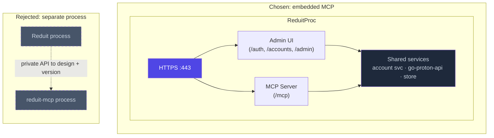

# ADR-0008: Embedded MCP server, not a separate process

- **Status:** accepted
- **Date:** 2026-04-25
- **Deciders:** Joe Stump

## Context and Problem Statement

Reduit ships a Model Context Protocol (MCP) server exposing
Proton-specific operations (label CRUD, system-folder moves, search,
encrypted send) that standard IMAP/SMTP MCPs cannot model cleanly.
The MCP server needs access to the same per-account state as the
sync workers and IMAP/SMTP backends.

The architectural choice: does the MCP server live inside the same
Reduit binary, or is it a separate process that talks to Reduit over
a private API?

## Decision Drivers

- The MCP server uses the same `go-proton-api` clients, the same
  account state, the same labels and message metadata as the IMAP
  backend. Sharing state in-process is trivial; sharing across
  processes requires a private API surface.
- Self-hosters deploy one container, not two. A separate MCP process
  doubles deployment complexity.
- MCP authentication should reuse Reduit's OIDC session model (or a
  per-account MCP token derived from it) — this is much simpler if MCP
  lives in the same HTTP server.
- Multi-user routing is identical to the admin UI (auth → identity →
  account scope). One implementation.

## Considered Options

1. **Embedded in the Reduit binary.** MCP server runs in the main
   process, listens on a separate port (or `/mcp` path on the same
   HTTPS listener), shares state with sync workers and IMAP/SMTP
   backends.
2. **Separate `reduit-mcp` binary.** Talks to Reduit over a private
   gRPC / REST API.
3. **stdio MCP only.** No HTTP server — the MCP server runs via stdio,
   suitable for a Claude Code subprocess invocation but not for
   remote use.

## Decision Outcome

**Chosen: option 1 — embedded MCP server.**

- The MCP server is mounted at `/mcp` on the same HTTPS listener as
  the admin UI (port 443 / configurable).
- MCP requests authenticate via:
  - **OIDC bearer token** (the JWT issued by the IdP), validated
    against the same OIDC config the admin UI uses; OR
  - **Per-account MCP token** issued from the admin UI, stored hashed in
    SQLite, presented via `Authorization: Bearer <token>`. A token is
    bound to exactly one account (`mcp_tokens.account_id`), consistent
    with the multi-account-per-user model in ADR-0010 and SPEC-0006.
  - Both authenticate to a Reduit account record; all MCP tool
    invocations are scoped to that account.
- The MCP transport is **HTTP+SSE** (Streamable HTTP per the MCP spec),
  which fits the same fronting Caddy / Traefik already terminates TLS
  for. Stdio support deferred (only useful for local Claude Code
  spawning, which Reduit's deployment model doesn't optimize for).
- Tool surface (formal definition in SPEC-0006):
  - `list_messages`, `get_message`, `search_messages`
  - `send_message` (handles Proton-recipient encryption automatically)
  - `list_labels`, `add_label`, `remove_label`
  - `move_to_folder` (Inbox, Archive, Sent, Drafts, Trash, Spam, All
    Mail, custom labels)
  - `mark_read`, `mark_unread`
  - `download_attachment`

### Consequences

**Positive**

- Single binary, single deployment. Self-hosters get MCP for free
  with `reduit run`.
- MCP tools share connection pools, account caches, and sync state
  with the rest of Reduit. No serialization overhead between the MCP
  layer and the Proton client layer.
- Authentication is unified — OIDC sessions cover both the admin UI
  and the MCP server.
- MCP tool implementations compose naturally with the same Proton
  client wrapper used by IMAP/SMTP backends; consistent error
  handling, retry, logging.

**Negative**

- The MCP server's resource use (tool execution, attachment streaming)
  competes with the sync workers and IMAP/SMTP backends in the same
  process. Mitigation: per-tool concurrency limits, observability.
- A single crash in the MCP layer can take down IMAP/SMTP. Mitigation:
  panic-recovery boundaries on every MCP tool invocation.
- Versioning is coupled — MCP and the rest of Reduit ship together.
  This is acceptable; we are not designing for a separate MCP release
  cadence.

**Neutral**

- The MCP can be disabled by config (`MCP_ENABLED=false`) for users
  who only want the IMAP/SMTP relay. Default: enabled.

## Pros and Cons of the Options

### Embedded (chosen)

- **Good:** Single deployment; shared state and auth; minimal
  serialization; consistent observability.
- **Bad:** Coupled fault domain.

### Separate `reduit-mcp` process

- **Good:** Independent fault domain; could scale MCP independently.
- **Bad:** Doubles deployment complexity; private API surface to
  design and version; serialization overhead; duplicate auth handling.
  Engineering cost not justified for the target scale.

### Stdio-only MCP

- **Good:** Works for local Claude Code spawning.
- **Bad:** Doesn't match the server-deployment model. We can add
  stdio later as a separate binary that talks to the embedded HTTP MCP.

## Architecture Diagram

The MCP server shares the same HTTPS listener, account state, and
Proton client wrapper as the admin UI. One binary, one auth model
(OIDC bearer or per-account MCP token), one fault domain. The dashed
alternative is rejected for the operational complexity it would add.

## References

- ADR-0001 (go-proton-api) — MCP tools call the same client.
- ADR-0002 (multi-tenant) — MCP tools scoped per-account via auth.
- ADR-0004 (OIDC) — MCP auth reuses OIDC sessions.
- SPEC-0006 (MCP tool surface).
- [Model Context Protocol](https://modelcontextprotocol.io/)
- [`github.com/modelcontextprotocol/go-sdk`](https://github.com/modelcontextprotocol/go-sdk)
