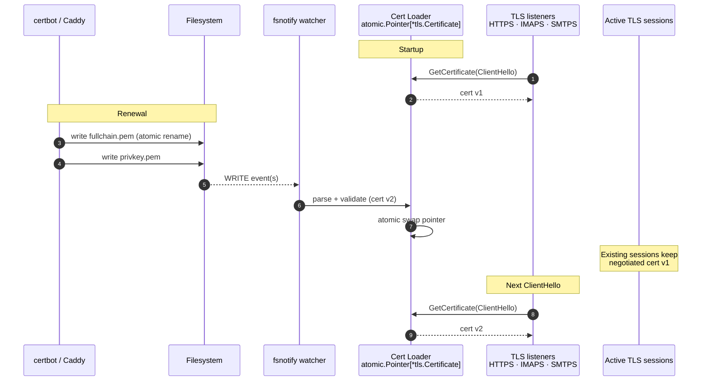

# ADR-0009: TLS via on-disk cert files with hot-reload

- **Status:** accepted (amended by [ADR-0011](ADR-0011-http-mode-for-reverse-proxy-fronting.md), 2026-05-04 — adds an opt-in HTTP-only mode for the admin/MCP listener; mail listeners still follow this ADR; refined by PR #61 (#54), 2026-06-27 — shared TLS-config builder with a TLS 1.2 floor and an explicit cipher-suite allowlist)
- **Date:** 2026-04-25
- **Deciders:** Joe Stump

> **Refined by PR #61 (issue #54), 2026-06-27.** The three TLS
> listeners (HTTPS, IMAPS, SMTPS) no longer each hand-roll a
> `*tls.Config`; they build it through a shared `tlsloader.Config(...)`
> builder. The builder pins `MinVersion: tls.VersionTLS12` — the TLS
> 1.2 floor is kept deliberately for interop with older IMAP/SMTP
> mail clients — and supplies an explicit forward-secret AEAD
> cipher-suite allowlist for the 1.2 fallback path (ECDHE key
> exchange with AES-GCM or ChaCha20-Poly1305 only). TLS 1.3 cipher
> suites are Go-managed and always on; the allowlist constrains only
> the 1.2 fallback. The on-disk cert loading and hot-reload via the
> `GetCertificate` callback described below are unchanged.

## Context and Problem Statement

Reduit serves three TLS-terminated endpoints — HTTPS (admin / MCP),
IMAPS (993), SMTPS (465). Self-hosters need TLS that:

- Works with their existing certificate-management tooling.
- Rotates automatically as certs are renewed.
- Does not drop in-flight IMAP IDLE or SMTP submission connections at
  rotation time.

The certificate-acquisition story (ACME challenge, DNS-01 vs HTTP-01,
domain validation, renewal scheduling) is a solved problem in the
self-hosting world: certbot, Caddy, Traefik, lego, acme.sh, dehydrated.
Reduit duplicating that machinery in-process adds complexity for no
gain.

## Decision Drivers

- Don't reinvent ACME. Self-hosters typically already run a TLS
  frontend (Caddy / Traefik / nginx) for other services and have
  certbot or similar handling renewals.
- No in-flight connection drops at rotation. IMAP IDLE connections live
  for ~29 minutes per the spec; SMTPS submissions are short-lived but
  parallel. A process restart at every renewal would be hostile.
- Operational simplicity. The relay reads cert files from disk; the
  operator decides how those files get there.

## Considered Options

1. **In-process autocert (`golang.org/x/crypto/acme/autocert`).** Reduit
   handles ACME directly.
2. **In-process certbot library** (e.g., `lego` as a Go module). Reduit
   handles ACME via a Go ACME client.
3. **External cert tool + on-disk files + hot-reload.** Reduit reads
   `cert_path` and `key_path` from config; `fsnotify` watches both
   files; on change, the in-memory `tls.Config.GetCertificate`
   callback returns the new cert without process restart.

## Decision Outcome

**Chosen: option 3 — external cert tool + on-disk files + hot-reload.**

- Configuration:
  ```yaml
  tls:
    cert_path: /etc/reduit/tls/fullchain.pem
    key_path: /etc/reduit/tls/privkey.pem
  ```
- Implementation:
  - On startup, load cert+key into a `*tls.Certificate` held behind a
    `sync.RWMutex` (or `atomic.Pointer[tls.Certificate]`).
  - Each `tls.Config` (HTTPS, IMAPS, SMTPS) sets
    `GetCertificate: func(*tls.ClientHelloInfo) (*tls.Certificate, error)`
    that returns the current pointer.
  - `fsnotify` watches both `cert_path` and `key_path` (and their
    parent directories — atomic `mv` patterns from certbot replace
    the file via rename; some operations only fire on the dir).
  - On change, attempt to reload. If the new cert/key pair fails to
    parse or doesn't match, log an error, KEEP the previous cert.
    No partial-state reload.
- Cert provisioning is OUT OF SCOPE for Reduit. Recommended pattern:
  certbot in a sidecar container or systemd timer writing to a shared
  volume mounted into Reduit; Caddy or Traefik in front for HTTP-01
  challenges; or a manual `acme.sh` cron.

### Consequences

**Positive**

- Reduit is small. No ACME state, no DNS provider integrations, no
  renewal scheduler. The TLS code path is ~100 lines.
- In-flight IMAP IDLE connections survive cert rotation. Each new
  TLS handshake gets the new cert; existing connections continue with
  whatever cert they negotiated under.
- Self-hosters use whatever cert-management tool they already have.
  No lock-in.
- Cert errors are visible to the operator (file-not-found, parse
  errors are logged) without crashing the server.

**Negative**

- **Operator burden:** Reduit doesn't help with cert acquisition.
  Self-hosters new to TLS need a setup guide pointing at certbot or
  Caddy. Documented in the README.
- **No fallback for missing certs.** If cert files don't exist at
  startup, Reduit errors out cleanly rather than starting in a
  degraded mode. Operators must provision certs before first run.
- **Per-account SAN coverage** is the operator's job. If a user
  configures `mail.family.tld` and the cert is only for `relay.tld`,
  the IMAPS handshake fails. Documentation will recommend wildcard
  or SAN coverage for the relay's hostname.

**Neutral**

- Cert reload races with active TLS handshakes are bounded — `tls`
  reads `GetCertificate` once per ClientHello. The atomic-pointer
  swap is contention-free.

## Pros and Cons of the Options

### External tool + on-disk + hot-reload (chosen)

- **Good:** Zero ACME complexity in Reduit; works with any cert tool;
  no in-flight connection drops.
- **Bad:** Operators must provision certs separately.

### autocert / in-process ACME

- **Good:** Single-binary cert experience.
- **Bad:** ACME state machinery duplicated; fragile around DNS-01
  providers; the moment a self-hoster wants a wildcard cert, they
  drop autocert anyway. Also requires Reduit to expose port 80 (for
  HTTP-01) — incompatible with running behind a proxy that already
  occupies port 80.

### In-process lego

- **Good:** More flexible than autocert (DNS-01 supported).
- **Bad:** Still imports an entire ACME stack; configuration is
  per-DNS-provider; complicated.

## Architecture Diagram



Reduit reads cert + key from disk, watches both files (and their
parent directory, since certbot atomically renames the file), and
hot-swaps the in-memory pointer when they change. Active IDLE / SMTP
sessions keep the cert they negotiated; only new handshakes pick up
the rotated cert.

## References

- ADR-0007 (IMAP/SMTP libraries) — `Server.TLSConfig` is wired into
  `go-imap` and `go-smtp`.
- [`fsnotify`](https://github.com/fsnotify/fsnotify)
- [Caddy](https://caddyserver.com/) — recommended TLS frontend.
- [certbot](https://certbot.eff.org/) — recommended ACME client.
