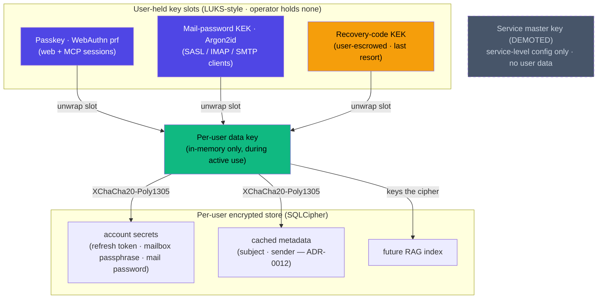

# ADR-0013: Multi-user key custody and operator trust model

- **Status:** proposed (2026-06-27)
- **Date:** 2026-06-27
- **Deciders:** Joe Stump

> **Amends [ADR-0003](ADR-0003-encryption-at-rest-scheme.md).** The
> single service master key that wraps *every* user's data key (the
> two-layer envelope at the heart of ADR-0003) is **demoted**: it no
> longer unlocks any user's mail. ADR-0003's at-rest threat model,
> AEAD primitives, and column-name-AAD discipline carry forward
> unchanged; only the *custody of the key that unlocks user data*
> changes. Read this ADR as superseding ADR-0003's **key hierarchy**
> while leaving the rest of ADR-0003 intact.

## Context and Problem Statement

Reduit is multi-user by design (ADR-0002, refined by ADR-0010): one
operator hosts mail for several people — the canonical case is a
family (Joe, Hannah, Maya, Sage). Under ADR-0003, a single service
master key, held by the daemon as a file the operator can read, wraps
the per-account data key for **every** account. That is fine when the
operator *is* the only user. It is not fine the moment a second human's
mail is on the box: the operator can read `master.key`, unseal any
account's data-key envelope, and decrypt that account's refresh token,
mailbox passphrase, and — via ADR-0012 — cached subjects and senders.
For a privacy-first relay hosting other people's mail, **the operator
must be treated as honest-but-curious toward the other users**: trusted
to run the service, not trusted to read their correspondence.

Here is the crux, stated bluntly: **a server that decrypts mail to do
its job cannot cryptographically prevent its own root operator from
reading that mail while the relay is running.** Reduit logs into Proton
*as* each user, decrypts OpenPGP bodies to serve IMAP FETCH and SMTP
submission, and (for the planned MCP RAG search) embeds message
content. Doing any of that requires the user's decryption material in
process memory. A root operator who *wants* to read live mail can dump
that memory, read swap, trigger a core dump, `ptrace` the process, or
swap the binary for one that copies plaintext aside. No amount of
clever key wrapping changes this — the plaintext is, by necessity,
right there in RAM. This is the same reason iCloud Mail is **not**
end-to-end encrypted and the reason Proton Bridge runs on the user's
*own* machine rather than on Proton's servers: a server that needs the
plaintext is a server that can be made to keep it.

So the achievable goal is **not** "the operator can never read it."
The achievable goal is:

1. **At-rest confidentiality from the operator.** A curious operator
   browsing the SQLite file, a backup, a snapshot, or a broader-access
   mount learns nothing about another user's mail. This is the full
   strength of ADR-0003's at-rest model, now extended to exclude the
   operator themselves (because the operator no longer holds the
   unlocking key).
2. **Minimized live-exposure window.** Plaintext and the user's data
   key exist in process RAM **only while that user is actively using
   the service** (a live web/MCP session, or a connected mail client
   driving IMAP/SMTP), plus a bounded grace window — never durably on
   disk.

That is a real, defensible security improvement over status quo, and it
is honest about its ceiling.

## Threat Model

**In scope (this ADR defends against):**

- **Honest-but-curious operator.** The operator who would `sqlite3` the
  database, grep a backup, or mount a snapshot to peek at another
  user's subjects, senders, or secrets — but who will *not* actively
  backdoor the running service. Against this adversary, per-user keys
  the operator does not hold make another user's data unreadable at
  rest, full stop.
- **Offline / at-rest compromise** — stolen disk, leaked backup,
  snapshot, or a host with broader-access mount of the SQLite file.
  This is exactly ADR-0003's at-rest threat model; this ADR strengthens
  it by removing the operator-held master key as a single point of
  decryption.

**Out of scope (this ADR explicitly does NOT defend against):**

- **Active malicious root operator** who modifies the running service
  (or the host kernel) to capture keys or plaintext while a user is
  active. As argued above, this is **uncloseable** by a server that
  decrypts mail to function. The only thing that closes it is
  **confidential computing / a TEE** — SGX, AMD SEV-SNP, AWS Nitro
  Enclaves, or an attested confidential VM — where the user releases
  their key *only* to an enclave whose measurement they have remotely
  attested, so a tampered host cannot obtain it. That is **out of scope
  for v1**: it is hardware-gated, demands a remote-attestation
  release-of-key protocol, and is impractical for the typical
  self-hoster running a container on a NAS or a cheap VPS. It is noted
  as the **Tier-2 upgrade path**, not a v1 deliverable.

The honest one-line summary: **at-rest + minimized-exposure-window
confidentiality from an honest-but-curious operator; full protection
against offline/at-rest compromise; no protection against an active
root who tampers with the live service.**

## Decision Drivers

- **Multi-user with a semi-trusted operator.** Once Reduit hosts more
  than one human's mail, the ADR-0003 model — operator decrypts
  everyone at rest and live — is unacceptable.
- **Background sync requires key residency while the user is absent.**
  A Proton relay's value is being always-on: syncing, serving IMAP IDLE
  to a desktop client, answering MCP queries. Some of that happens while
  the human is not at a browser. The design must say *when* a user's key
  may exist and *for how long*.
- **IMAP/SMTP clients only speak SASL.** Thunderbird, Apple Mail, and
  `mutt` authenticate with a username and password over SASL PLAIN.
  They cannot perform a WebAuthn ceremony. Whatever unlocks the data
  key must therefore *also* be derivable from the per-user mail
  password, or connected mail clients break.
- **Recovery without operator help.** If a user loses their unlock
  factors, the operator must not be able to recover their data — that
  would reintroduce operator custody. Recovery has to route through a
  user-held secret.
- **Reuse the stack.** WebAuthn/passkeys already live in the
  control-plane via Pocket ID (ADR-0004). ADR-0003's AEAD envelope and
  ADR-0012's seal-per-value are already implemented. Prefer extending
  them over inventing new crypto.
- **Honesty over theater.** The design must not claim a property it
  cannot deliver (e.g., "operator can never read your mail"). It must
  state its ceiling plainly.

## Considered Options

1. **Status quo — ADR-0003 single service master key wraps all users.**
   One operator-held key unseals every account's data key. The operator
   can decrypt any user's secrets and (via ADR-0012) cached metadata,
   both at rest and live.
2. **Per-user keys unlocked by user-held secrets (multi-slot), demote
   the master key (CHOSEN).** Each user's data key is wrapped in several
   independent LUKS-style key slots — passkey-PRF, mail-password KEK,
   recovery-code KEK — none of which the operator holds. The master key
   stops wrapping user data. Plaintext exists only in RAM during active
   use.
3. **Confidential computing / TEE (Tier 2).** Per-user keys released
   only to a remotely-attested enclave, excluding even an active root
   operator. Strongest, but hardware-gated and impractical for
   self-hosters.
4. **No server-side decryption — push crypto to each user's client
   (Proton Bridge model).** Each user runs a local agent that holds
   their keys and decrypts on their own machine; Reduit never sees
   plaintext.

## Decision Outcome

**Chosen: option 2 — per-user data keys, wrapped in multiple
independent LUKS-style key slots held by the *user*, with the ADR-0003
service master key demoted out of the user-data path.**

Concretely:

### Per-user data key; master key demoted

- Each **user** (the `users` row from ADR-0010, not the per-Proton-
  account row) gets a **per-user data key** — a random 256-bit key that
  is the root of trust for *that user's* mail and account secrets.
- The ADR-0003 **service master key is demoted.** It no longer wraps any
  per-account data key and no longer unlocks any user's mail. Its
  residual role is, at most, protecting **service-level configuration**
  (non-user-scoped daemon state). It is removed from the path between
  the operator and any user's plaintext. This is the core amendment to
  ADR-0003: ADR-0003's two-layer envelope (master → data key → secret)
  becomes (user unlock factor → user data key → account secret), and
  the operator holds no factor in that chain.

### Multiple independent key slots (LUKS-style)

The per-user data key is wrapped independently in **several key slots**,
any one of which can unlock it — exactly the way LUKS lets multiple
passphrases each unwrap the same volume key. The operator holds **none**
of these slots. Three slots ship:

1. **Passkey / WebAuthn `prf` extension — primary.** A registered
   passkey, exercised through the WebAuthn `prf` extension, deterministically
   yields a stable per-credential secret that the server never
   persists. That secret derives a KEK that unwraps the user's data key.
   Used to unlock during web sessions and MCP/agent sessions. Pocket ID
   and WebAuthn are already in the stack (ADR-0004), so this reuses
   existing identity infrastructure rather than adding a second one.
2. **IMAP/SMTP mail-password-derived KEK.** Argon2id over the user's
   Reduit-generated mail password yields a KEK that unwraps the same
   data key. This is the slot that makes **connected mail clients work**:
   a Thunderbird session speaking only SASL PLAIN presents the mail
   password, Reduit derives the KEK, unwraps the data key, and can run
   background fetch/sync for that account. This directly resolves the
   "passkeys don't work for IMAP clients" problem — the IMAP client
   never needs to know a passkey exists.
3. **Recovery-code KEK.** A high-entropy recovery code, generated once
   and **escrowed by the user** (printed, stored in a password manager),
   derives a KEK that unwraps the data key. This is the *only* path back
   if the user loses both their passkey and their mail password. **The
   operator cannot use it and cannot recover the data without it** — by
   design.

Any slot unwraps the data key; losing one slot does not lose the data as
long as another slot survives. Adding the recovery code as a mandatory
third slot is what makes losing the other two non-catastrophic without
handing recovery power to the operator.

### Per-user encrypted store

- Each user's **account secrets** (refresh tokens, mailbox passphrases,
  per-user mail passwords — the ADR-0003 columns), **cached message
  metadata** (the ADR-0012 `subject`/`sender`), and the **(future) RAG
  index** live in a **per-user encrypted store** keyed by that user's
  data key — e.g. a per-user [SQLCipher](https://www.zetetic.net/sqlcipher/)
  / [sqlite-multiple-ciphers](https://github.com/utelle/SQLite3MultipleCiphers)
  database. At rest, the operator **literally cannot open another
  user's database file** without that user's data key, which the
  operator does not hold. (This is the same per-account-encrypted-store
  shape already on the table for scaling encrypted search — but here the
  key is the *user's*, not derived from the service master key.)
- **Plaintext exists only in process RAM** while the user's data key is
  loaded — i.e. during an active session/connection plus the bounded
  grace window. Durable storage (the SQLite file, backups, snapshots)
  only ever holds ciphertext.

ADR-0012's seal-per-value sealing of hot metadata still applies; the
only change is that the wrapping key becomes the **user's data key**
rather than a master-wrapped per-account key.

### Architecture Diagram

Three independent slots each unwrap the same per-user data key; the
operator holds none of them. The demoted service master key (dashed) is
out of the user-data path entirely. Plaintext lives only in RAM while a
slot has unlocked the data key.

### Consequences

**Positive**

- **A curious operator gains nothing at rest.** Another user's secrets,
  cached subjects/senders, and RAG index are in a database the operator
  cannot open. Backups, snapshots, and broader-access mounts are useless
  against another user's mail.
- **The ADR-0003 catastrophic-master-key-loss failure mode is split per
  user and given a user-controlled recovery path** (the recovery-code
  slot) instead of an operator-held single point of total loss.
- **Mail clients keep working** via the password-derived slot, despite
  passkeys being unusable over SASL.
- **Reuses the stack** — WebAuthn (ADR-0004), AEAD envelopes (ADR-0003),
  seal-per-value (ADR-0012).

**Negative / trade-offs (honest)**

- **Background sync vs. key residency is the load-bearing, unresolved
  knob.** If a user's data key exists in RAM *only* while that user is
  logged in, then **background sync pauses when they fully log off** —
  no connected client, no live web/MCP session, no key, no sync. The
  pragmatic policy is to keep the key resident while *any* IMAP IDLE,
  MCP, or web session is live, plus a grace window after the last
  session drops. That keeps sync working in the common case (a desktop
  client is almost always connected) — but it means the key sits in RAM
  the whole time a client is connected, which is a **standing target for
  an active root operator** (out of scope, but worth naming) and does
  nothing for the truly-offline user. The exact residency window is an
  **open question** below; it is the central UX-vs-exposure trade-off of
  this whole design.
- **Lost passkey *and* lost mail password = data unrecoverable without
  the recovery code.** The operator cannot help. This is intended, and
  it raises the stakes on the recovery-code UX: the user must be made to
  save it, loudly, at enrollment.
- **Migration from ADR-0003.** Existing per-account data-key envelopes
  wrapped under the service master key must be **re-wrapped under the
  owning user's data key**, and the master key must stop being a
  user-data unlocker. (Pre-alpha, no production data — a clean forward
  ratchet, but the migration and re-enrollment flow still have to be
  written.)
- **Performance / UX cost.** Argon2id at mail-client auth and at
  recovery-code unlock; the passkey-PRF slot requires both client and
  IdP support for the `prf` extension (see open questions).

**Neutral**

- **ADR-0012's seal-per-value still stands**, with the wrapping key
  changed to the user's data key. The planned RAG / searchable-encryption
  storage design (a **forthcoming ADR**) **depends on this one** — it
  needs a per-user key to key the per-user index, which is exactly what
  this ADR establishes.
- A **single-user install** gains nothing from operator-exclusion
  (the operator *is* the user). An opt-in "solo / trusted-operator
  single-key" mode that keeps the simpler ADR-0003 ergonomics for
  single-user deployments is worth considering — listed as an open
  question, not decided here.

## Pros and Cons of the Options

### Per-user keys, multi-slot, master demoted (chosen)

- **Good:** At-rest confidentiality from the operator — another user's
  store is unopenable without that user's key.
- **Good:** Plaintext only in RAM during active use; durable storage is
  always ciphertext.
- **Good:** Password slot keeps SASL mail clients working; passkey slot
  reuses ADR-0004; recovery slot gives operator-free recovery.
- **Good:** Honest about its ceiling — names the active-root limit
  instead of pretending to close it.
- **Bad:** Background sync depends on a key-residency policy that trades
  UX against exposure and is not yet settled.
- **Bad:** Lost passkey + password ⇒ unrecoverable without the recovery
  code; no operator escape hatch.
- **Bad:** Requires a re-wrap migration and a per-user enrollment flow.

### Status quo — single service master key (rejected)

- **Good:** Simplest; already shipped (ADR-0003); fully headless with no
  per-user enrollment.
- **Bad:** The operator decrypts **every** user's mail, both at rest and
  live. Unacceptable once a second human's mail is on the box.

### Confidential computing / TEE (rejected for v1, noted as Tier 2)

- **Good:** Strongest model — excludes even an active malicious root via
  remote attestation + attested key release.
- **Bad:** Hardware-gated (SGX / SEV-SNP / Nitro), needs an attestation
  protocol, impractical for self-hosters on a NAS or cheap VPS. Right
  as a future upgrade path, wrong as a v1 requirement.

### No server-side decryption — Proton Bridge model (rejected)

- **Good:** Reduit never holds plaintext; strongest confidentiality.
- **Bad:** Defeats the entire purpose of Reduit — a **shared, always-on
  relay** with server-side IMAP/SMTP and an MCP RAG search. If every
  user has to run a local crypto agent, there is no relay to host.

## Open Questions

These MUST be resolved before this ADR can move from **proposed** to
**accepted**:

- **Key-residency window / policy for background sync.** How long does a
  user's data key stay resident after the last live session drops? Tie
  residency to active IMAP IDLE / MCP / web sessions plus a grace
  window — but the exact window, and what happens to background sync for
  a fully-offline user, is the central UX-vs-exposure trade-off and is
  unresolved.
- **WebAuthn `prf` availability in the Pocket ID + Go relying-party
  stack.** The passkey slot assumes the `prf` extension is available
  end-to-end (authenticator, browser, Pocket ID as IdP, and Reduit's Go
  RP library). This needs **verification** before the passkey slot can
  be relied on; if `prf` is unavailable, the slot design has to change.
- **Argon2id parameters** (memory / time / parallelism) for the
  password and recovery-code KEKs.
- **Recovery-code format and enrollment UX** — how it is generated,
  displayed, and confirmed-saved so users don't lock themselves out.
- **Opt-in solo / trusted-operator single-key mode** for single-user
  installs that don't benefit from operator-exclusion — offer it, or
  keep one model for everyone?

## References

- [ADR-0003](ADR-0003-encryption-at-rest-scheme.md) (service-master-key
  envelope encryption) — **amended:** the service master key is demoted
  out of the user-data path; its AEAD primitives, column-name-AAD
  discipline, and at-rest threat model are retained. The per-account
  data-key envelope is replaced by a per-user data key wrapped in
  user-held slots.
- [ADR-0004](ADR-0004-oidc-control-plane-auth.md) (OIDC control-plane
  auth) — Pocket ID + WebAuthn already in the stack; the passkey-`prf`
  slot reuses this identity infrastructure.
- [ADR-0008](ADR-0008-embedded-mcp-server.md) (embedded MCP server) —
  MCP/agent sessions are one of the active-use contexts that load a
  user's data key; the planned RAG search runs here.
- [ADR-0010](ADR-0010-multi-account-per-user.md) (multi-Proton-account
  per user) — the per-user data key is keyed to the `users` row; one
  user's key protects all of that user's accounts.
- [ADR-0012](ADR-0012-encrypt-cached-message-metadata.md) (encrypt
  cached message metadata) — seal-per-value for `subject`/`sender`
  still stands; the wrapping key becomes the user's data key.
- **Forthcoming RAG / searchable-encryption ADR** — depends on this
  decision for a per-user key to key the per-user search index.
- Multi-user operator-trust requirement — the originating concern: an
  operator hosting a family's mail must not be able to read other
  members' correspondence at rest.
