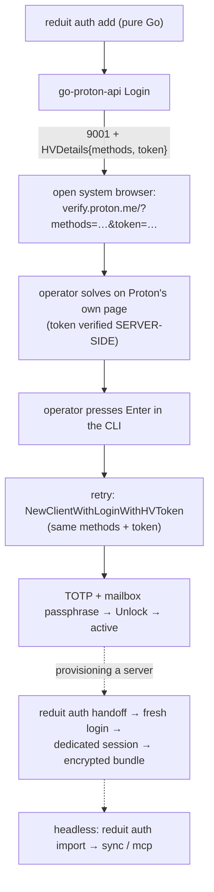

# ADR-0021: Human verification via Proton's verify page, desktop bootstrap, headless handoff

- **Status:** proposed (rev 2, 2026-07-02 — mechanism corrected to the actual
  Proton Bridge method after two failed render-the-captcha-ourselves attempts;
  the CGO amendment from rev 1 is withdrawn)
- **Date:** 2026-07-01 (rev 2: 2026-07-02)
- **Deciders:** Joe Stump
- **Relates to:** [ADR-0001](ADR-0001-go-proton-api-as-proton-client.md),
  [ADR-0006](ADR-0006-sqlite-persistent-store.md) (pure-Go posture — fully
  preserved by rev 2), [ADR-0012](ADR-0012-single-user-local-first.md),
  [ADR-0013](ADR-0013-secrets-in-os-keychain.md); issue #126

## Context and Problem Statement

`reduit auth add` authenticates to Proton via `go-proton-api` (ADR-0001). On a
real account the first login returns Proton's anti-abuse wall — HTTP 422, API
code **9001**, "please complete CAPTCHA" — and a legitimate, current client app
version does not avoid it. The login retry must present a **verified**
human-verification token in the `x-pm-human-verification-token` header.

Rev 1 of this ADR assumed the solved token had to be *captured* from the
CAPTCHA widget (via `postMessage`) and chose a native webview to do it —
amending ADR-0006 to admit CGO. Live testing falsified the whole premise, twice:

- A **native webview** (`webview_go`) shares a persistent session and offers no
  cookie/header/CSP control; navigating to the captcha URL landed on the
  authenticated **mail SPA (inbox)**, never the captcha.
- A **controlled Chrome** (chromedp: throwaway profile, `x-pm-appversion`
  header, CSP bypass) rendered Proton's captcha *wrapper*, but its inner asset
  iframe was blocked by `frame-ancestors https://calendar.proton.me
  https://drive.proton.me` — Proton's captcha embed chain is reserved for
  first-party contexts.

Reading Proton Bridge's actual implementation
([`internal/hv/hv.go`](https://github.com/ProtonMail/proton-bridge/blob/master/internal/hv/hv.go))
revealed the correct model: **the token is never captured client-side.**
Bridge formats `https://verify.proton.me/?methods=<methods>&token=<token>`,
opens it in the user's normal browser, the user solves the challenge on
Proton's own standalone verification page — which **verifies the token
server-side** — and Bridge retries the login with the *same* token it already
held. No embedding, no capture, no CSP fight, no browser machinery.

## Decision Drivers

- **Match Bridge exactly.** Bridge is built on the same `go-proton-api`; its HV
  flow is the effectively-sanctioned path, and it is trivially simple.
- **Preserve ADR-0006.** Pure Go, `CGO_ENABLED=0`, single build,
  cross-compilable. Rev 2 requires no CGO, no webview, no chromedp — the rev-1
  amendment is withdrawn.
- **Headless cannot solve a CAPTCHA** — it needs a credential minted on a host
  with a browser.

## Considered Options

1. **Loopback iframe / reverse proxy** — render Proton's captcha in a page we
   serve. *Falsified live:* `frame-ancestors` CSP blocks it.
2. **Native OS webview (rev 1 choice)** — render + capture in a WKWebView.
   *Falsified live:* persistent shared session → mail SPA, not the captcha; the
   thin binding offers no isolation/header/CSP levers; costs CGO.
3. **Controlled Chrome via chromedp** — all the levers (fresh profile, headers,
   CSP bypass). *Falsified live:* the captcha asset's `frame-ancestors` admits
   only `calendar.proton.me`/`drive.proton.me` as parents; the embed chain is
   first-party-only. Costs a Chrome runtime dependency.
4. **Proton's standalone verify page (the actual Bridge method).** Open
   `https://verify.proton.me/?methods=…&token=…` in the user's normal browser;
   the solve verifies the token server-side; retry login with the same token.

## Decision Outcome

**Chosen: option 4 — the verify-page flow, exactly as Proton Bridge does it.**

- **Desktop bootstrap.** On a 9001, `reduit auth add`/`refresh` prints and
  opens `https://verify.proton.me/?methods=<offered>&token=<token>` in the
  system browser, waits for the operator to complete the challenge (a single
  foreground "press Enter when done" prompt), then retries the login via
  `NewClientWithLoginWithHVToken` with the **same** `APIHVDetails{Methods,
  Token}` — continuing to the existing TOTP + mailbox-passphrase steps.
  All offered methods (captcha, email, sms) are passed through; the verify page
  lets the user pick.
- **Pure Go everywhere.** No webview, no chromedp, no CGO, no build tags, no
  browser runtime dependency (any default browser works; the URL is printed for
  copy/paste). ADR-0006 stands unmodified.
- **Bootstrapping still requires a browser somewhere** — in practice a desktop.
  **Headless via `handoff` (unchanged from rev 1):** `reduit auth handoff
  <address>` on a desktop performs a fresh login (verify page + TOTP +
  passphrase) to mint a **dedicated session** for the headless host, packaged
  as an encrypted bundle for `reduit auth import`. Distinct sessions per host —
  no shared rotating refresh token (Proton rotates the token on every use), so
  desktop and headless never race.

### Consequences

**Positive**

- Radically simpler: the entire solver is "format URL, open browser, wait,
  retry." No token capture, no CSP/CORS surface, nothing to break when Proton
  changes the captcha widget — the verify page is theirs.
- ADR-0006 fully preserved: one pure-Go build, `CGO_ENABLED=0`,
  cross-compilable. The rev-1 CGO amendment and the chromedp Chrome-runtime
  requirement are both gone.
- Same UX as Proton Bridge, so operator expectations transfer.

**Negative**

- The wait-for-solve is unsynchronized (the CLI can't know when the solve
  completes; the operator presses Enter). A premature Enter retries with an
  unverified token — handled by allowing a second solve attempt before failing.
- The `handoff` bundle remains a sensitive surface (carries the mailbox
  passphrase + a refresh token); it still warrants its own spec + threat note,
  and costs one interactive login per headless host.

**Operational**

- go-proton-api primitives used: `APIError.IsHVError`/`GetHVDetails` (extract
  `{Methods, Token}`), and `NewClientWithLoginWithHVToken` (retry with the
  same details). The `GetCaptcha` render endpoint is **not** used.
- Single-host use (bootstrap and run on the same desktop) needs no `handoff`.

### Confirmation

- A live `reduit auth add` past a real 9001: browser opens the verify page,
  operator solves, Enter, login proceeds to TOTP → passphrase → `active`;
  `reduit labels` then succeeds.
- `CGO_ENABLED=0 go build ./cmd/reduit` succeeds; `go.mod` contains neither
  `webview` nor `chromedp`.
- A `handoff` bundle minted on desktop imports on a second host where `labels`
  and `sync` succeed while the desktop session keeps working.

## Architecture

## More Information

- **Rev history.** Rev 1 (2026-07-01) chose a native webview and amended
  ADR-0006 to admit CGO behind a build tag; two live failures (webview → inbox
  SPA; chromedp → first-party-only `frame-ancestors`) and Bridge's source
  showed the capture premise itself was wrong. Rev 2 withdraws the CGO
  amendment entirely.
- **[ADR-0013](ADR-0013-secrets-in-os-keychain.md)** owns where secrets live;
  the `handoff` bundle is the desktop→headless transport and needs its own
  spec.
- **Issue #126** built the HV plumbing (`HVRequiredError`,
  `NewClientWithLoginWithHVToken` wiring, TOTP integration) that this flow
  retains; only the solve mechanism changed.
