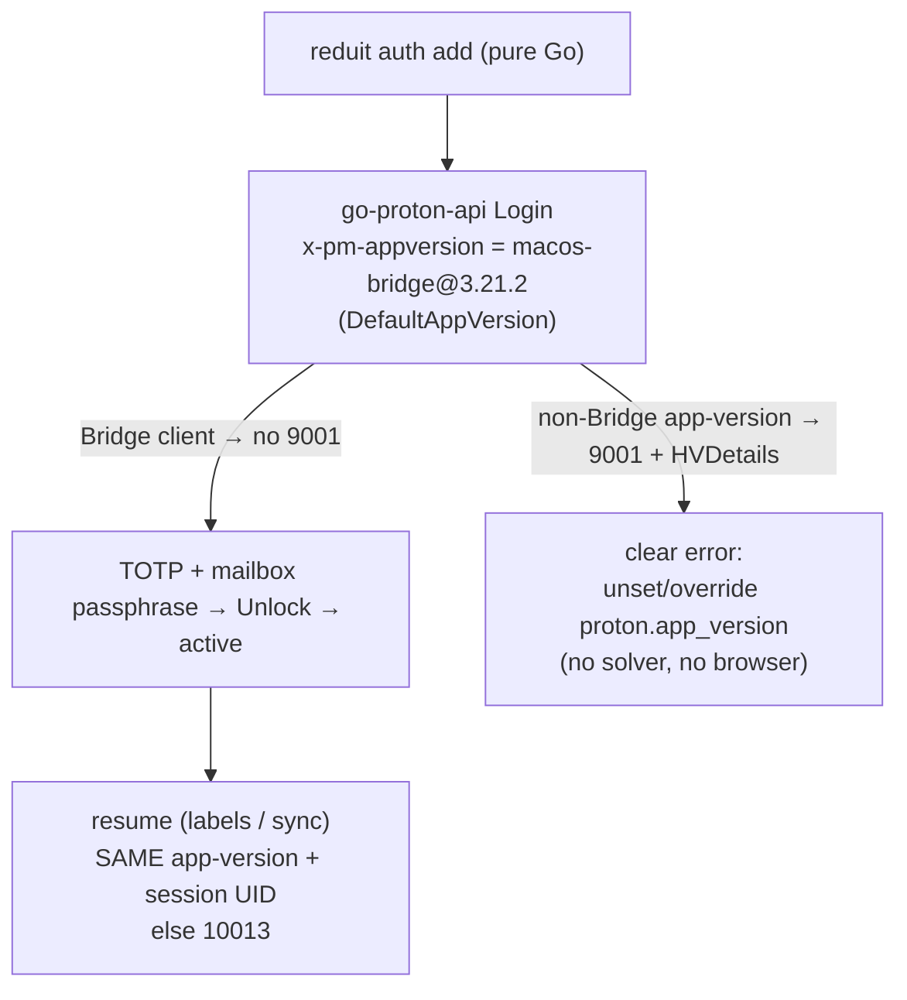

# ADR-0021: Avoid human verification by identifying as a Proton Bridge client

- **Status:** proposed (rev 3, 2026-07-03 — the actual fix is the Bridge
  app-version, which makes Proton skip human verification entirely; every in-app
  CAPTCHA-solve mechanism was falsified live or proved unnecessary, so no solver
  is implemented. The CGO amendment from rev 1 stays withdrawn.)
- **Date:** 2026-07-01 (rev 2: 2026-07-02; rev 3: 2026-07-03)
- **Deciders:** Joe Stump
- **Relates to:** [ADR-0001](ADR-0001-go-proton-api-as-proton-client.md),
  [ADR-0006](ADR-0006-sqlite-persistent-store.md) (pure-Go posture — fully
  preserved), [ADR-0012](ADR-0012-single-user-local-first.md),
  [ADR-0013](ADR-0013-secrets-in-os-keychain.md); issue #126

## Context and Problem Statement

`reduit auth add` authenticates to Proton via `go-proton-api` (ADR-0001). Proton
challenges the **web** client family (`web-mail@…`) with its anti-abuse wall —
HTTP 422, API code **9001**, "please complete CAPTCHA" — on every fresh login.
Revs 1–2 took that challenge as a given and tried to *solve* it in-app: rev 1
chose a native webview (amending ADR-0006 to admit CGO), rev 2 switched to
opening Proton's standalone `verify.proton.me` page and retrying the login with
the challenge token. Both premises were falsified by live testing.

The decisive observation came from Proton Bridge: Proton **waves the Bridge
client family through with no human verification at all.** The challenge is a
function of the app-version presented in the `x-pm-appversion` header, not of the
account or the host. Identifying as a Bridge client (e.g. `macos-bridge@3.21.2`)
means the 9001 never fires, so there is nothing to solve. reduit therefore
defaults to a Bridge app-version (`proton.DefaultAppVersion`) and implements **no
in-app CAPTCHA solver**. Confirmed live end-to-end: `reduit auth add` logs in and
`reduit labels` succeeds, with no verification step.

## Decision Drivers

- **Avoid the wall, don't fight it.** The Bridge app-version is the effectively
  sanctioned path (Bridge is built on the same `go-proton-api`) and removes the
  problem instead of engineering around it.
- **Preserve ADR-0006.** Pure Go, `CGO_ENABLED=0`, single build,
  cross-compilable. No webview, no chromedp, no browser runtime dependency. The
  rev-1 CGO amendment stays withdrawn.
- **No dead machinery.** Every solve mechanism was live-falsified or proved
  unnecessary; shipping any of them would be untested, unreachable code.

## Considered Options

Each was investigated live; none is a working in-app solver.

1. **Loopback iframe / reverse proxy** — render Proton's captcha in a page we
   serve. *Falsified live:* `verify.proton.me`'s `frame-ancestors` CSP blocks
   embedding it.
2. **Native OS webview (rev 1 choice)** — render + capture in a WKWebView.
   *Falsified live:* its persistent shared session navigated straight to the
   authenticated mail SPA, never the captcha; the thin binding offers no
   isolation/header/CSP levers; and it costs CGO.
3. **Controlled Chrome via chromedp + native-app bridge capture** — a
   throwaway-profile headful Chrome rendering `verify.proton.me` top-level, with
   `window.AndroidInterface` injected to capture the solved token off the
   `HUMAN_VERIFICATION_SUCCESS` broadcast. *Unnecessary:* it was never needed
   once the Bridge app-version avoided the challenge, and it costs a Chrome
   runtime dependency plus `chromedp`/`cdproto` in `go.mod`.
4. **Verify page + press-Enter, retry same token (rev 2 choice)** — open
   `verify.proton.me/?methods=…&token=…`, operator solves and presses Enter,
   retry the login with the *same* URL token. *Falsified live:* the retry scored
   **12087** (`HumanValidationInvalidToken`) — the solved token is not the URL
   challenge token; there is no server-side binding to the URL token.
5. **Identify as a Proton Bridge client (app-version).** Present a Bridge
   `x-pm-appversion`; Proton skips human verification entirely. *Confirmed live.*

## Decision Outcome

**Chosen: option 5 — avoid human verification by identifying as a Proton Bridge
client. No in-app CAPTCHA solver is implemented.**

- **Default Bridge app-version.** `reduit` defaults to `proton.DefaultAppVersion`
  (`macos-bridge@3.21.2`) when `proton.app_version` / `REDUIT_PROTON_APP_VERSION`
  is unset. Proton waves the Bridge family through with no 9001, so the normal
  login never sees a challenge and continues straight to the existing TOTP +
  mailbox-passphrase steps.
- **Overridable, pinned.** The app-version is a pinned Bridge string,
  overridable via config for the rare operator who needs a different value (or
  the literal `auto`, which detects the web client and *will* be challenged —
  opt-in only). It should be bumped if Proton ever rejects it with a 5003
  (bad app-version).
- **Session binds to the app-version.** Proton binds a session to the
  app-version that minted it, so the **same** app-version must be presented at
  mint (`auth`) and at resume (`labels`/`sync`); a mismatch yields 10013. A
  single default satisfies this for the normal path.
- **Clear error on the avoided path.** If a non-Bridge app-version is configured
  and Proton returns a 9001, `reduit` returns a clear, actionable error —
  "unset/override the app-version" — and does **not** render, embed, or capture a
  challenge. There is no solver to fall back to.
- **Pure Go everywhere.** No webview, no chromedp, no CGO, no build tags, no
  browser runtime dependency. ADR-0006 stands unmodified.

### Consequences

**Positive**

- Radically simpler and fully working: no captcha widget, no CSP/CORS surface,
  no token capture, no browser machinery — nothing to break when Proton changes
  the challenge UI.
- ADR-0006 fully preserved: one pure-Go build, `CGO_ENABLED=0`,
  cross-compilable. `go.mod` carries no `chromedp`/`cdproto`/`webview`.
- Headless hosts work with no special handling — no browser is required anywhere,
  because no challenge is ever raised.

**Negative**

- reduit depends on Proton continuing to wave the Bridge client family through.
  If that changes, or a 5003 forces a different app-version that *is* challenged,
  there is no in-app solver — the operator sees the clear app-version error and
  the pin must be bumped.
- The app-version is a pinned string that needs occasional maintenance (a 5003
  bump), tracked against the current Bridge release.

**Operational**

- go-proton-api primitives used: the app-version is set on the manager/config;
  `APIError.IsHVError`/`GetHVDetails` still classify a 9001 into
  `HVRequiredError` so the CLI can *detect* the avoided-path case and message it.
  `NewClientWithLoginWithHVToken` and the `GetCaptcha` render endpoint are **not**
  used.
- Single-host and headless use are identical: add on any host, sync on any host,
  as long as the app-version is consistent across commands.

### Confirmation

- A live `reduit auth add` under the default Bridge app-version: login proceeds
  to TOTP → passphrase → `active` with **no** verification step; `reduit labels`
  then succeeds. *(Confirmed end-to-end.)*
- `CGO_ENABLED=0 go build ./cmd/reduit` succeeds; `go.mod` contains neither
  `webview` nor `chromedp` (`grep -c chromedp go.mod` == 0).
- Configuring a web-client app-version reproduces the 9001 and yields the clear
  app-version error, with no browser launched.

## Architecture

## More Information

- **Rev history.** Rev 1 (2026-07-01) chose a native webview and amended
  ADR-0006 to admit CGO; live failure (webview → inbox SPA) plus Bridge's source
  showed the capture premise was wrong, and rev 2 (2026-07-02) withdrew the CGO
  amendment and switched to opening `verify.proton.me` and retrying the same
  token. Rev 2 was then falsified too: the loopback iframe hit `frame-ancestors`,
  the chromedp native-app-bridge capture was never needed, and the
  press-Enter/same-token retry scored 12087 (the solved token ≠ the URL token).
  Rev 3 records the actual fix — the **Bridge app-version** avoids the challenge
  entirely — and retires all solver machinery.
- **[ADR-0001](ADR-0001-go-proton-api-as-proton-client.md)** owns the go-proton-api
  wrapper the app-version is configured through; **[ADR-0013](ADR-0013-secrets-in-os-keychain.md)**
  owns the session UID persisted per mailbox so a cross-process resume can
  present it.
- **Issue #126** built the HV plumbing (`HVRequiredError`, TOTP integration);
  `HVRequiredError` is retained to detect and message the avoided-path 9001, but
  the `NewClientWithLoginWithHVToken` retry wiring and the browser solver are
  removed.
