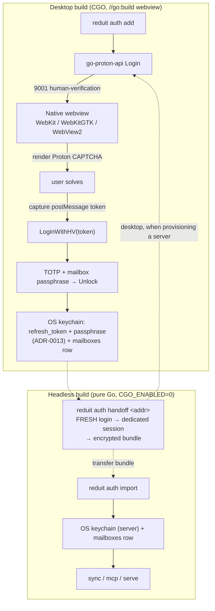

# ADR-0021: Native-webview human verification, desktop bootstrap, headless token import

- **Status:** proposed
- **Date:** 2026-07-01
- **Deciders:** Joe Stump
- **Amends:** [ADR-0006](ADR-0006-sqlite-persistent-store.md) (narrows the pure-Go /
  `CGO_ENABLED=0` posture to the default/headless build; the desktop auth build
  now links CGO)
- **Relates to:** [ADR-0001](ADR-0001-go-proton-api-as-proton-client.md),
  [ADR-0012](ADR-0012-single-user-local-first.md),
  [ADR-0013](ADR-0013-secrets-in-os-keychain.md); issue #126

## Context and Problem Statement

`reduit auth add` authenticates to Proton via `go-proton-api` (ADR-0001). On a
real account the very first call returns Proton's anti-abuse wall — HTTP 422,
API code **9001**, "please complete CAPTCHA" — and a legitimate, current client
app version (`web-mail@<version>`) does **not** avoid it. To pass it, the client
must present the solved CAPTCHA token back on the login retry (the
`x-pm-human-verification-token` header).

The problem is capturing that token. Proton's CAPTCHA delivers the solved token
**only via `window.parent.postMessage`** to an *embedding* page, and its assets
set a `frame-ancestors` Content-Security-Policy that permits embedding **only
from a `proton.me` origin**. Consequently:

- A plain browser tab (`open <captcha-url>`) *renders* the CAPTCHA but the token
  is `postMessage`d to the tab itself — there is no channel back to reduit.
- Re-serving or reverse-proxying the CAPTCHA through a `127.0.0.1` loopback
  origin is blocked by `frame-ancestors` (and the CAPTCHA's own cross-origin /
  proof-of-work calls would hit CORS). This was attempted (#126) and does not
  work.

So capturing the token requires **controlling the surface that renders the
CAPTCHA**. Separately: a **headless** reduit (a server running `sync`/`mcp`) has
no display and cannot present a CAPTCHA at all — yet it still needs Proton
credentials. How should reduit obtain the token on desktop, and how should a
headless host authenticate?

## Decision Drivers

- **Token capture is mandatory** and requires controlling the render surface
  (embed-and-listen, or drive-the-browser).
- **Robustness over cleverness.** Proton Bridge — built on this same
  `go-proton-api` — solves this with a controlled native webview. That is the
  proven, effectively-sanctioned path.
- **Preserve the ADR-0006 benefit where it matters.** The server/headless path
  (`store`, `sync`, `mcp`, `serve`) must stay pure-Go, `CGO_ENABLED=0`, and
  cross-compilable — that is reduit's deployment target and the whole reason
  ADR-0006 chose `modernc` sqlite over CGO.
- **Headless cannot solve a CAPTCHA interactively** — it needs a credential
  minted somewhere with a display.

## Considered Options

1. **Loopback iframe / reverse proxy (pure Go).** Re-serve or MITM-proxy Proton's
   CAPTCHA through `127.0.0.1`, stripping CSP.
2. **Drive a real browser via `chromedp` (pure Go, Chrome DevTools Protocol).**
   Navigate a controlled Chrome top-level to the real CAPTCHA URL (proton.me
   origin → no `frame-ancestors`/CORS problem), inject a listener over CDP, read
   the token out.
3. **Native OS webview (the Proton Bridge method, CGO).** Embed the CAPTCHA in a
   webview reduit controls — WebKit (macOS), WebKitGTK (Linux), WebView2
   (Windows) — render and capture the token in a clean-room context.
4. **Session import only.** No in-app solve: the user logs into Proton on the web
   normally (passing CAPTCHA + 2FA via Proton's own UI) and reduit adopts that
   session.

## Decision Outcome

**Chosen: option 3 (native webview) for desktop bootstrap, plus option 4
(import) for headless.**

- **Desktop bootstrap.** `reduit auth add` opens a **native OS webview**, renders
  Proton's CAPTCHA, captures the `postMessage` token, and continues to the
  existing TOTP + mailbox-passphrase steps. **Bootstrapping a mailbox requires a
  desktop.**
- **CGO is contained behind a build tag.** The webview links CGO (WebKit /
  WebKitGTK / WebView2). It lives behind a build tag (e.g. `//go:build webview`)
  so the **default/headless build stays pure-Go, `CGO_ENABLED=0`, and
  cross-compilable** — `store`/`sync`/`mcp`/`serve` are unchanged and never link
  the webview. Two build variants ship: a desktop build (webview, CGO) and a
  headless build (no webview, pure Go).
- **Headless via `handoff` (a fresh desktop login).** A headless host does
  **not** solve CAPTCHAs. Instead, `reduit auth handoff <address>` on the desktop
  performs a **fresh interactive login** (webview CAPTCHA → TOTP → passphrase) to
  mint a **new, independent Proton session dedicated to the headless host**, and
  packages that session (`proton_user_id`, `address`, `refresh_token`,
  `mailbox_passphrase`) into an **encrypted bundle**. The headless host imports
  it (`reduit auth import`), decrypting into the local OS keychain (ADR-0013) and
  creating the `mailboxes` row; sync/MCP then run normally. Because `handoff`
  mints a *distinct* session, the desktop's own session is untouched — the two
  hosts never share a single, rotating refresh token.
- **Reuse, not replace, the #126 plumbing.** The `HVRequiredError` /
  `Captcha` / `LoginWithHV` wrapper surface from #126 is retained; the webview
  simply becomes the desktop token source in place of the CSP-blocked loopback
  page. `chromedp` (option 2) was the pure-Go runner-up; it is rejected as the
  default because it depends on a Chrome/Chromium runtime and drives the user's
  browser profile, whereas a controlled webview is a clean-room render with zero
  runtime dependency on macOS. It remains a possible fallback for platforms
  where the native webview is unavailable.

### Consequences

**Positive**

- Robust, Bridge-proven CAPTCHA handling; no fragile CSP/CORS/proof-of-work
  fighting that breaks when Proton changes the widget.
- The headless/server binary stays **pure-Go and cross-compilable** — ADR-0006's
  benefit is preserved exactly where reduit is deployed unattended.
- On macOS the webview is `WebKit.framework`, present by default — **zero runtime
  dependency** for the common desktop bootstrap.

**Negative**

- **CGO re-enters for the desktop auth build.** It needs a C toolchain to build;
  a Linux *desktop* build needs `libwebkit2gtk`; Windows needs the WebView2
  runtime. This is the concrete amendment to ADR-0006's "CGO-free everywhere."
- Two build variants to produce, test, and document (desktop-webview vs.
  headless-pure-Go), and the desktop build loses trivial cross-compilation.
- The **`handoff` credential path** is a sensitive surface: the bundle carries
  the `mailbox_passphrase` (which unlocks the OpenPGP keys) and the refresh
  token. It must be encrypted at rest and in transit (AEAD with a random nonce +
  a user-supplied passphrase/key) and warrants its own spec + threat note.
- `handoff` costs the operator a **second interactive login** (another CAPTCHA +
  2FA) per headless host, since each host gets its own session. Accepted as the
  price of avoiding a shared rotating token.

**Operational**

- **Token rotation — resolved.** Proton refresh tokens rotate on every use
  (`go-proton-api`'s `authRefresh` overwrites `c.ref`), so two hosts must never
  share one session. `handoff` resolves this by performing a **fresh desktop
  login to mint a dedicated session** for the headless host; desktop and headless
  then hold independent `{UID, refresh_token}` pairs and never race. (Proton
  allows multiple concurrent sessions; `go-proton-api` exposes session
  list/revoke — `GET`/`DELETE /auth/v4/sessions` — but no child-session *fork*,
  so a fresh login is the mechanism.)
- Single-host use (bootstrap and run on the same desktop) involves no `handoff`
  and no rotation race at all.
- **Platform fallback.** Where a native webview is unavailable (e.g. a Linux
  desktop without WebKitGTK), the user falls back to the session-import path or
  the `chromedp` runner.

### Confirmation

- The desktop build (with the `webview` tag) completes an interactive
  `reduit auth add` past a live 9001 challenge on a real account, reaching TOTP
  and then `active`.
- The default/headless build compiles with `CGO_ENABLED=0`, cross-compiles, and
  contains no webview symbols.
- A `reduit auth handoff` on desktop mints a distinct session and its bundle
  imports on a second (headless) host, where `reduit labels` and `sync` then
  succeed — while the desktop's own session keeps working, unaffected.

## Architecture

## More Information

- **Amends [ADR-0006](ADR-0006-sqlite-persistent-store.md).** ADR-0006's SQLite /
  `modernc` decision stands unchanged; this ADR only narrows the *implied*
  "CGO-free everywhere" posture to the default/headless build and admits CGO for
  the optional desktop `webview` build.
- **[ADR-0013](ADR-0013-secrets-in-os-keychain.md)** owns where the two secrets
  live; this ADR adds the desktop→headless *transport* for them (export/import),
  which ADR-0013 previously left to "documented operator setup."
- **[ADR-0001](ADR-0001-go-proton-api-as-proton-client.md)** — the human
  verification, CAPTCHA fetch, and HV-token retry are all `go-proton-api`
  primitives (`GetCaptcha`, `NewClientWithLoginWithHVToken`, `APIHVDetails`).
- **Issue #126** implemented the HV wrapper surface and the (now-superseded for
  desktop) loopback token capture. A follow-up spec should formalize the webview
  bootstrap and the export/import credential flow (including the token-handoff
  resolution).
