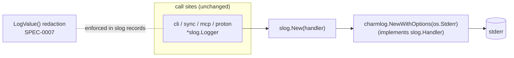

# ADR-0022: Structured logging via charmbracelet/log (as an slog.Handler)

- **Status:** accepted (shipped 2026-07-03)
- **Date:** 2026-07-03
- **Deciders:** Joe Stump

## Context and Problem Statement

Reduit's logging goes through the standard library: every call site holds a
`*slog.Logger`, and the root builder (`internal/cli/root.go`) wires either
`slog.NewTextHandler` or `slog.NewJSONHandler` to stderr from
`config.LoggerConfig{Level, Format}`. That works, but the stdlib text handler
is spartan — dense `key=value` on one line, no color, no level styling — and
reduit is a developer-facing local-first CLI (ADR-0012) where readable
day-to-day logs matter.

The sibling app `msgbrowse` already settled this for itself: its ADR-0008
adopts `github.com/charmbracelet/log` for human-friendly structured logs. We
want the same nicer developer experience and cross-app consistency, **without**
disturbing two things reduit already got right:

- The **slog API surface**. Six files pass `*slog.Logger` around; none should
  change. The go-proton-api `resty.Logger` shim (ADR-0001, `internal/proton/logger.go`)
  and the discard-default loggers in `internal/mcp` and `internal/sync` are all
  slog-based and must keep working untouched.
- The **secret-redaction discipline** (SPEC-0007 "No Secret Leakage"). Redaction
  is enforced at the slog level — secret-bearing types carry `LogValue()`, and
  the auth path logs structure, not secret values. That guarantee must survive
  the backend swap unchanged.

The question is narrow: can we get charmbracelet/log's output without touching
call sites or the redaction model?

## Decision Drivers

- **Human-friendly logs by default**, JSON when a machine consumes them.
- **Zero churn at call sites.** `*slog.Logger` stays the currency; only the
  handler changes.
- **Redaction preserved.** Secret non-leakage is a slog-level concern (`LogValue()`);
  the backend must not be able to bypass it.
- **stderr only.** Logs must stay on stderr — stdout carries MCP JSON-RPC
  (SPEC-0006) and auth prompts (SPEC-0007). A log line on stdout corrupts the
  protocol.
- **Pure Go / `CGO_ENABLED=0`** preserved (ADR-0006). No new cgo may creep in.

## Considered Options

1. **Keep the stdlib text/JSON handlers (status quo).** Zero dependencies,
   fully adequate for machines. But the text output is plain and unstyled, and
   we forgo consistency with msgbrowse.
2. **charmbracelet/log used *as an slog.Handler*.** `*charmlog.Logger`
   implements `slog.Handler`, so we construct one and hand it to `slog.New(...)`.
   Call sites, the resty shim, and redaction are all untouched; only the root
   handler construction changes. Pure Go.
3. **zerolog or zap.** Both are fast, mature structured loggers. But each wants
   to be *the* logger API, pulling call sites off slog (or forcing a second
   adapter), and neither buys the styled dev output or the msgbrowse
   consistency that motivates the change. More churn, less benefit.

## Decision Outcome

**Chosen: option 2 — adopt `github.com/charmbracelet/log`, used as an
`slog.Handler`.**

- **Backend, not API.** charmbracelet/log's `*log.Logger` satisfies
  `slog.Handler`. The root builder constructs
  `charmlog.NewWithOptions(os.Stderr, …)` and wraps it with `slog.New(…)`,
  still returning a `*slog.Logger`. Every call site keeps its `*slog.Logger`;
  nothing else in the tree knows the backend changed.
- **Single construction point.** The only code that changes is
  `buildLogger`/`buildLoggerTo` in `internal/cli/root.go`. The stdlib
  `slog.NewTextHandler`/`slog.NewJSONHandler` imports leave that builder.
- **Format mapping.** `LoggerConfig.Format` `"text"` (the default) → charm's
  human-readable `TextFormatter` (styled, level-colored); `"json"` →
  `charmlog.JSONFormatter` for machine consumers.
- **Level mapping.** `LoggerConfig.Level` `debug`/`info`/`warn`/`error` →
  `charmlog.DebugLevel`/`InfoLevel`/`WarnLevel`/`ErrorLevel`; any unrecognized
  value (and the empty string) falls back to `InfoLevel`. `--verbose` still
  forces `debug` upstream in `loadConfigUnchecked`.
- **stderr, with timestamps.** Output goes to `os.Stderr` with
  `ReportTimestamp: true`. Caller reporting is left off (not idiomatic/cheap
  enough to justify by default).
- **Redaction unchanged — enforced across formats.** Redaction lives in the
  slog records (`LogValue()`, structure-only auth logging). charmbracelet/log
  v1.0.0's text formatter does **not** resolve `slog.LogValuer` (the stdlib
  `TextHandler` did), so the charm handler is wrapped in a small
  `resolvingHandler` that resolves LogValuer attrs — per-record and via
  `logger.With`, recursing into groups — before delegating. That keeps
  `LogValue()` redaction working in **both** text and json, so the guarantee
  holds in the default (text) format, not just json.
- **Fallback loggers untouched.** The go-proton-api resty shim
  (`internal/proton/logger.go`) and the discard-default loggers in
  `internal/mcp/server.go` and `internal/sync/engine.go` remain as-is — they
  are slog-based and orthogonal to the backend.

### Consequences

**Positive**

- Nicer, level-styled developer logs out of the box; JSON still available for
  machines.
- Call sites, the resty shim, and the redaction model are all unchanged — a
  one-function swap.
- ADR-0006 preserved: charmbracelet/log is pure Go; `CGO_ENABLED=0 go build`
  still succeeds and no cgo enters the graph.
- Consistency with msgbrowse (its ADR-0008).

**Negative**

- A new direct dependency (and its lipgloss/termenv transitive set), for a
  developer-experience gain rather than a functional one.

**Operational**

- `LoggerConfig{Level, Format}` semantics are unchanged; existing config keys
  keep working. Only the rendered text output looks different.

### Confirmation

- `TestBuildLogger_RedactsLogValuerInBothFormats` (`internal/cli/logger_test.go`)
  is the load-bearing redaction check: it logs a `LogValue()`-redacted
  secret-bearing type through **both** text and json, via both the per-record
  attr and the `logger.With` path, and asserts the placeholder is present and
  the raw secret is absent. This test fails without the `resolvingHandler`
  wrapper (text leaked the raw struct) and passes with it — it is what confirms
  redaction survives the backend swap in the default format. (The older
  `TestErrorsNeverContainSecrets`/prompt-echo tests only checked error strings
  and never exercised `LogValue()` through the handler.)
- The construction test asserts the built `*slog.Logger`'s handler is the
  `resolvingHandler` wrapping a `*charmlog.Logger` for `text`, `json`, and the
  empty format, exercises both formatters' output, and pins the level mapping
  including the info fallback.
- A grep shows no `slog.NewTextHandler`/`slog.NewJSONHandler` remains in the
  root builder.
- `CGO_ENABLED=0 go build ./cmd/reduit` succeeds and `go mod verify` is clean.

## Architecture

## More Information

- **[ADR-0006](ADR-0006-sqlite-persistent-store.md)** fixes the pure-Go /
  `CGO_ENABLED=0` posture that charmbracelet/log preserves.
- **[ADR-0001](ADR-0001-go-proton-api-as-proton-client.md)** owns the
  go-proton-api `resty.Logger` slog shim, which is untouched by this change.
- **SPEC-0007 "No Secret Leakage"** (`docs/openspec/specs/onboarding-and-auth/`)
  normatively constrains logging; it now asserts charmbracelet/log as the
  backend behind the slog API.
- **SPEC-0006 (MCP tool surface)** requires logs on stderr so stdout carries
  only JSON-RPC; this decision keeps that invariant.
- msgbrowse ADR-0008 adopted charmbracelet/log first; this ADR mirrors that for
  reduit.
