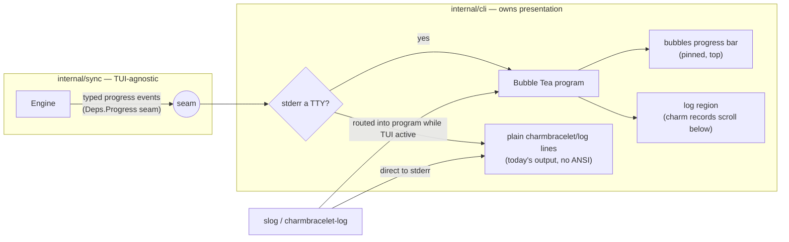

# ADR-0023: Sync progress bar via charmbracelet/bubbles (pinned bar, scrolling logs)

- **Status:** proposed
- **Date:** 2026-07-03
- **Deciders:** Joe Stump

## Context and Problem Statement

A first `reduit sync` backfill runs for minutes: it pages the entire mailbox's
metadata (the backfill window is filtered client-side — see
`internal/proton/backfill.go`), then fetches and decrypts every message in the
window one at a time. Until recently the run was silent; it now emits INFO
heartbeat logs (backfill starting / progress every 100 / complete), but there
is still no visual progress indicator. How should `reduit sync` show live
progress in an interactive terminal — without corrupting non-interactive
output (cron, CI, pipes) and without coupling the sync engine to a UI?

The owner's requirement is explicit: the progress bar MUST be implemented with
[charmbracelet/bubbles](https://github.com/charmbracelet/bubbles) and MUST stay
pinned at the top of the terminal during a sync while log lines scroll past
below it.

## Decision Drivers

- A long-running backfill needs an at-a-glance answer to "how far along, how
  much left" — heartbeat logs alone make the operator do arithmetic.
- The bar and the log stream must not fight: a naive progress line interleaved
  with log writes tears the terminal. The bar must own the top of the screen
  and logs must flow beneath it.
- Non-interactive invocations (cron / systemd timer / launchd / piped output)
  MUST keep today's plain log output — no ANSI control sequences in captured
  logs. The bar is a progressive enhancement, never a requirement.
- reduit already standardized on the charm ecosystem for terminal output:
  charmbracelet/log is the slog backend (ADR-0022). The charm libraries are
  designed to compose (a charm log writer can be routed through a Bubble Tea
  program).
- The sync engine (`internal/sync`) is presentation-agnostic today; it must
  stay that way (no TUI imports in the engine — the CLI owns rendering).
- Pure-Go / `CGO_ENABLED=0` posture (ADR-0006) must be preserved.

## Considered Options

1. charmbracelet/bubbles progress component in a Bubble Tea program (bar
   pinned on top, logs scrolling below)
2. Status quo: INFO heartbeat logs only
3. Hand-rolled ANSI carriage-return progress line
4. A dedicated progress-bar library outside the charm ecosystem (vbauerster/mpb,
   schollz/progressbar)

## Decision Outcome

Chosen option: **charmbracelet/bubbles progress component in a Bubble Tea
program**, because it is the owner's stated requirement, it is the only option
that cleanly composes a pinned bar with a scrolling log region (Bubble Tea owns
the screen; log lines are injected into the program rather than racing it), and
it keeps reduit inside the charm terminal stack it already adopted with
ADR-0022.

The shape of the integration:

- **Engine seam, not engine dependency.** `internal/sync` gains a small
  progress-reporting seam on its `Deps` (a callback or channel carrying typed
  progress events: backfill enumerated N, message M of N applied, tail batch
  applied, mailbox done). The engine imports neither bubbletea nor bubbles;
  `internal/cli` owns all presentation. A nil reporter is a no-op.
- **TTY-gated.** The Bubble Tea program runs only when the output is a
  terminal. Otherwise `reduit sync` behaves exactly as today: plain
  charmbracelet/log lines, no TUI, no ANSI garbage. `--watch` composes with
  both modes.
- **Logs under the bar.** While the TUI is active, the slog/charm log stream is
  routed into the Bubble Tea program (the program's writer seam /
  `tea.Println`) so records render below the pinned bar instead of tearing it.
  When the program exits (sync done or interrupted), logging reverts to plain
  stderr and the final summary table prints as today.
- **Progress math.** The backfill has a real denominator (len of
  `BackfillMessageIDs`) → a determinate bar. The tail phase has no meaningful
  total → indeterminate presentation (spinner/percent-less bar) fed by batch
  events.

### Consequences

- Good, because a long first sync finally shows live, glanceable progress with
  logs still fully visible beneath the bar.
- Good, because the engine stays TUI-agnostic behind a typed progress seam that
  any future surface (MCP observability #117, a local UI) can also consume.
- Good, because bubbles/bubbletea are pure Go — `CGO_ENABLED=0` and
  cross-compilation are unaffected (ADR-0006 posture stands).
- Good, because cron/CI/piped runs are byte-identical to today (TTY gate).
- Bad, because it adds bubbletea + bubbles (and their transitive charm deps) to
  `go.mod` for a single command's presentation.
- Bad, because a TUI event loop adds a concurrency surface (engine goroutines →
  program messages) that must be tested; a torn-down program must never
  swallow the run's error or the final summary.
- Neutral, because MCP stdout safety is untouched — sync is a CLI verb; the
  MCP server path never runs the TUI.

### Confirmation

- `internal/sync` has no bubbletea/bubbles import (grep-enforceable; the
  progress seam is typed events on `Deps`).
- A non-TTY run's output contains no ANSI escape sequences and matches the
  plain-log golden path (test with a pipe writer).
- A TTY run renders the bar at the top with log lines below it (manual
  verification + unit tests on the model's Update/View).
- `CGO_ENABLED=0 go build ./cmd/reduit` stays green; the SPEC that follows this
  ADR (sync progress UI) carries the normative scenarios.

## Pros and Cons of the Options

### 1. bubbles progress in a Bubble Tea program (chosen)

The bubbles `progress` component rendered by a small Bubble Tea model; engine
progress events arrive as program messages; log records are injected below the
bar.

- Good, because pinned-bar-plus-scrolling-logs is a first-class Bubble Tea
  layout — the framework owns the screen, so the bar and logs cannot tear.
- Good, because it stays in the charm stack reduit standardized on (ADR-0022);
  log records and TUI share styling conventions.
- Good, because bubbles' progress model (gradient bar, percent, spring
  animation) is mature and maintained.
- Good, because the engine seam it forces (typed progress events) is reusable
  beyond the TUI.
- Bad, because it is the heaviest dependency of the options.
- Bad, because Bubble Tea's event loop must be integrated carefully with the
  engine's goroutines and the `--watch` signal handling.

### 2. Status quo: INFO heartbeat logs only

Keep the "backfill progress done=1200 total=4200" lines as the only progress
surface.

- Good, because zero new dependencies and identical behavior everywhere.
- Good, because it already works in cron/CI by construction.
- Bad, because it fails the owner's stated requirement (a visible pinned bar).
- Bad, because operators must mentally diff log lines to estimate remaining
  work; no at-a-glance completion signal.

### 3. Hand-rolled ANSI carriage-return progress line

Print `\r`-rewritten progress to stderr between log writes.

- Good, because it is dependency-free and simple for the happy path.
- Bad, because it fights the log stream: any log line printed while the bar is
  live tears the output; solving that properly reinvents a screen-owning event
  loop — i.e., Bubble Tea, badly.
- Bad, because terminal-width handling, resize, and cleanup on interrupt are
  all manual and historically buggy.
- Bad, because it fails the requirement to use bubbles.

### 4. mpb / progressbar (non-charm progress libraries)

`vbauerster/mpb` or `schollz/progressbar`, mature bar libraries with log-safe
writers.

- Good, because they are purpose-built for progress bars and lighter than a
  full TUI framework.
- Neutral, because pure Go, so the build posture would survive.
- Bad, because composing "pinned bar + scrolling structured logs" is exactly
  their weak spot — their log-bypass writers reorder or buffer charm's styled
  output unpredictably.
- Bad, because it splits reduit's terminal stack across two ecosystems
  (charm for logs, another for progress) for no capability gain.
- Bad, because it fails the requirement to use bubbles.

## Architecture Diagram

## More Information

- Owner requirement (2026-07-03): bubbles-based progress bar, pinned on top,
  logs scrolling below, during `reduit sync`.
- Related: **ADR-0022** (charmbracelet/log as the slog backend — the log stream
  this bar must coexist with), **ADR-0006** (pure-Go posture bubbletea/bubbles
  preserve), **SPEC-0002** (sync bookkeeping/observability — the counts the bar
  renders), issue **#117** (MCP observability — a future consumer of the same
  progress seam).
- A follow-up spec (`/sdd:spec` — sync progress UI) carries the normative
  requirements and WHEN/THEN scenarios for the TTY gate, the pinned layout, the
  fallback path, and the engine seam.
- Reference: [charmbracelet/bubbles](https://github.com/charmbracelet/bubbles)
  (progress component), [charmbracelet/bubbletea](https://github.com/charmbracelet/bubbletea).
