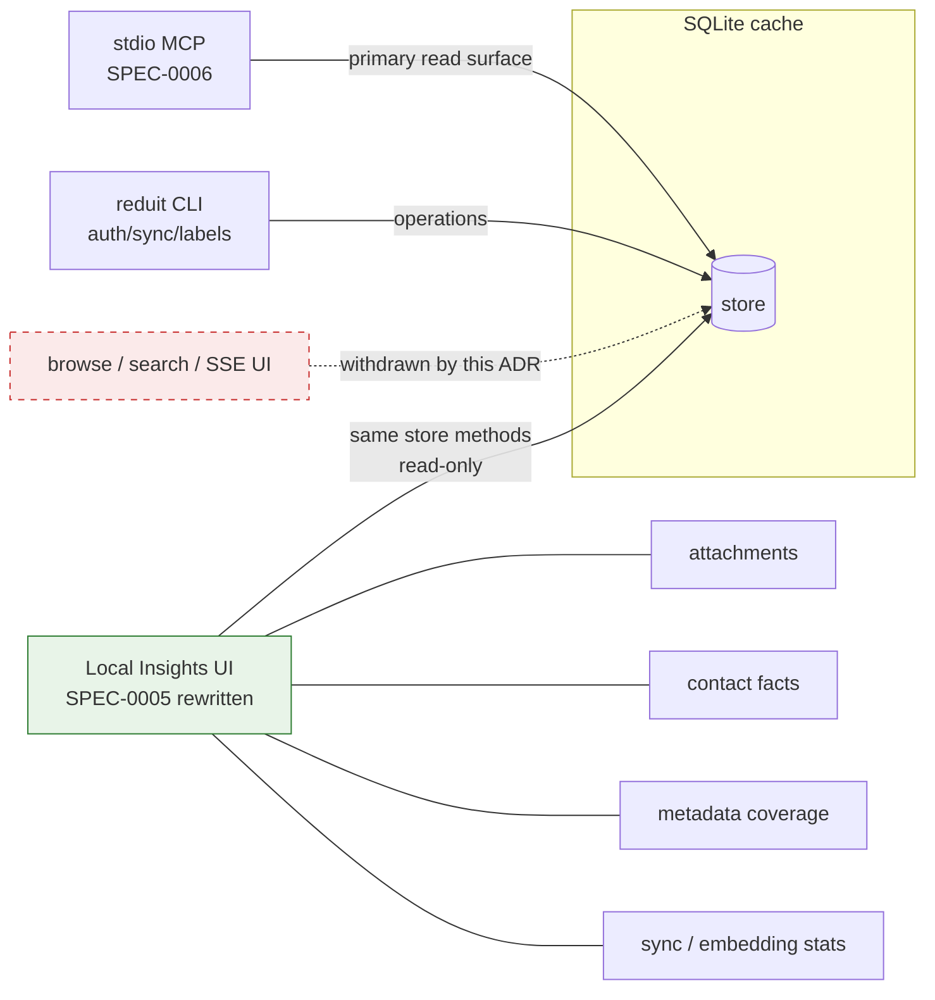

# ADR-0024: Drop the browse/search web UI; scope the local UI to insights (attachments, facts, metadata, stats)

- **Status:** proposed
- **Date:** 2026-07-03
- **Deciders:** Joe Stump

## Context and Problem Statement

SPEC-0005 specified an optional loopback HTMX web UI for browsing the cache
with human eyes: mailboxes → conversations → messages, keyword + semantic
search, media browsing, contact facts, and optional SSE live updates — a
sibling of the `msgbrowse` UI. None of it has been built (the `serve` command
is an honest stub), and the backlog carried a five-issue epic (#75,
#102–#105) for it.

Meanwhile the product's actual reading surface shipped elsewhere: the stdio
MCP (SPEC-0006, ADR-0017) is how the cache is consumed, by agents, with the
CLI for operations. A full browse/search web UI duplicates the MCP surface
for a single-user tool whose user reads mail in Proton's own clients — the
same "the UI is not the product" force that ADR-0005 already named. Should
reduit carry a full web UI at all, and if not, what human-facing surface is
worth keeping?

## Decision Drivers

- The MCP tool surface is the primary consumer of the cache; a browse/search
  UI re-implements it for no capability gain (ADR-0017's shared-store rule
  existed precisely because two read surfaces drift).
- Reduit's user already has full mail clients (Proton web/apps, and the
  sibling `msgbrowse` for archives); reduit's value is the RAG cache, not
  another mail reader.
- What a human *does* periodically want to see with eyes is what the cache
  has **derived**: extracted attachments, per-contact facts, message
  metadata coverage, and sync/embedding/extraction stats — none of which is
  a mail-reading experience.
- Every UI surface carries a hardening budget (CSP, escaping, path
  containment); it should be spent on the smallest surface that earns it.
- Owner decision (2026-07-03): no full-blown UI; re-introduce something
  closer to an attachment/fact/metadata/stats surface.

## Considered Options

1. Keep the full browse/search UI on the backlog (status quo)
2. Drop the web UI entirely — MCP + CLI only
3. Scope the local UI to a lightweight **insights** surface: attachments,
   contact facts, metadata, and stats — no browse, no search UI

## Decision Outcome

Chosen option: **scope the local UI to a lightweight insights surface**,
because it keeps the one thing a web page is genuinely better at (glanceable
derived-data dashboards, clickable attachment/fact listings) while deleting
the redundant mail-reading surface and most of the attack/maintenance
budget. The MCP remains the primary read surface; the CLI remains the
operational surface.

Concretely:

- The browse (mailboxes → conversations → messages), keyword/semantic search
  UI, and SSE live-update requirements of SPEC-0005 are **withdrawn**.
  Epic #75 and issues #102–#105 are closed won't-fix.
- SPEC-0005 is rewritten as **Local Insights UI**: attachment browsing
  (path-contained serving), contact facts with citations, message/mailbox
  metadata coverage, and cache/sync/embedding stats — read-only over the
  same `store` methods the MCP uses (no drift).
- The security posture carries over unchanged: optional loopback-only HTTP
  server, no authentication (the OS user is the identity), strict self-only
  CSP, `html/template` escaping of all untrusted strings.
- ADR-0005's stack decision (HTMX, Tailwind 4, DaisyUI, server-rendered, no
  runtime build step) **stands** for this smaller surface; only its scope is
  narrowed. SSE drops from "retained if needed" to out of scope.
- The insights UI is future work, scheduled by the owner; fresh issues get
  cut against the rewritten SPEC-0005 when it is.

### Consequences

- Good, because the redundant second read-surface (and its drift risk
  against the MCP) is gone.
- Good, because the remaining UI is small enough that its hardening
  requirements (CSP, escaping, containment) cover pages that mostly render
  reduit-derived data rather than raw hostile mail bodies.
- Good, because five stale backlog issues close and the spec stops
  describing software nobody intends to build.
- Bad, because a human cannot eyeball a cached conversation in reduit; they
  must use Proton's clients or the MCP through an agent.
- Neutral, because `reduit serve` remains a stub either way until the
  insights UI is scheduled.

### Confirmation

- SPEC-0005 (spec.md + design.md) describes only the insights scope; no
  requirement mentions conversation browsing, a search UI, or SSE.
- Epic #75 and #102–#105 are closed won't-fix referencing this ADR.
- When built, the insights UI's handlers call the same `store` methods as
  the MCP tools (grep-checkable, per ADR-0017), and `internal/` contains no
  browse/search HTTP handlers.

## Pros and Cons of the Options

### 1. Keep the full browse/search UI (status quo)

- Good, because a human could read the cache end-to-end without an agent.
- Bad, because it duplicates the MCP read surface and Proton's own clients.
- Bad, because browse/search pages render raw hostile mail content — the
  maximum-hardening surface — for minimal added value.
- Bad, because it is the largest remaining epic on a single-user tool.

### 2. Drop the web UI entirely

- Good, because zero UI surface, zero hardening budget.
- Good, because MCP + CLI already cover agents and operations.
- Bad, because derived-data inspection through an agent chat or sqlite3 is
  a poor experience for "what did extraction find?" and "how healthy is the
  cache?" — glanceable pages earn their keep there.
- Bad, because attachment viewing through MCP (base64 through an agent) is
  actively worse than a browser.

### 3. Lightweight insights UI (chosen)

- Good, because it keeps the genuinely web-shaped views (attachments,
  facts, stats) and nothing else.
- Good, because the ADR-0005 stack and SPEC-0005 security posture transfer
  directly to a smaller page set.
- Neutral, because it still requires the loopback server + hardening
  baseline, just over fewer, lower-risk pages.
- Bad, because scope creep pressure ("just add a message view") will need
  this ADR to point at.

## Architecture Diagram

## More Information

- Owner decision (2026-07-03) closing epic
  [#75](https://gitea.stump.rocks/joestump/reduit/issues/75) and
  [#102](https://gitea.stump.rocks/joestump/reduit/issues/102)–[#105](https://gitea.stump.rocks/joestump/reduit/issues/105)
  won't-fix.
- Narrows the scope of **ADR-0005** (frontend stack — the stack decision
  stands); consistent with **ADR-0012** (single-user local-first),
  **ADR-0017** (stdio MCP primary, shared store, no drift), **ADR-0006**
  (SQLite cache).
- Governs the rewritten **SPEC-0005** (Local Insights UI).
