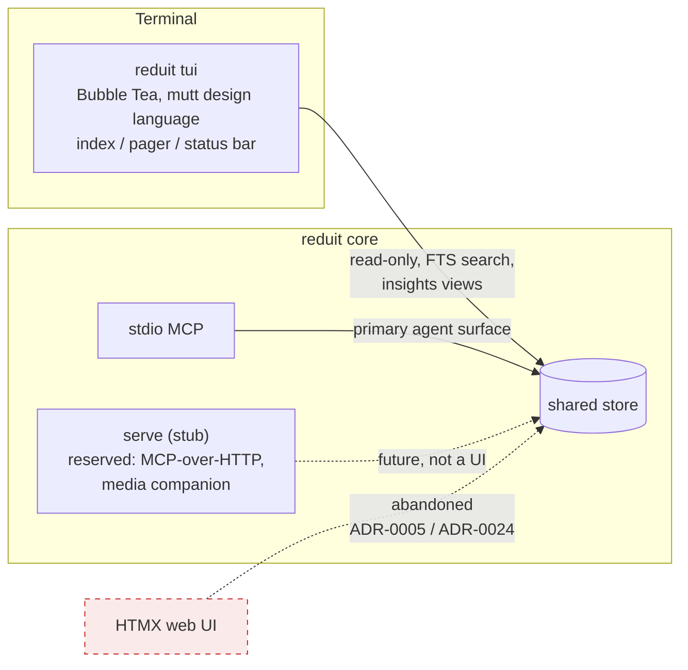

# ADR-0025: Abandon the web UI; the local human surface is a Bubble Tea TUI in a mutt-inspired design language

- **Status:** proposed
- **Date:** 2026-07-03
- **Deciders:** Joe Stump

## Context and Problem Statement

ADR-0024 (earlier the same day) narrowed the never-built HTMX web UI to a
lightweight "insights" web surface. The owner has since decided to abandon
the web UI **entirely**: reduit's human-facing surface will be a local
**terminal UI** built on Bubble Tea, styled as a loving homage to `mutt` —
mutt as *design language* (dense index rows, pager, status bar, keyboard-
first interaction), not as a feature-for-feature clone. What surface does
reduit ship for human eyes, on what stack, and what happens to the web-UI
artifacts and the `serve` command?

## Decision Drivers

- reduit's terminal stack is already charm end-to-end: charmbracelet/log
  (ADR-0022) and bubbletea/bubbles/lipgloss shipped with the sync progress
  bar (ADR-0023). A TUI adds **zero new ecosystems**; a web UI maintains a
  second one (HTMX/Tailwind/DaisyUI) for a single-user tool.
- A TUI deletes the entire web hardening budget: no HTTP listener for the
  UI, no CSP, no cookie/auth questions, no hostile-HTML rendering — the
  terminal renders text through lipgloss, and `html/template` concerns
  vanish.
- The owner has a Bubble Tea **design system** (Claude Design) to serve as
  the normative style reference — the design investment lands directly.
- mutt is the right aesthetic for the product: reduit is a keyboard-first,
  local-first mail *cache* tool used by a terminal-native operator.
- The MCP (ADR-0017) remains the primary read surface for agents; the
  shared-store no-drift rule applies to a TUI exactly as it did to the web
  UI.
- `serve` retains non-UI value: a potential MCP-over-HTTP transport and a
  media-companion endpoint (serving an attachment to a browser beats
  base64 in a terminal), so the command should not be deleted with the UI.

## Considered Options

1. Ship the ADR-0024 insights **web** UI as decided
2. **Bubble Tea TUI** in a mutt-inspired design language (no web UI at all)
3. No human surface — MCP + CLI verbs only

## Decision Outcome

Chosen option: **Bubble Tea TUI**, because it puts the human surface in
the ecosystem reduit already ships, deletes the web attack/maintenance
budget outright, and matches how the product is actually used. This
supersedes ADR-0024's insights-web decision through exactly the
revisit-by-ADR discipline ADR-0024 required.

Concretely:

- **Surface**: a `reduit tui` command (working name) hosting a full-screen
  Bubble Tea program. v1 scope: the insights views (attachments, contact
  facts, metadata coverage, sync/embedding stats), **keyword/FTS search**
  (mutt-style `/` and limit) with a results index and a message pager to
  read hits, all read-only over the shared store. Semantic/hybrid search
  joins when the embeddings vertical (SPEC-0008) ships. Compose/send is
  out of scope for v1.
- **Design language**: mutt-inspired — index rows, pager, status line,
  single-key bindings, help footer — with the owner's Bubble Tea design
  system as the normative style reference (SPEC-0005 design.md).
- **Web UI**: abandoned. ADR-0024's insights-web scope is superseded;
  ADR-0005's HTMX/Tailwind/DaisyUI stack is retired for good (banner
  update); no `internal/` HTTP UI handlers will exist.
- **`serve`**: retained as a stub, explicitly **not a UI** — reserved for
  MCP-over-HTTP and/or a loopback media-companion endpoint (e.g. handing
  an attachment to a browser). ADR-0011 narrows to that scope. Whether it
  ever ships is a future decision.
- **Images**: in-terminal image rendering (Kitty graphics protocol,
  iTerm2 inline images, Sixel) is noted as a v2 possibility on supporting
  terminals, with open-in-default-app (and later possibly `serve`) as the
  universal fallback. Not a v1 requirement.
- **Artifacts**: SPEC-0005 is rewritten again as **Local TUI**; ADR-0024's
  status gains a superseded-by note; the won't-fix closures of #75 and
  #102–#105 stand (they were web-UI issues).

### Consequences

- Good, because one terminal stack serves logs, progress, and now the
  whole human surface; skills and styles compose (the progress-bar
  TTY/teardown discipline carries straight over).
- Good, because the web hardening budget (CSP, escaping, listener
  exposure) is deleted rather than defended.
- Good, because search + reading return to the human surface (withdrawn
  from the web UI by ADR-0024) at terminal cost, not web cost — FTS only
  in v1.
- Bad, because a TUI is single-machine-by-construction: no phone/tablet
  glance-at-it story, ever (accepted: that is what Proton's clients are
  for).
- Bad, because rich media in terminals is protocol-fragmented (Kitty/
  iTerm2/Sixel vs Terminal.app's nothing); v1 punts to open-in-app.
- Neutral, because `serve` remains a stub either way; ADR-0011 survives
  in narrowed form rather than retiring.

### Confirmation

- SPEC-0005 (spec.md + design.md) describes the TUI; no requirement
  mentions HTTP, HTML, or CSP.
- No `internal/` package registers UI HTTP routes; the TUI imports
  bubbletea/bubbles/lipgloss and reads only `store` methods shared with
  the MCP (grep-checkable, ADR-0017).
- ADR-0024 carries a superseded-by-ADR-0025 status note; ADR-0005's
  banner records the stack retirement.

## Pros and Cons of the Options

### 1. Insights web UI (ADR-0024 as decided)

- Good, because glanceable dashboards and clickable attachments are
  web-native strengths.
- Bad, because it keeps a second frontend stack + the full web hardening
  budget alive for a single-user tool.
- Bad, because the owner does not want it — a surface nobody wants is
  pure liability.

### 2. Bubble Tea TUI, mutt design language (chosen)

- Good, because it reuses the shipped charm stack and the owner's design
  system; keyboard-first matches the operator.
- Good, because no listener, no web attack surface, offline-native.
- Neutral, because TUI testing is model-level (Update/View) rather than
  httptest — the progress bar already established the pattern.
- Bad, because media/graphics are second-class in terminals.

### 3. No human surface (MCP + CLI only)

- Good, because zero UI cost of any kind.
- Bad, because inspecting facts/attachments/stats through an agent chat
  or sqlite3 is a poor experience, and the owner explicitly wants a
  human surface.

## Architecture Diagram

## More Information

- Supersedes the insights-web scope of **ADR-0024** (which required
  exactly this: scope changes arrive by superseding ADR). Retires the
  **ADR-0005** frontend stack. Builds on **ADR-0023** (Bubble Tea already
  in-tree, TTY gate + teardown discipline), **ADR-0022** (charm log),
  **ADR-0017** (shared store, MCP primary), **ADR-0012** (single-user
  local-first). **ADR-0011** narrows to serve's reserved non-UI role.
- Normative style reference: the owner's Bubble Tea design system
  (Claude Design) — to be linked in SPEC-0005 design.md when shared.
- Owner decisions (2026-07-03): mutt as design language; keep `serve`
  for MCP/media possibilities; keyword/FTS-only search in v1.
