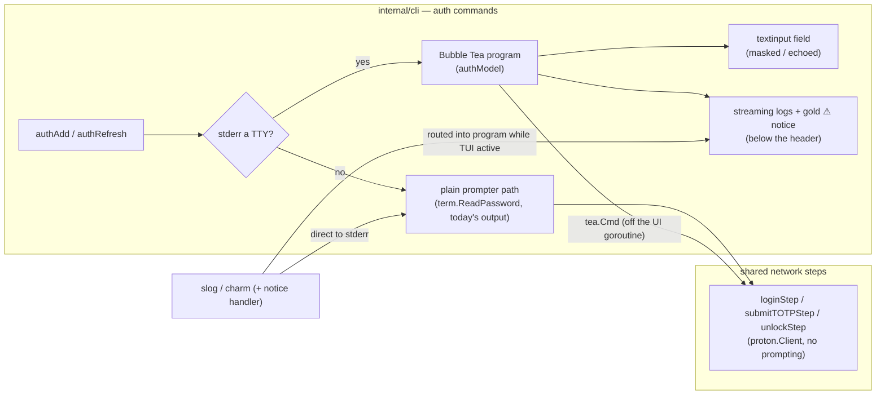

# ADR-0026: Interactive auth TUI via Bubble Tea (request/response form over the auth network sequence)

- **Status:** accepted (2026-07-04)
- **Date:** 2026-07-04
- **Deciders:** Joe Stump

## Context and Problem Statement

`reduit auth add` and `reduit auth refresh` are interactive: they read a Proton
password, an optional TOTP code, and a mailbox passphrase from the terminal,
interleaved with network calls (`Login` → `SubmitTOTP` → `Unlock`). Today those
prompts are bare `fmt.Fprint` labels with `term.ReadPassword`
(`internal/cli/prompt.go`), and the go-proton-api client logs raw diagnostics to
stderr around them. The result is visually inconsistent with the rest of the
product — which now has a mutt-inspired Bubble Tea design language (ADR-0025) and
a pinned-bar-over-scrolling-logs sync UI (ADR-0023) — and it is actively
confusing: on `auth refresh` the expected cheap-resume probe hits a
scope-downgraded session and logs a red `403 / 9101` error before the flow falls
back to interactive re-login exactly as designed, so a normal refresh looks
broken.

How should the interactive auth flow present its input and progress — matching
the TUI design language and taming the benign diagnostics — without coupling the
auth network logic to a UI, without regressing non-interactive/piped auth, and
without ever letting the TUI own a secret?

The complication that makes this a distinct decision from ADR-0023: the sync bar
is **observe-only** (the engine runs to completion and merely emits progress).
Auth is **request/response** — the UI must collect a field, hand it to a network
call, and use that call's result to decide the next field (TOTP only if the
account has it; passphrase only after login succeeds). The presentation layer
has to drive an async state machine, not just watch one.

## Decision Drivers

- The interactive auth surface should match the TUI design language (ADR-0025)
  and reuse the pinned-header-over-scrolling-logs pattern already built for sync
  (ADR-0023), rather than inventing a second presentation idiom.
- Secrets must never leak (SPEC-0007 "No Secret Leakage"): password/TOTP/
  passphrase are read without echo today; a TUI must preserve that (masked
  input) and must not route secret values through logs or notices.
- The auth network sequence and its error handling (human-verification mapping
  per ADR-0021, TOTP-only 2FA, the immutable-account check, secret zeroing, the
  refresh cheap-resume escalation) are load-bearing and already correct. A TUI
  must **reuse** that logic, not fork it — any drift between an interactive and a
  piped path is a security and correctness risk.
- Non-interactive/piped auth (automation, a headless host unlocking a keyring
  out of band, tests) MUST keep working byte-for-byte. The TUI is a progressive
  enhancement gated on a TTY, exactly like the sync bar.
- The benign refresh-time `403 / 9101` scope diagnostic should read as an
  informational notice, not an error — but a genuine auth failure must still read
  as an error. The reclassification must be narrow and must not touch the sync
  engine's logging.
- Pure-Go / `CGO_ENABLED=0` posture (ADR-0006) must be preserved; bubbletea,
  bubbles, and lipgloss are already dependencies (ADR-0023/0025).

## Considered Options

1. A Bubble Tea program with `bubbles/textinput` fields whose model drives the
   auth network calls as `tea.Cmd`s between fields, TTY-gated, reusing the
   ADR-0023 pinned-header/log-injection pattern (chosen).
2. Status quo: keep the bare `term.ReadPassword` prompts; only silence the 403s.
3. Lightweight lipgloss styling of the existing prompter (styled labels, a
   header, a success line) with no Bubble Tea program and no async model.
4. Adopt `charmbracelet/huh` (a form library) for the input fields.

## Decision Outcome

Chosen option: **a TTY-gated Bubble Tea program whose model drives the auth
network sequence as `tea.Cmd`s between `bubbles/textinput` fields**, because it
is the only option that both matches the TUI design language and honors the
request/response nature of auth, while keeping the network logic shared with the
plain path so nothing forks.

The shape of the integration:

- **Shared network steps, not a forked state machine.** The `Login → SubmitTOTP
  → Unlock` sequence and its error classification are extracted from
  `interactiveAuth` into small, prompt-free step functions. The existing plain
  prompter path composes them unchanged (its signature and the `scriptPrompter`
  tests are untouched); the TUI model calls the *same* steps from inside its
  `tea.Cmd`s. There is exactly one implementation of the auth network logic.
- **TTY-gated, mirroring ADR-0023.** A single gate (`runAuthGated`, the analog
  of `runSyncGated`, reusing the same `isTerminal` seam) chooses once: on a
  terminal, the Bubble Tea form; otherwise today's plain prompter path,
  byte-for-byte. `auth add` and `auth refresh` both route through it.
- **Request/response model.** One model with a phase enum (`password →
  loggingIn → totp → submitTOTP → passphrase → unlocking → done/failed`). Each
  network step runs off the UI goroutine as a `tea.Cmd` returning a typed result
  message; `Update` folds the result to pick the next field. One reconfigured
  `textinput` masks the password/passphrase (`EchoPassword`) and echoes the
  TOTP.
- **Display-only, never the owner of secrets or results.** The passphrase is the
  only value that crosses teardown, and it crosses as the model's return value
  the caller already owns and zeroes — identical to today. Password and TOTP are
  zeroed inside their `tea.Cmd`s right after use. The success line and any error
  print from the caller *after* teardown, on a restored terminal, exactly as the
  sync summary does (ADR-0023).
- **Benign-scope notice via a scoped log handler.** A `slog.Handler` wrapper,
  installed **only** on the logger handed to the proton dialer for the auth
  commands, inspects records before formatting: the expected salts-scope
  `403 / 9101` during the refresh cheap-resume is downgraded from ERROR and
  tagged so it renders as a gold notice in the streaming-log region; a genuine
  auth error passes through as an error. The sync engine's logger is untouched.

### Consequences

- Good, because interactive auth finally matches the mutt/cyberpunk TUI design
  language and the confusing red 403 becomes a calm, explanatory notice.
- Good, because the auth network logic stays single-sourced: the plain and TUI
  paths cannot drift, so SPEC-0007's security invariants hold on both.
- Good, because non-interactive/piped auth is byte-identical to today (TTY gate),
  so automation and tests are unaffected.
- Good, because it reuses the ADR-0023 machinery (pinned header, log injection,
  `isTerminal`) rather than adding a second presentation idiom.
- Bad, because inverting a straight-line blocking prompt sequence into an async
  `tea.Cmd` state machine is more code and a new concurrency surface to test.
- Bad, because it deepens the CLI's dependence on the Bubble Tea event loop for a
  second command family.
- Neutral, because MCP stdout safety is untouched — auth is a CLI verb; the MCP
  server never runs this TUI.

### Confirmation

- The auth network steps have exactly one implementation; the plain path and the
  TUI model both call it (grep-enforceable; the `scriptPrompter` tests pass
  unchanged).
- A non-TTY `auth add`/`auth refresh` starts no Bubble Tea program and produces
  the same prompts/output as today (test via the `isTerminal` seam + a scripted
  prompter).
- Password and passphrase fields never echo characters; no secret value appears
  in any log record or notice (unit tests on the model and the notice handler).
- The refresh cheap-resume `403 / 9101` renders as a notice, not an error; a
  wrong-password failure still renders as an error.
- `CGO_ENABLED=0 go build ./cmd/reduit` stays green. The paired SPEC-0013 carries
  the normative WHEN/THEN scenarios.

## Pros and Cons of the Options

### 1. Bubble Tea textinput form driving the network sequence (chosen)

- Good, because it is the only option that matches the TUI design language AND
  models auth's request/response shape (fields chosen by network results).
- Good, because reusing the shared network steps keeps the plain and TUI paths
  from diverging.
- Good, because it composes with the ADR-0023 pinned-header/log-injection layout
  the streaming cute logs + notice depend on.
- Bad, because it is the heaviest option: an async model, a notice handler, and
  a new test surface.

### 2. Status quo prompts, only silence the 403s

- Good, because minimal effort and zero new surface.
- Bad, because it fails the owner's stated requirement (a full TUI) and leaves
  the prompts visually inconsistent with the rest of the product.

### 3. Lightweight lipgloss-styled prompts (no Bubble Tea program)

- Good, because it keeps `term.ReadPassword` (No Secret Leakage is trivially
  preserved) and is far less code.
- Good, because it still fixes the scary-403 problem.
- Bad, because it is not the full TUI the owner asked for: no focused fields, no
  spinner during network calls, no streaming-log region — a styled CLI, not the
  mutt surface.
- Neutral, because it could be a stepping stone, but the chosen option subsumes
  it.

### 4. charmbracelet/huh form library

- Good, because huh gives focused fields and validation out of the box.
- Bad, because huh's model owns the whole form lifecycle, which fights the
  request/response requirement (network calls must run *between* fields and
  decide the next one) — bending huh to that is more awkward than a purpose-built
  model.
- Bad, because it adds a dependency for capability the existing bubbles/textinput
  (already vendored) provides.

## Architecture Diagram

## More Information

- Owner requirement (2026-07-04): a full Bubble Tea TUI for interactive auth,
  with the benign refresh 403/9101 surfaced as a cute inline notice while logs
  stream.
- Related: **ADR-0023** (sync progress bar — the pinned-header/log-injection
  pattern and TTY gate this reuses), **ADR-0025** (Bubble Tea TUI design
  language), **ADR-0022** (charmbracelet/log as the slog backend the notice
  handler wraps), **ADR-0013** (secrets in the OS keychain — where the
  passphrase lands after the TUI), **ADR-0021** (identify as a Proton Bridge
  client to avoid human verification — the HV-required error the login step maps),
  **ADR-0006** (pure-Go posture bubbletea/bubbles preserve), **SPEC-0007**
  (onboarding & auth — the semantics and No Secret Leakage invariant this must
  hold).
- The paired **SPEC-0013** (Interactive Auth UI) carries the normative
  requirements and WHEN/THEN scenarios for the input masking, the TTY gate and
  fallback, the shared network steps, clean teardown/interrupt, and the
  benign-scope notice.
- Reference: [charmbracelet/bubbles](https://github.com/charmbracelet/bubbles)
  (textinput, spinner), [charmbracelet/bubbletea](https://github.com/charmbracelet/bubbletea).
