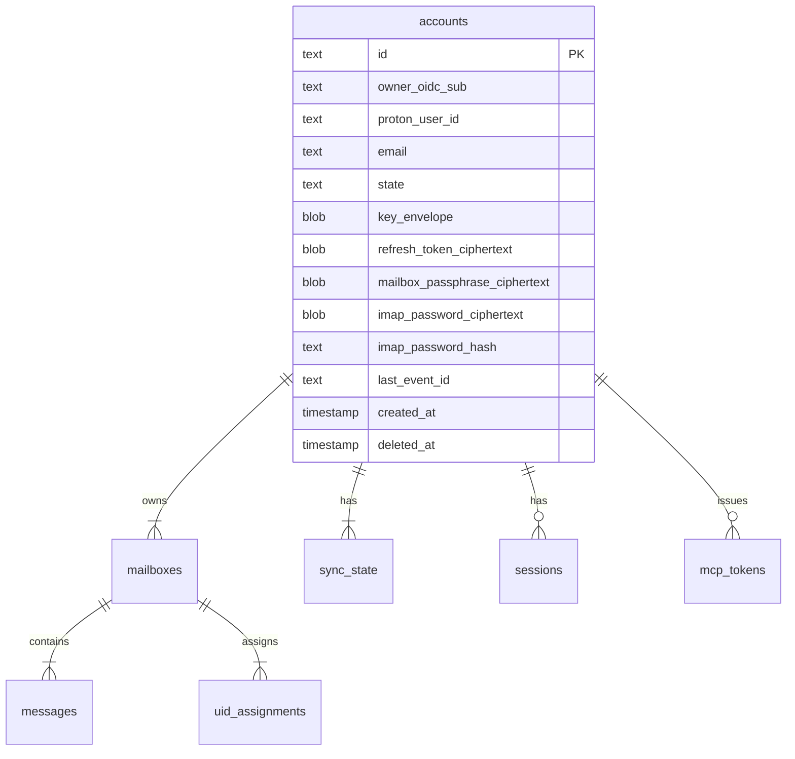

# Design: Account Model (SPEC-0001)

## Architecture

The account model is the top of the multi-tenant data hierarchy.
Every other piece of state in Reduit (mailbox UID maps, sync cursors,
sessions, MCP tokens, message metadata) hangs off an `account_id`
foreign key.



`owner_oidc_sub` is `NOT NULL`. Uniqueness is on the composite
`(owner_oidc_sub, proton_user_id)` — a given user MUST NOT add the
same Proton account twice, but two distinct users MAY in principle
each have a row referencing the same `proton_user_id` (access
control lives at the per-account relay credentials and MCP tokens).
There is no longer a uniqueness constraint on `oidc_subject` alone;
that column has been replaced by `owner_oidc_sub` per ADR-0010. An
index on `owner_oidc_sub` SHOULD exist for the hot "list my
accounts" path.

Admin status is no longer materialized as an `is_admin` column.
It is computed at request time by checking
`Principal.Subject ∈ OIDC_ADMIN_SUBS`. The schema-migration
follow-up drops the column.

## Key data structures

### `accounts` table

The single source of truth for who owns what. Sensitive columns are
suffixed `_ciphertext` (envelope-sealed under the account's data key
from `key_envelope`); the data key itself is sealed under the service
master key.

### Account state machine

```
pending_proton_setup --(proton login completes)--> active
                                                    |
                                            (admin suspends)
                                                    |
                                                    v
                              soft_deleted <-- suspended
                                    |              ^
                            (retention sweep)      |
                                    v       (admin un-suspends)
                          [hard delete; cascade]   |
                                                   v
                                                active
```

Transitions are driven by:

- Wizard completion (`pending_proton_setup` → `active`)
- Admin actions (`active` ↔ `suspended`, `* → soft_deleted`)
- Retention sweep (`soft_deleted` → hard-deleted after N days)

## Why XChaCha20-Poly1305 for envelope sealing

- **Nonce safety**: XChaCha20 takes a 192-bit nonce, large enough for
  random generation without birthday-collision worry. AES-GCM's 96-bit
  nonce requires a counter or careful birthday-bound math.
- **No key schedule**: ChaCha20 has no per-key precomputation, so the
  per-field re-keying we do (envelope decrypt → seal) is cheap.
- **Pure Go**: `golang.org/x/crypto/chacha20poly1305` works without
  CGO, matching ADR-0006's preference for `modernc.org/sqlite`.

We could use `filippo.io/age` instead, which wraps the same primitives
in a higher-level envelope format. Decision deferred to implementation
— age is opinionated about file format, which is overkill for in-table
ciphertexts.

## Master-key rotation procedure (deferred to v0.5)

1. Operator generates new master key file (`reduit master-key generate
   --output new-master.key`).
2. Operator runs `reduit migrate-master-key --old-key old.key
   --new-key new.key`.
3. The migrate command iterates every account row, decrypts
   `key_envelope` with the old master key, re-seals with the new
   master key, persists. Per-account data keys are unchanged; only
   the outer envelope rotates.
4. Operator atomically replaces the master-key file and restarts
   Reduit.

This is a cold operation (Reduit must be stopped). v0.1 ships only
the algorithm and key generation; the migration command lands in v0.5.

## Open questions

- **Audit trail granularity**: state transitions are logged but not
  retained as queryable rows. v0.5 may add an `audit_events` table.
- **Normalized `users` table**: deferred per ADR-0010. The current
  shape (single `owner_oidc_sub` column on `accounts`) suffices at
  ≤50-account scale. If user-level attributes ever accumulate
  (preferences, secondary-OIDC linking, display name overrides),
  backfill from `DISTINCT owner_oidc_sub` and add the FK as a
  non-breaking forward migration.

## References

- ADR-0002 (multi-tenant)
- ADR-0003 (encryption-at-rest)
- ADR-0006 (SQLite store)
- ADR-0010 (multi-Proton-account per user)
- SPEC-0002 (sync worker — reads `last_event_id` from the account row)
- SPEC-0003 (IMAP server — reads `imap_password_hash` for SASL)
