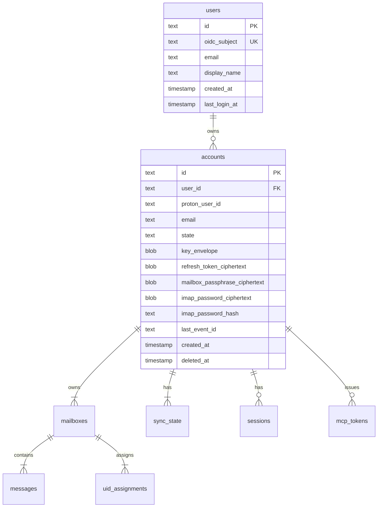

# Design: Account Model (SPEC-0001)

## Architecture

The account model has two top-level entities — `users` (sourced from
OIDC) and `accounts` (sourced from Proton, FK to users 1:N) — and a
single derived attribute (admin status, computed at session-bind time
from the OIDC subjects allowlist; never persisted).

Every per-account piece of state in Reduit (mailbox UID maps, sync
cursors, sessions, MCP tokens, message metadata) hangs off an
`account_id` foreign key. Every per-user lookup uses `users(id)`
either directly (e.g., session lookup) or transitively via
`accounts.user_id`.



`users.oidc_subject` is `UNIQUE NOT NULL`. `accounts.user_id` is
`NOT NULL` and references `users(id)` with `ON DELETE CASCADE`. The
account-level uniqueness constraint is `(user_id, proton_user_id)` —
a given user MUST NOT add the same Proton account twice, but two
distinct users MAY in principle each have a row referencing the same
`proton_user_id` (access control lives at the per-account relay
credentials and MCP tokens). An index on `accounts(user_id)` is
created for the hot "list my accounts" path.

Admin status is **not** a column. It is computed at session-bind
time by checking `Principal.Subject ∈ OIDC_ADMIN_SUBS` and stored
on the in-memory session record. The allowlist is read from env at
startup; any future hot-reload path re-derives the contract at that
time.

The `accounts` table never carried an `oidc_subject` or `is_admin`
column in the rewritten migrations — those columns are removed
greenfield, not dropped via ALTER, because the project has not
shipped (per ADR-0010 migration approach).

## Key data structures

### `accounts` table

The single source of truth for who owns what. Sensitive columns are
suffixed `_ciphertext` (envelope-sealed under the account's data key
from `key_envelope`); the data key itself is sealed under the service
master key.

### Account state machine

```
pending_proton_setup --(proton login completes)--> active
                                                    |
                                            (admin suspends)
                                                    |
                                                    v
                              soft_deleted <-- suspended
                                    |              ^
                            (retention sweep)      |
                                    v       (admin un-suspends)
                          [hard delete; cascade]   |
                                                   v
                                                active
```

Transitions are driven by:

- Wizard completion (`pending_proton_setup` → `active`)
- Admin actions (`active` ↔ `suspended`, `* → soft_deleted`)
- Retention sweep (`soft_deleted` → hard-deleted after N days)

## Why XChaCha20-Poly1305 for envelope sealing

- **Nonce safety**: XChaCha20 takes a 192-bit nonce, large enough for
  random generation without birthday-collision worry. AES-GCM's 96-bit
  nonce requires a counter or careful birthday-bound math.
- **No key schedule**: ChaCha20 has no per-key precomputation, so the
  per-field re-keying we do (envelope decrypt → seal) is cheap.
- **Pure Go**: `golang.org/x/crypto/chacha20poly1305` works without
  CGO, matching ADR-0006's preference for `modernc.org/sqlite`.

We could use `filippo.io/age` instead, which wraps the same primitives
in a higher-level envelope format. Decision deferred to implementation
— age is opinionated about file format, which is overkill for in-table
ciphertexts.

## Master-key rotation procedure (deferred to v0.5)

1. Operator generates new master key file (`reduit master-key generate
   --output new-master.key`).
2. Operator runs `reduit migrate-master-key --old-key old.key
   --new-key new.key`.
3. The migrate command iterates every account row, decrypts
   `key_envelope` with the old master key, re-seals with the new
   master key, persists. Per-account data keys are unchanged; only
   the outer envelope rotates.
4. Operator atomically replaces the master-key file and restarts
   Reduit.

This is a cold operation (Reduit must be stopped). v0.1 ships only
the algorithm and key generation; the migration command lands in v0.5.

## Open questions

- **Audit trail granularity**: state transitions are logged but not
  retained as queryable rows. v0.5 may add an `audit_events` table.
- **Multi-OIDC-subject linking**: orthogonal feature deferred. The
  `users` table is a precondition; the linking semantics (primary vs.
  secondary, IdP trust model, identity-merge UX) are out of scope for
  this ADR.
- **User-row removal UX**: v0.1 has no admin UI for deleting users;
  it is an operator-tool action. The `ON DELETE CASCADE` from `users`
  to `accounts` is the safety primitive when it does happen.

## References

- ADR-0002 (multi-tenant)
- ADR-0003 (encryption-at-rest)
- ADR-0006 (SQLite store)
- ADR-0010 (multi-Proton-account per user)
- SPEC-0002 (sync worker — reads `last_event_id` from the account row)
- SPEC-0003 (IMAP server — reads `imap_password_hash` for SASL)
