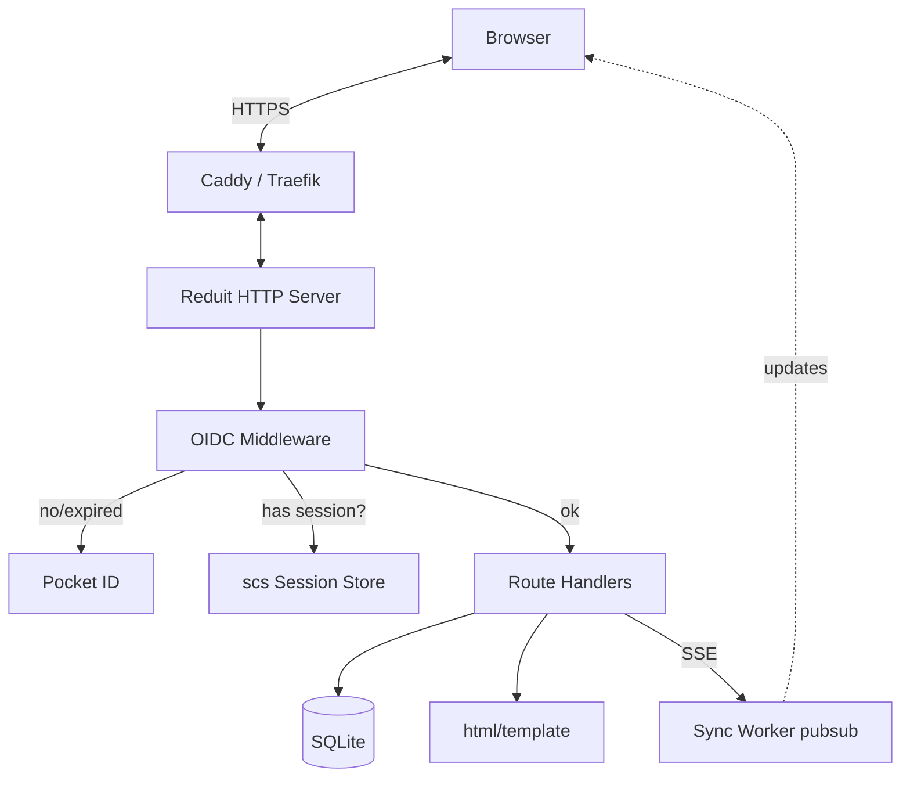

# Design: Admin UI Flows (SPEC-0005)

## Architecture

Server-rendered HTML via Go's `html/template` (or `a-h/templ`,
deferred to implementation), with HTMX for partial swaps and SSE for
live sync-status pushes. No JS bundler; Tailwind 4 is pre-built;
DaisyUI 5 components; Hero Icons inlined as SVG.



## Route catalog (informative)

| Method | Path | Purpose |
|---|---|---|
| GET | `/` | Landing — redirects to `/accounts` if logged in, else `/auth/login` |
| GET | `/auth/login` | Initiate OIDC auth-code-with-PKCE |
| GET | `/auth/callback` | OIDC callback; create session |
| POST | `/auth/logout` | Clear session, optional RP-Initiated Logout |
| GET | `/accounts` | Account dashboard |
| GET | `/accounts/setup` | Add-Proton-account wizard step 1 |
| POST | `/accounts/setup/auth` | Wizard step 1 submit (email + password) |
| POST | `/accounts/setup/2fa` | Wizard step 2 submit (TOTP/FIDO2) |
| POST | `/accounts/setup/unlock` | Wizard step 3 submit (mailbox passphrase) |
| GET | `/accounts/me/credentials` | View IMAP/SMTP host + rotate password |
| POST | `/accounts/me/credentials/rotate` | Rotate password; render once-only modal |
| GET | `/accounts/me/mcp-tokens` | List MCP tokens |
| POST | `/accounts/me/mcp-tokens` | Issue new MCP token |
| POST | `/accounts/me/mcp-tokens/{id}/revoke` | Revoke a token |
| GET | `/sse/accounts/{id}/status` | SSE sync-status stream |
| GET | `/admin/accounts` | Admin: all accounts |
| POST | `/admin/accounts/{id}/suspend` | Admin: suspend |
| POST | `/admin/accounts/{id}/unsuspend` | Admin: unsuspend |
| POST | `/admin/accounts/{id}/delete` | Admin: soft-delete |
| GET | `/healthz` | Liveness probe |
| GET | `/readyz` | Readiness probe (checks SQLite connectivity) |
| GET | `/metrics` | Prometheus metrics (IP-restricted by config) |

## Wizard step UX

```mermaid
sequenceDiagram
    participant U as User
    participant W as Wizard Container
    participant S as Server
    participant Pr as go-proton-api

    U->>W: GET /accounts/setup
    W->>S: render step 1
    S-->>W: HTML(step 1)

    U->>W: submit email + password
    W->>S: POST /accounts/setup/auth (HTMX)
    S->>Pr: AuthInfo + Auth
    alt 2FA needed
        S-->>W: HTML(step 2)
        U->>W: submit 2FA code
        W->>S: POST /accounts/setup/2fa (HTMX)
        S->>Pr: AuthTOTP / FIDO2 verify
        S-->>W: HTML(step 3)
    else no 2FA
        S-->>W: HTML(step 3)
    end

    U->>W: submit mailbox passphrase
    W->>S: POST /accounts/setup/unlock (HTMX)
    S->>Pr: Unlock keyring
    S->>S: persist refresh token + passphrase (encrypted)
    S->>S: account → active; start sync worker
    S-->>W: HTML(success; redirect to /accounts)
```

Each step's submit is an HTMX request that returns the next partial.
Errors render the same step with an inline alert. Wizard state
(passing intermediate Proton auth tokens between steps) lives in the
session under a short-lived key cleared on completion or abort.

## SSE design

The SSE handler does:

1. Validate the request is for an account the user owns (or admins).
2. Subscribe to a per-account update channel.
3. Stream events as `data: <json>\n\n` with periodic comment-only
   heartbeats (`: keepalive\n\n` every 15s).
4. Close on client disconnect or account state change.

The data model (rendered as JSON):

```json
{ "kind": "sync_progress", "cursor": "abc123", "messages_fetched": 42, "current_op": "fetching attachments" }
{ "kind": "error", "message": "Proton API 5xx; backing off", "retry_in_s": 8 }
{ "kind": "state_change", "from": "active", "to": "suspended" }
```

The HTMX side uses [HTMX SSE extension](https://htmx.org/extensions/sse/)
to subscribe and swap targeted elements (e.g., a status badge swaps
on every `sync_progress` event).

## First-run bootstrap

The first OIDC login on an empty database becomes the initial admin.
Implementation: in the OIDC callback handler, if `SELECT COUNT(*)
FROM accounts = 0`, the new account is created with `is_admin =
true` and the OIDC `sub` is added to the in-memory admin set for
the session. Subsequent logins follow the configured allowlist.

This is documented prominently — the operator MUST log in first
before exposing Reduit publicly, otherwise an attacker who reaches
the OIDC redirect could become admin.

## Content security and CSRF

- All state-changing requests require an anti-CSRF token (double-
  submit cookie pattern). HTMX includes a header automatically.
- `Content-Security-Policy: default-src 'self'; img-src 'self' data:;
  style-src 'self' 'unsafe-inline';` (unsafe-inline only for Tailwind
  preflight; Tailwind 4 may eliminate this in pure-build mode).
- HSTS, X-Content-Type-Options, X-Frame-Options: standard hardening.

## Open questions

- **Templating engine**: `html/template` (stdlib) vs `a-h/templ`
  (compile-time-checked, used in some Joe projects) vs Pongo /
  Quicktemplate. Decision deferred to scaffold time. `templ` is the
  current recommendation; `html/template` is the safe fallback.
- **i18n**: v0.1 is English-only. Family-deployment use case doesn't
  obviously need other languages, but worth flagging.
- **Theme**: DaisyUI 5 ships several themes; pick a tasteful default
  (`pastel` or `nord`?) plus the system-detection toggle Joe prefers
  on `joe-links`.

## References

- ADR-0004 (OIDC)
- ADR-0005 (frontend stack)
- SPEC-0001 (Account Model)
- SPEC-0002 (Sync Worker — SSE source)
