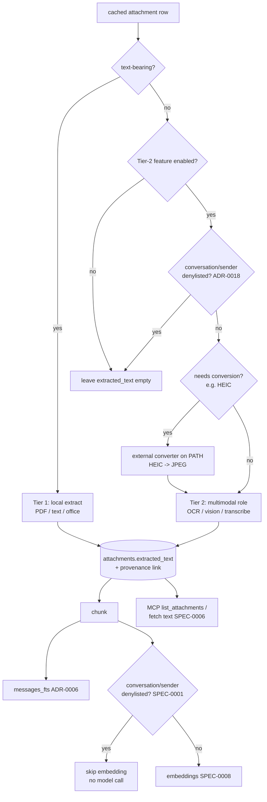

# Design: Attachment Extraction & Indexing (SPEC-0009)

## Architecture

Attachment extraction is a **tiered pipeline** that runs after sync has
landed a message and its attachment rows in the cache, and before (or
as part of) the embed pass. It has exactly two tiers with sharply
different trust and cost profiles:

- **Tier 1 (text)** extraction and FTS indexing are local, always-on,
  and free of any model or network call. It reads text-bearing payloads
  (PDF, plain text, common office formats) with Go libraries / a local
  extractor and writes `attachments.extracted_text`. The one Tier-1 step
  that *does* call a model is embedding (SPEC-0008); like message-body
  embedding it is skipped for denylisted conversation/sender (SPEC-0001,
  ADR-0018), while extraction and FTS indexing still run.
- **Tier 2 (media)** is opt-in and is the *only* path that sends
  attachment bytes outward. OCR, vision captioning, and audio
  transcription each have a default-off flag and, when enabled, route
  through the **multimodal model role** (ADR-0018) — a different
  endpoint than the cheap text/embedding role.

Both tiers converge on the same downstream: `extracted_text` is chunked,
indexed in FTS5 locally, handed to SPEC-0008 for embedding (a model
call, skipped for denylisted conversation/sender), and later cited
through MCP (SPEC-0006). Two steps reach a model — Tier-1 embedding and
the Tier-2 multimodal call — and both honor the denylist (SPEC-0001,
ADR-0018); everything else stays on the box.

A denylist gate sits **before** any model call is prepared — both the
Tier-2 multimodal call and the Tier-1 embed step — so a denylisted
attachment never has its bytes marshalled for any model egress
(SPEC-0001 owns the `denylist` table; ADR-0018 is the egress decision).
Local Tier-1 extraction and FTS indexing are upstream of that gate
because they make no model call, so they always run for denylisted
conversation/sender; only the embed step and Tier-2 features are
suppressed.

## Storage and provenance

Extraction reuses the `attachments` row and its `extracted_text` column
(ADR-0006). The cache key is **stable attachment identity**, not a
message row id, and each cached extraction carries the
`(message_hash, attachment_id)` provenance link. This is the
same hash-keyed, FK-free pattern used by `embeddings` and
`contact_facts` (ADR-0006 / SPEC-0001): idempotent re-sync (SPEC-0002)
never orphans or re-derives extracted text, and the provenance link is
exactly what MCP citations and search hits carry back to the user.

Tier-2 cache entries are additionally keyed by the **multimodal model
identity** that produced them. Re-running with the same attachment and
same model is a no-op; reconfiguring the multimodal role lets the
affected feature re-run under the new model identity without disturbing
Tier-1 text or other attachments. The invariant is: **nothing is
re-sent to a model unless the attachment changed or the relevant model
changed.**

## Tier 1 — local text extraction

Tier 1 dispatches on attachment type to a local extractor (Go library
per format, or a local extractor binary). It produces UTF-8 text into
`extracted_text`, which is then chunked and FTS-indexed locally and
handed to the SPEC-0008 embedding path. Extraction and FTS indexing have
no flag to disable them and run for every text-bearing attachment —
local text is the core win of ADR-0016 and costs nothing in egress. The
embed step is the lone Tier-1 model call, so it is skipped for any
attachment whose conversation or sender is denylisted (SPEC-0001,
ADR-0018), exactly as message-body embedding behaves; the local text and
FTS row remain. Types with no extractable embedded text leave
`extracted_text` empty and fall through to the Tier-2 decision (only
relevant if a media feature is enabled).

## Tier 2 — opt-in media via the multimodal role

Each of OCR, vision, and audio is an independent default-off flag.
When a flag is on and an attachment qualifies, the pipeline:

1. Checks the **denylist** (owned by SPEC-0001; egress decision
   ADR-0018); a denylisted conversation/sender short-circuits to skip.
2. Runs any required **external conversion** (e.g. HEIC→JPEG) by
   shelling out to a converter on `PATH`.
3. Calls the **multimodal model role** (`Vision` / `Transcribe`,
   ADR-0018) and stores the returned text as media-derived
   `extracted_text`, keyed by attachment identity + model.

Routing Tier 2 to a hosted multimodal endpoint sends **raw image/audio
bytes** off the device — the single most sensitive egress in Reduit.
The defaults (all Tier-2 flags off; multimodal role local by default,
ADR-0018) keep this from happening by accident, and SECURITY.md
documents it explicitly when an operator opts in against a hosted
endpoint.

## External converters

Heavy or format-specific conversion is delegated to an external
converter on `PATH` rather than compiling native image/media codecs
into the binary — the same posture msgbrowse took for display-only
HEIC transcoding (its ADR-0014), broadened here to feed OCR/vision.
The converter is invoked with a fixed tool name and file-path arguments
(no shell), writing to a temp file and renaming atomically. With no
converter present, the conversion-dependent Tier-2 step logs once and
skips the attachment; it never becomes a hard runtime requirement and
never aborts the run. This keeps the binary pure-Go and statically
linkable while still handling formats a model can't ingest directly.

## Malformed-input safety

The archive is hostile input (ADR-0016). Every extractor invocation —
Tier-1 parser, external converter, Tier-2 pre/post-processing — is
wrapped so that a panic, decode error, timeout, or runaway resource use
is **contained to the single attachment**: logged with provenance, the
attachment skipped (`extracted_text` left empty), and the run
continuing. Per-attachment timeouts bound runaway work. A malformed
file MUST NEVER crash, hang, or abort the pipeline; partial extraction
of a corpus is always preferable to a fatal stop.

## Configuration surface

| Setting | Role | Default |
|---|---|---|
| Tier-1 text extraction | local, no model | always on (no flag) |
| OCR | Tier-2, multimodal role | off |
| Vision captions | Tier-2, multimodal role | off |
| Audio transcription | Tier-2, multimodal role | off |
| Multimodal role: base URL / model / key | ADR-0018 | local default; key via env |

The multimodal role is configured **independently** of the
text/embedding role (ADR-0018) so an operator can keep text fully local
while choosing, deliberately, to send only media to a different
endpoint — or keep everything local. Keys come from the environment
(`REDUIT_LLM_*`), never committed.

## Downstream integration

- **Search (SPEC-0008):** chunked `extracted_text` is FTS-indexed
  locally for every attachment and embedded (unless its
  conversation/sender is denylisted, in which case the embed step is
  skipped per SPEC-0001 / ADR-0018), so attachment content surfaces in
  hybrid search hits alongside message bodies.
- **MCP (SPEC-0006):** `list_attachments` and the fetch-attachment-text
  tool return the cached text with `(message_hash,
  attachment_id)` citations; the citation contract (SPEC-0006) is
  satisfied directly by the provenance link stored here.

## Edge cases

- **Denylisted but text-bearing.** Tier-1 extraction and FTS indexing
  still run (no model call); the model-bound steps — the Tier-1 embed
  step and every Tier-2 feature — are suppressed. The denylist gate is
  specifically the egress boundary, not a blanket index exclusion: the
  text stays searchable by keyword (FTS) but is not embedded.
- **Tier-2 enabled, no converter for the format.** The attachment's
  Tier-2 step is skipped with a single log line; its Tier-1 text (if
  any) is unaffected.
- **Multimodal role unreachable.** Tier-2 fails cleanly per ADR-0018's
  graceful-absence posture; Tier-1 text, browsing, and keyword search
  keep working.
- **Model reconfigured mid-corpus.** Tier-2 cache keyed by model
  identity means only attachments examined under the new model re-run;
  already-processed-under-the-same-model attachments are not re-sent.
- **Same attachment on multiple messages.** Because the cache is keyed
  by stable attachment identity, identical content is extracted once;
  each carrying message gets its own `(message_hash,
  attachment_id)` provenance link to the shared extraction.

## References

- ADR-0016 (attachment extraction & indexing) — the tiered model, Tier-1
  always-on/local, Tier-2 opt-in/multimodal, caching + provenance,
  external converters.
- ADR-0018 (LLM access & egress posture) — two model roles, multimodal
  role, single egress, the conversation/sender denylist egress decision,
  env keys, graceful absence.
- SPEC-0001 (mailbox cache) — owns the `denylist` table this spec
  enforces for both the Tier-1 embed step and Tier-2 model calls.
- ADR-0006 (SQLite store) — `attachments.extracted_text`; hash-keyed,
  FK-free derived data; FTS5 external-content index.
- msgbrowse ADR-0014 (external image converter) — the converter-on-PATH
  pattern Reduit broadens from display to OCR/vision.
- SPEC-0008 (embeddings & hybrid search) — chunking, embedding, ranking
  consumers of `extracted_text`.
- SPEC-0006 (MCP tool surface) — `list_attachments`, fetch attachment
  text, citation contract.
- SPEC-0002 (sync & cache) — idempotent re-sync over stable identity.
- SPEC-0005 (local UI) — owns serving/rendering attachments (out of
  scope here).
