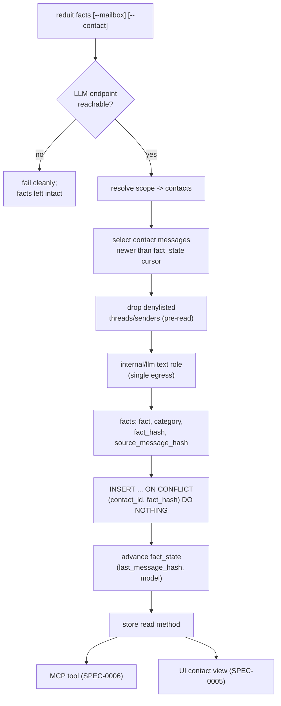

# Design: Sender / Contact Facts (SPEC-0011)

## Architecture

Contact facts are a derived, cited index over cached mail. The unit is
the **contact** — a correspondent identity in the store (ADR-0006) —
not a raw email address. `contact_identifiers` maps several addresses to
one `contact_id`, so a person who writes from work and personal
addresses accrues one fact set. Extraction is a deliberate pass
(`reduit facts`), never a side effect of sync: it reads a contact's
eligible messages, calls the text/embedding model role through the
single egress (ADR-0018), and writes atomic, categorized, cited facts.

Three tables carry the feature (all hash-keyed for re-sync safety,
ADR-0014):

- `contacts` / `contact_identifiers` — the correspondent identity layer;
  facts hang off `contact_id`.
- `contact_facts` — one row per atomic fact: `contact_id`, `fact`,
  `category`, `fact_hash`, `source_message_hash`, `model`. Dedupe via
  `UNIQUE(contact_id, fact_hash)`. **No FK** from `source_message_hash`
  to `messages`.
- `fact_state` — per-contact incremental cursor: `contact_id`,
  `last_message_hash`, `model`. Drives "only newer messages" and
  "model change re-opens".



`contact_facts` and `fact_state` key off **stable content hashes**, with
no foreign key from `source_message_hash` to `messages`. Re-sync
(ADR-0014) may delete and re-insert a message row with the same content
hash; a CASCADE would wipe a contact's facts on every re-sync, exactly
the failure embeddings avoid. Provenance by hash survives: a fact whose
source message is currently absent still renders, just without a working
jump-to-source link.

## Data model

```sql
CREATE TABLE contact_facts (
    id                  TEXT PRIMARY KEY,   -- UUIDv7
    contact_id          TEXT NOT NULL REFERENCES contacts(id) ON DELETE CASCADE,
    fact                TEXT NOT NULL,
    category            TEXT NOT NULL,      -- constrained allowlist; else 'other'
    fact_hash           TEXT NOT NULL,      -- sha256(normalize(fact))
    source_message_hash TEXT NOT NULL,      -- stable hash; NO FK to messages
    model               TEXT NOT NULL,      -- producing text model
    created_at          TIMESTAMP NOT NULL,
    UNIQUE (contact_id, fact_hash)
);

CREATE TABLE fact_state (
    contact_id        TEXT PRIMARY KEY REFERENCES contacts(id) ON DELETE CASCADE,
    last_message_hash TEXT,                 -- cursor; NULL = never run
    model             TEXT,                 -- model that produced facts so far
    last_run_at       TIMESTAMP
);
```

- `fact_hash = sha256(lower(trim(fact)))` — normalized so trivially
  restated facts collapse. The `UNIQUE(contact_id, fact_hash)` constraint
  is the whole dedupe mechanism; `PutFact` is
  `INSERT … ON CONFLICT(contact_id, fact_hash) DO NOTHING`.
- `source_message_hash` is the message's stable content hash, the same
  identity sync and embeddings key on (ADR-0014). It is deliberately not
  an FK.
- `contact_facts.contact_id` and `fact_state.contact_id` **do** cascade
  from `contacts`: removing a contact removes its facts and cursor, which
  is correct (no message provenance is involved in that delete).

## Incremental extraction

`fact_state.last_message_hash` is a cursor, not a row id. At run time it
resolves back to a keyset position (e.g. `(ts, id)`) over the contact's
messages so it survives re-ingest; a missing/NULL hash restarts from the
contact's first message (safe, because `PutFact` is idempotent). The
loop, per contact:

1. Resolve scope (`--mailbox` / `--contact`) to a set of contacts.
2. Select the contact's messages newer than the cursor, **excluding
   denylisted threads/senders before reading bodies**.
3. Batch to the text model via `internal/llm`; parse `{fact, category,
   evidence}` items, coercing out-of-allowlist categories to `other` and
   resolving `evidence` to a `source_message_hash`.
4. `PutFact` each (idempotent); advance and persist the cursor after each
   batch so a mid-run failure resumes next run.

**Model change.** If `fact_state.model` differs from the configured text
model, the contact is re-opened from the start (cursor reset for the
run). Prior facts are **not** deleted; re-derived facts merge under the
unique constraint, so a model swap re-scans without churn or duplicates.
`fact_state.model` is updated to the new model as the run advances.

**No new endpoint.** Extraction's only outbound call is `internal/llm`
(text/embedding role). With no reachable endpoint the command fails
cleanly and writes nothing — `fact_state` and `contact_facts` are left
exactly as they were, and already-extracted facts stay readable.

## Privacy boundary

Extraction is an LLM feature and inherits ADR-0018 in full:

- **Single egress.** The sole network call is through `internal/llm`. No
  other package in the facts path dials out.
- **Denylist, pre-read.** The per-conversation/sender denylist is applied
  while *selecting* messages, before any body is read into memory — so
  denylisted content never reaches the extractor, let alone the model,
  and never contributes a `contact_facts` row.
- **Local default.** With the text role pointed at the local default,
  no message content leaves the device during extraction. Routing the
  text role to a hosted model is the deliberate, documented egress of
  ADR-0018.

## Surfacing — one read path

Both the MCP tool (SPEC-0006) and the UI contact view (SPEC-0005) read
facts through a **single store method** (e.g. `FactsForContact`). That
method returns each fact with its `source_message_hash` and a resolvable
source reference. Because both surfaces share it, the MCP and UI views
cannot present different fact sets for the same contact. The MCP tool
exposes the citation so an agent can answer "where did I get this"; the
UI renders the fact with a jump-to-source link when the message is
cached, and plainly (no link) when it is not.

## Rationale

- **Contact, not address.** Facts about a person fragment uselessly if
  keyed per address; `contact_identifiers` already models one person
  across addresses, so facts attach to `contact_id` and accrue once.
- **Hash provenance, no FK.** A FK + CASCADE from `source_message_hash`
  to `messages` would destroy a contact's facts on every re-sync. Stable-
  hash provenance with no FK is re-sync-safe and degrades gracefully (a
  missing source just drops the jump link), matching embeddings (ADR-0015)
  and attachment text (ADR-0016).
- **Dedupe in the constraint.** `UNIQUE(contact_id, fact_hash)` +
  `ON CONFLICT DO NOTHING` makes both re-runs and merged-address
  extraction idempotent without application-side dedup logic.
- **Cursor over scan.** A per-contact hash cursor keeps cost bounded as
  mail grows and makes runs resumable; resolving the hash to a keyset
  position makes the cursor survive re-ingest.
- **Model change re-opens, not wipes.** Re-deriving under the unique
  constraint lets a model upgrade improve the fact set without a
  destructive reset, while still letting old and new facts coexist
  cleanly.
- **One read method.** Sharing the store read between MCP and UI is the
  cheapest possible guarantee that the two surfaces never drift.

## Edge cases

- **Mid-run LLM failure.** The cursor is persisted per batch, so the run
  aborts but the next run resumes where it stopped; partial facts already
  written are valid and deduped.
- **Source message later vanishes.** A fact whose `source_message_hash`
  no longer resolves still renders; it simply has no working jump link
  until (and if) re-sync restores the message under the same hash.
- **Unmapped address.** Messages from an address not yet in
  `contact_identifiers` are not auto-merged into any contact; their facts
  wait for manual reconciliation rather than polluting a neighbor's set.
- **Denylist applied after some facts exist.** Denylisting a thread stops
  it contributing *new* facts; previously extracted facts are not
  retroactively scrubbed by extraction (a separate purge concern, not in
  this spec).
- **Contact deleted.** `ON DELETE CASCADE` from `contacts` removes the
  contact's `contact_facts` and `fact_state`; no message provenance is
  touched.

## References

- ADR-0019 (sender/contact facts extraction) — incremental, cited,
  deduped, hash-keyed; the decision this spec formalizes.
- ADR-0018 (LLM single-egress posture) — `internal/llm` sole egress,
  text/embedding role, denylist, local default, graceful absence.
- ADR-0006 (SQLite store) — `contacts`, `contact_identifiers`,
  `contact_facts`, `fact_state`; hash-keyed derived tables, no FK to
  `messages`.
- ADR-0014 (sync-and-cache) — stable content hash identity; why CASCADE
  from messages is forbidden.
- ADR-0015 (embeddings) / ADR-0016 (attachments) — sibling hash-keyed
  derived data with the same re-sync-safe provenance pattern.
- msgbrowse ADR-0011 (contact-facts) — the chat-contact precedent Reduit
  mirrors for email correspondents.
- SPEC-0001 (mailbox model) — contact-level identity reconciliation is
  manual.
- SPEC-0005 (loopback UI) — contact view surface.
- SPEC-0006 (MCP tool surface) — facts tool with citations.
