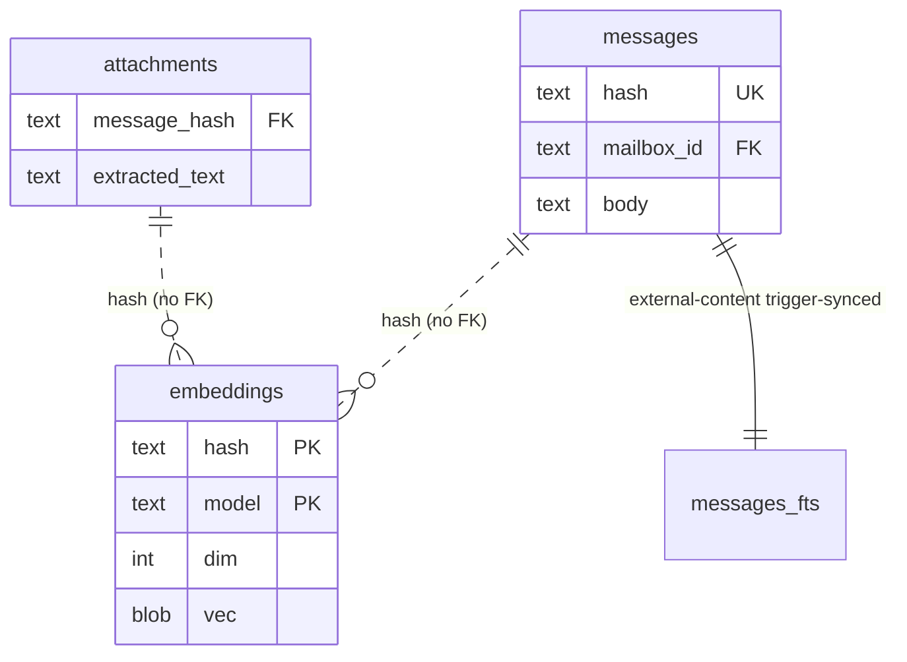

# Design: Embeddings & Semantic/Hybrid Search (SPEC-0008)

## Architecture

Search is one `store` API with three layers stacked by capability, each
falling back to the one beneath it. The bottom layer — FTS5 keyword
search — has no dependencies beyond the SQLite file and always works.
The middle layer — vector semantic search — needs vectors and a query
embedding. The top layer — `search_messages` — fuses the two with
reciprocal-rank fusion. MCP (ADR-0017) and the local TUI (ADR-0025) both
call the *same* `store` methods, so there is one implementation and no
surface drift.

The store reads `messages_fts` (an FTS5 external-content index kept
current by triggers, ADR-0006) and `embeddings` (BLOB vectors keyed by
`(hash, model)`, no FK to `messages`, ADR-0015). The only outbound call
the search path makes is embedding the query, and it makes that call
through `internal/llm`, the single egress (ADR-0018). Browsing and
keyword search make no outbound call at all.

```mermaid
flowchart TD
    Q[query + filters] --> KW[FTS5 keyword search<br/>bm25, filtered]
    Q --> EMB{embedding<br/>endpoint &<br/>vectors?}
    EMB -- no --> KWONLY[degrade: keyword-only]
    EMB -- yes --> QV[embed query once<br/>via internal/llm]
    KW --> CAND[candidate set<br/>narrowed by filters]
    QV --> COS[brute-force cosine<br/>over candidates only]
    CAND --> COS
    KW --> RRF[reciprocal-rank fusion<br/>Σ 1/&#40;60+rank&#41;]
    COS --> RRF
    KWONLY --> OUT[ranked, cited results]
    RRF --> OUT

    subgraph store [one store API: MCP + TUI share it]
        KW
        COS
        RRF
    end
```



The crucial ordering: keyword/metadata filtering runs **first** and
produces the candidate set; the cosine pass scores only that set, never
the whole `embeddings` table. This is what makes brute-force cosine fast
enough at personal-mailbox scale without any index (ADR-0015) — the
filter is the pre-selector an ANN index would otherwise be.

## Data model

`embeddings` is content-addressed and model-tagged:



- **`PRIMARY KEY (hash, model)`** — a vector is identified by *what it
  describes* (content hash) and *what produced it* (model name). Two
  models for the same message are two rows; neither clobbers the other.
- **No FK to `messages`.** Re-sync (ADR-0014) churns `messages` rows but
  preserves content hashes; vectors keyed by hash survive untouched. The
  dangling-vector cost (a vector whose message was deleted) is paid by a
  periodic prune, not by an FK cascade — the same reasoning ADR-0006
  applies to all hash-keyed derived tables.
- **`dim` + `vec` BLOB.** The dimension is stored alongside the bytes so
  a cosine pass can validate vectors are commensurable and skip
  mismatched-dimension rows (e.g. left over from a different model
  family) defensively.
- **Attachment text is just another hash.** SPEC-0009 writes
  `attachments.extracted_text`; its content hash is embedded exactly
  like a message body and FTS-indexed alongside one. Provenance flows
  back through the hash → attachment → message chain, so a hit cites the
  attachment.

## Embedding generation

`reduit embed [--mailbox …] [--model …]` is the incremental, idempotent
batch embedder:

1. **Select missing.** Enumerate message and chunk content hashes in
   scope (optionally filtered by `--mailbox`) that have **no** row in
   `embeddings` for the target `--model`. This `LEFT JOIN … IS NULL`
   selection is what makes the command incremental and a re-run a no-op.
2. **Apply the denylist.** Drop any hash whose thread/sender is on the
   ADR-0018 denylist *before* it reaches the model — denylisted content
   is never sent and never embedded.
3. **Batch.** Submit the remaining texts to the text/embedding role in
   batches via `internal/llm.Embed`, one round trip per batch.
4. **Upsert.** Write `(hash, model, dim, vec)` rows transactionally.

Failure modes are clean: no reachable endpoint → report and exit before
any write, leaving existing vectors and keyword search intact; a
mid-batch error → the already-committed batches stand and the next run
picks up exactly the still-missing hashes (idempotent, so partial
progress is safe).

```
content in scope ──▶ LEFT JOIN embeddings (model) IS NULL ──▶ missing set
                                                                  │
                          denylist (ADR-0018) drops threads ◀─────┤
                                                                  ▼
                         batch ──▶ internal/llm.Embed ──▶ upsert (hash,model,dim,vec)
```

## Retrieval

**Keyword (always).** `MATCH` against `messages_fts`, ordered by
`bm25()`, with metadata filters (`mailbox`, `sender`, date range,
`has_attachment`, `has_link`) applied as conjunctive `WHERE` clauses on
the joined `messages` row. Returns a ranked list with provenance.

**Semantic (best-effort).** Embed the query once via `internal/llm`,
then cosine-score the vectors for the candidate hashes the keyword/
filter pass already produced. Brute-force by default; if `sqlite-vec` is
compiled/loaded, the same `store` method runs a `vec0` MATCH instead —
same inputs, same result shape, callers unchanged (ADR-0015, ADR-0017).

**Fusion (`search_messages`).** Take the keyword list and the vector
list and compute, for each distinct result, `score = Σ 1/(60 + rank_i)`
over the lists it appears in (the constant 60 is the conventional RRF
damping). Order by fused score. RRF is used precisely because bm25 and
cosine live on incomparable scales — fusing on *rank* is scale-free and
robust (ADR-0017, msgbrowse ADR-0004). If the vector list is empty
(no endpoint, no vectors), fusion is a pass-through of the keyword list:
the same code path degrades to keyword-only without a special case.

Every returned result carries `message_id`, stable `hash`, `mailbox`,
`conversation`/`sender`, `source`, and `timestamp` (ADR-0017), so an
agent cites exactly and a human can open the message in the TUI.

## Snippet safety

Snippets are cut from untrusted message bodies, so the order of
operations is: **escape, then mark**. The store escapes the surrounding
text first and inserts highlight markers only around the matched span,
so a body containing markup cannot inject active content into the
rendered snippet. The highlight markers are the only un-escaped tokens
in the snippet, and they are emitted by the store, never derived from
message content.

## Degradation matrix

| Endpoint | Vectors for candidates | `search_messages` behavior |
|----------|------------------------|----------------------------|
| reachable | present | full hybrid (keyword ⊕ vector via RRF) |
| reachable | absent | keyword-only (nothing to fuse) |
| unreachable | present | keyword-only (cannot embed the query) |
| unreachable | absent | keyword-only |

Keyword is the invariant floor in every row; the vector half is purely
additive. No cell errors.

## Rationale

- **Filter-then-cosine, not index-then-filter.** ANN infrastructure
  earns its keep only when the candidate set is the whole corpus. Here
  the keyword/metadata filter is a cheap, already-built pre-selector, so
  a brute-force cosine over its output is fast at personal scale and
  needs zero extra infrastructure (ADR-0015). `sqlite-vec` is the escape
  hatch for unusually large corpora and changes only the store
  internals.
- **RRF over score-mixing.** bm25 and cosine are not on a shared scale;
  any weighted sum of the raw scores is a tuning trap. Rank fusion is
  parameter-light (one damping constant) and degrades cleanly when one
  list is empty.
- **Hash-keyed, FK-free vectors.** Decoupling vectors from `messages`
  rows is what lets re-sync be idempotent and lets two embedding models
  coexist for A/B or migration without a schema change (ADR-0015,
  ADR-0006).
- **One egress for embeddings.** Query and content embedding both route
  through `internal/llm`, so the privacy boundary (ADR-0018) is a single
  auditable line of config; the denylist is enforced before content
  reaches the model, and the local default keeps everything on-device.

## Edge cases

- **Dimension mismatch in a candidate set.** Vectors from an older model
  family may differ in `dim`. The cosine pass filters to the query
  model's dimension and skips others, rather than producing a garbage
  similarity. (`--model` keeps a run coherent; mixed-model corpora are a
  read-time concern.)
- **Embedding endpoint dies mid-`embed`.** Committed batches stand;
  re-running resumes from the still-missing set. No placeholder or
  partial vector is ever written, so a half-finished run never poisons
  search.
- **Denylisted thread later un-denylisted.** Its content simply appears
  in the next `reduit embed` missing-set and gets embedded then; nothing
  back-fills automatically and nothing was leaked in the interim.
- **Snippet straddling a multibyte boundary.** Escaping happens on the
  decoded text before marker insertion, so highlight markers never split
  a UTF-8 sequence.
- **Empty candidate set.** If filters exclude everything, both halves
  are empty and the result is an empty (not errored) list.

## References

- ADR-0015 (embeddings & vector backend) — `embeddings(hash, model)`,
  brute-force cosine default, optional `sqlite-vec`, batched `reduit
  embed`.
- ADR-0017 (stdio MCP & hybrid RAG) — `search_messages` hybrid + RRF +
  citation-faithful provenance; one store shared with the TUI.
- ADR-0018 (single LLM egress & denylist) — query/content embedding
  through `internal/llm`; local default; per-thread denylist.
- ADR-0006 (SQLite store) — FTS5 external-content + triggers;
  hash-keyed FK-free derived tables.
- SPEC-0009 (attachment extraction) — produces `extracted_text` this
  spec indexes and embeds.
- SPEC-0001 (mailbox model) — `mailbox_id` scoping for filters.
- msgbrowse ADR-0002 (vector backend), ADR-0004 (MCP SDK & RAG) — the
  sibling decisions this mirrors.
