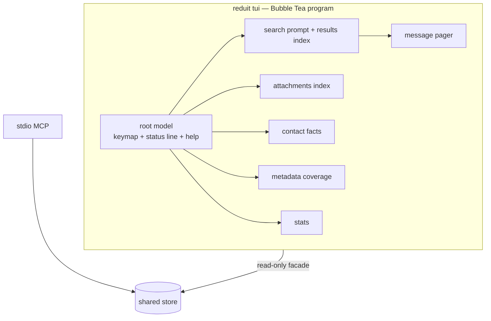

# Design: Local TUI (SPEC-0005)

> Rewritten 2026-07-03 per ADR-0025: the web UI is abandoned; the human
> surface is a Bubble Tea TUI in a mutt-inspired design language.

## Context

reduit already ships the charm stack: charmbracelet/log renders all logs
(ADR-0022) and bubbletea/bubbles/lipgloss arrived with the sync progress
bar (ADR-0023), which also established the house TTY discipline (gate on
a real terminal, clean teardown, never corrupt the exit-code contract).
The TUI extends that foundation into a full-screen application. mutt is
the design north star: information-dense, keyboard-only, instantly
legible to a terminal-native operator.

## Style reference — "Bubbletea TUI Design System"

The normative visual reference is the owner's **Bubble Tea design system**
(Claude Design, "Bubbletea TUI Design System" —
<https://claude.ai/design/p/5c2f3709-9093-45fd-9762-fbe0a39b6c7b>). Where
the design system and this spec conflict, the spec's *requirements* win
(behavior, security, scope); the design system governs *look and feel*.

**Aesthetic direction (owner brief):** cutesy-cyberpunk / Tron — imagine a
genius 13-year-old Japanese gamer/coder girl built this homage to `mutt` in
Bubble Tea. Kawaii-cyberpunk meets anime: neon phosphor on a blue-black
void, a faint Tron grid floor, a blinking block cursor as the UI's
heartbeat, playful lowercase voice, tasteful boba/tea flourishes — dense
and keyboard-first like mutt, but *alive* and glowing rather than austere.
It must never read as corporate or flat.

### Tokens (from the design system — treat as the source of truth)

- **Palette.** Void/surfaces `#08080F → #1E1E38`; brand Charm purple
  `#7D56F4` + hot pink `#FF5FA2`; Tron accents cyan `#4EE6FF` + mint
  `#00F0A8`; phosphor text `#F4F4FF` fading to dim indigo-grey; gold/coral
  for warn/danger. Foreground is neon on blue-black. **No glow / drop-shadow
  system:** the design system's `0 0 12px` neon "glow" is a web-CSS affordance
  a terminal cannot render — defer to bubbletea/bubbles/lipgloss defaults.
  Emphasis and "elevation" are expressed with lipgloss-native means only —
  foreground/background color, bold, border style/color, and adaptive
  light/dark colors — never a simulated halo.
- **Type.** Monospace-first. Body/UI **JetBrains Mono**; chunky display/
  wordmarks **Space Mono** (tracking ~-0.04em, often gradient-filled);
  pixel eyebrows/badges **Silkscreen**. Hierarchy comes from weight/size/
  color, not font family. ⚠️ These are free substitutes for Charm's
  commercial faces; swap to licensed faces via the token aliases if desired.
- **Borders & layout.** Lip Gloss rounded border (`╭ ╮ ╰ ╯`) is the
  signature; DOM/TUI chrome mirrors it. Focus shifts the border to cyan; the
  active index/table row carries an inset colored rail (`inset 3px 0 0`
  pink) — the analog of mutt's `>` cursor. Spacing is cell-aware on a 4px
  base.
- **Motion.** Quick and springy (Harmonica-style), 120–340ms; braille/dots/
  moon **spinners**; the **cyan block cursor** blinks `steps(1)` ~1.06s.
  Everything MUST honor `prefers-reduced-motion` (cursor/spinners freeze,
  progress jumps to end) — the reduced-motion equivalent in a TUI is
  `lipgloss`/`bubbletea` rendering without the blink/spin tick.
- **Iconography.** Base layer: plain Unicode + box-drawing glyphs that render
  in **any** terminal font — nav `↑↓←→`, status `✓ ✗ ◆ ● ○ •`, prompts
  `❯ › $`, spinners `⣾⣽⣻⢿⡿⣟⣯⣷` / `⠋⠙⠹⠸`, progress `█ ▓ ▒ ░`, borders
  `─ │ ╭ ╮ ╰ ╯ ├ ┤`. Emoji only as sparing flourishes (never in dense UI).
  This is how mutt + Charm render — type the glyph, never a web icon set.
  **Optional Nerd Fonts enhancement layer** (<https://www.nerdfonts.com> — the
  patched-font glyph set powerline/Oh-My-Zsh themes rely on): when the user's
  terminal has a Nerd Font, the TUI MAY use its extended glyphs (file-type
  icons, git branch/state, folder/attachment icons) for a richer index/status
  line. This MUST be a progressive enhancement gated behind detection or an
  explicit config opt-in (Nerd Font code points render as tofu boxes without a
  patched font), and every Nerd Font glyph MUST have a plain-Unicode fallback
  from the base layer. Never assume a Nerd Font is present.
- **Voice.** Playful, warm, lowercase; address the user as "you"; a load-
  bearing dim **help footer** of `key • action` pairs on every view
  (`↑/↓ navigate • enter select • / search • q quit`); shell-flavored
  prompt glyph + blinking cursor.

The design system ships 15 Bubble Tea-shaped component idioms (TerminalWindow,
StatusBar, Kbd, List, Table, Tabs, Badge, Spinner, Progress, KeyHint, Dialog,
Button, TextInput, Checkbox, Toggle) and two reference kits (a scaffolder flow
and a two-pane markdown reader) — the TUI's index/pager/status-bar/help
composition maps directly onto these idioms.

> The design system is a *web recreation* (React/CSS) of the aesthetic; this
> spec's implementation is real bubbletea/bubbles/lipgloss Go. The tokens
> (colors, glyphs, motion timing, voice) transfer; the React components are
> visual references, not code to port.

## Architecture

One Bubble Tea program (`reduit tui`), a root model routing among view
models (search index, message pager, attachments, contact facts,
metadata, stats). All data access goes through a thin read-only facade
over the shared `store` (ADR-0017 no-drift: the MCP and TUI call the
same methods; new aggregates land in `store` first).

## Key decisions

### Views are bubbles-composed models behind one keymap

**Choice**: each view is its own model composing bubbles components
(list, viewport, textinput, help); the root owns global keys (`?`, `q`,
view switching) and the status line; view models own local keys (`j/k`,
`/`, enter).
**Rationale**: matches the progress bar's established model-testing
pattern (Update/View unit tests, no terminal needed) and keeps the mutt
keymap coherent in one place.

### Search is FTS-only in v1

**Choice**: `/` runs the store's FTS5 keyword search; the results index
and pager read the cached plaintext.
**Rationale**: owner decision; semantic/hybrid joins when SPEC-0008
lands, as a new search mode behind the same prompt.

### Attachments hand off to the OS

**Choice**: opening an attachment writes/locates the cached file and
hands it to the platform opener; no in-terminal preview in v1.
**Rationale**: terminal image protocols (Kitty/iTerm2/Sixel) are
fragmented (Terminal.app: none). v2 MAY render images inline on
supporting terminals (ADR-0025); a future `serve` media companion is
another path. Executable-ish MIME types are never auto-opened without
confirmation.

### Hostile-string sanitation at the render boundary

**Choice**: one sanitizer strips C0/C1 controls and escape sequences
from every mail-derived string before it reaches lipgloss.
**Rationale**: the web UI's XSS budget becomes the TUI's
escape-injection budget; centralizing it makes it testable (the analog
of the old CSP grep-test).

### TTY discipline inherited from ADR-0023

**Choice**: refuse non-TTY with a clear error; alt-screen; restore on
exit/suspend/signal.
**Rationale**: same discipline the progress bar shipped; a TUI has no
meaningful non-TTY fallback (unlike sync, whose fallback is logs).

## Risks / Trade-offs

- **Bubble Tea full-screen apps are harder to test than handlers** →
  model-level Update/View tests (established pattern) + the sanitizer
  unit-tested exhaustively.
- **Large result sets/pagers** → store queries paginate; the viewport
  virtualizes; no unbounded loads.
- **Design-system drift** → the style reference is versioned in the
  design doc; visual changes cite it.

## Open questions

- Command name: `reduit tui` vs taking over bare `reduit`.
- Whether the message pager offers `v` to view a hit's thread siblings
  (nice mutt touch) in v1 or v2.

## References

- ADR-0025 (governing), ADR-0023 (Bubble Tea + TTY discipline),
  ADR-0022 (charm log), ADR-0017 (shared store), ADR-0012 (single-user),
  ADR-0006 (cache); SPEC-0002 (offline reads), SPEC-0008 (future
  semantic search), SPEC-0011 (facts read-only surface)
- mutt (design language); owner's Bubble Tea design system — embedded
  above as the style reference (2026-07-04)
