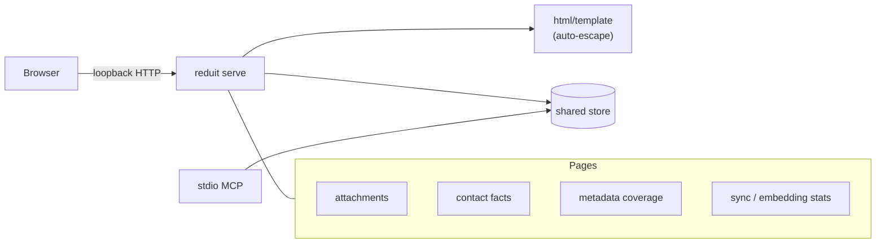

# Design: Local Insights UI (SPEC-0005)

> **Scope note.** Rewritten 2026-07-03 per ADR-0024: the browse/search UI is
> withdrawn; this design covers only the insights surface (attachments,
> contact facts, metadata, stats).

## Architecture

An optional `reduit serve` loopback HTTP server rendering a handful of
read-only, server-side pages (ADR-0005 stack: HTMX + Tailwind 4 + DaisyUI,
`html/template`, no runtime build step, all assets self-hosted). Every
handler reads through the same `store` methods the MCP tools use
(ADR-0017's no-drift rule); the UI holds no state, performs no writes, and
never calls Proton.

## Page set (informative)

| Page | Reads | Notes |
| --- | --- | --- |
| Attachments | attachments + owning message metadata | list, view/download via path-contained serving |
| Contact facts | contacts, contact_identifiers, contact_facts (+ citation metadata) | read-only; mutations stay CLI/MCP (SPEC-0011) |
| Metadata coverage | messages (counts, date ranges, folders per mailbox) | "what does the cache hold" |
| Stats | sync_runs, embeddings coverage, extraction coverage, store size | "how healthy is the cache" |

There are deliberately **no** conversation, message, or search routes
(SPEC-0005 REQ "Withdrawn Surfaces Stay Withdrawn").

## Security posture (unchanged from the withdrawn spec)

- **Loopback by default, no auth** (ADR-0012): the OS user is the identity;
  non-loopback binds warn loudly and never grow a login.
- **Strict CSP, self-only assets**: no off-origin request of any kind; no
  inline script; at most hash-allowed inline style.
- **Everything mail-derived is escaped**: fact text, filenames, contact
  names, subjects, and label names are attacker-influenced strings and pass
  through contextual auto-escaping; nothing is ever marked safe HTML.
- **Path-contained media serving**: resolved attachment paths are verified
  inside reduit's data root; traversal is rejected before any file I/O.

The insights pages render far less raw mail content than the withdrawn
browse UI (no bodies), but the threat model is identical — a crafted
message controls filenames and extracted facts — so the posture is kept
at full strength.

## Shared-store contract (no drift)

UI handlers call the same store methods as the MCP's stats/facts/
attachment tools and add none of their own SQL beyond what the store
exposes. If a page needs a new aggregate, the method lands in `store`
first and both surfaces get it (ADR-0017).

## Offline behavior

All pages render from the cache with no network (SPEC-0002 "Offline
Behavior" reads). A cold cache renders empty states, not errors.

## Open questions

- Whether the stats page warrants a small time-series (sync_runs history
  sparkline) or stays tabular in v1.
- Whether attachment viewing should stream inline (Content-Disposition
  inline for safe MIME types) or force download for everything; the safe
  default is download-only for any type the browser could execute.

## References

- ADR-0024 (insights scope — governing), ADR-0005 (frontend stack,
  narrowed), ADR-0012 (single-user local-first), ADR-0017 (stdio MCP +
  shared store), ADR-0006 (SQLite cache)
- SPEC-0011 (contact facts), SPEC-0002 (sync bookkeeping/offline),
  SPEC-0009 (attachment extraction)
