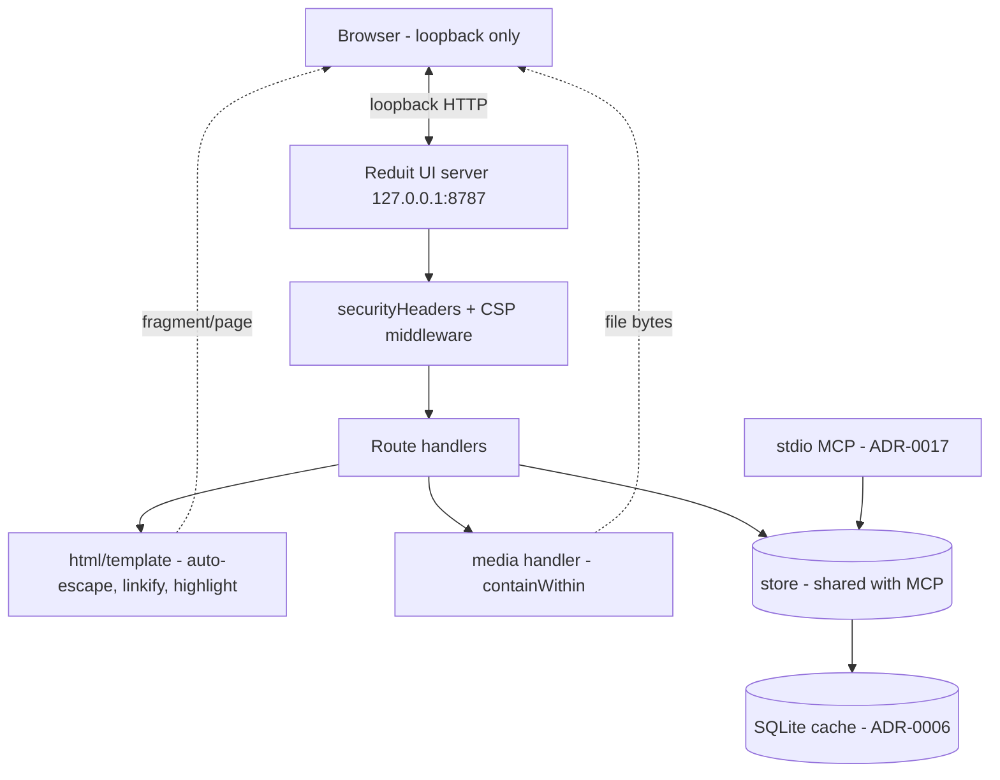
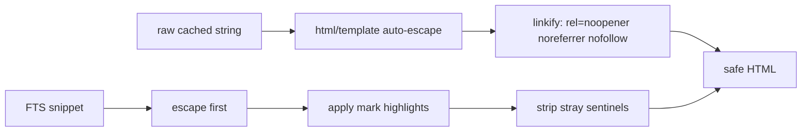

# Design: Local Browse & Search UI (SPEC-0005)

## Architecture

The local UI is an optional loopback HTTP server that server-renders
HTML via Go's `html/template` (or `a-h/templ`, deferred to
implementation), with HTMX for partial swaps and SSE only where a
screen needs live updates. There is no JS bundler: Tailwind 4 +
DaisyUI 5 is pre-built and committed, htmx and its SSE extension are
vendored, and Hero Icons are inlined as SVG (ADR-0005, reframed). The
server runs as the local OS user with no authentication (ADR-0012).

The defining property is **no drift**: the UI is a thin presentation
layer over the same `store` (ADR-0006) that backs the stdio MCP
(ADR-0017). Search, transcript/context, attachment listing/serving,
and contact facts are single implementations on `store`; the UI and
the MCP tools are two callers of one method set. The cache is derived
from Proton (ADR-0014); the UI never writes mail state.

`securityHeaders` wraps every handler and sets the CSP and hardening
headers (SPEC-0005 "Strict CSP"). The loopback default and the
non-loopback warning live in the server bootstrap, mirroring
`msgbrowse`'s `internal/web/server.go` `isLoopback` check.

## Security posture (mirrors msgbrowse)

This UI inherits `msgbrowse`'s posture (its ADR-0010 / SECURITY.md)
near-verbatim, because the threat model is identical: cached mail is
hostile input and the only adversaries left after the local-first
pivot are other software on the machine and a crafted message — the
network attacker is removed by the loopback default.

- **Loopback default + warn.** `listen_addr` defaults to
  `127.0.0.1:8787`. A non-loopback bind is allowed but logs a loud
  "the UI has no authentication" warning. No login is shipped;
  loopback-by-default is the boundary, operator access control is the
  rest.
- **`default-src 'none'` + self-only assets.** The CSP is maximally
  strict because the UI is built to need nothing off-origin: vendored
  htmx, the committed Tailwind+DaisyUI stylesheet, inline Hero Icons,
  and `theme.js` are all same-origin. No CDN exceptions to carve.
- **Escape everything untrusted.** Bodies, subjects, sender, and
  attachment extracted text flow through `html/template`
  auto-escaping. A `renderBody` helper re-escapes text runs and
  linkifies URLs with `rel="noopener noreferrer nofollow"`; a
  `highlightSnippet` helper escapes before applying `<mark>` and
  strips stray sentinels.
- **Path-contained media, SVG forced to download.** A `containWithin`
  helper cleans, anchors (strips leading separators), and verifies the
  resolved path stays inside the per-source base; SVG (and other
  script-capable formats) get a download disposition and are never
  inlined.

## Route catalog (informative)

| Method | Path | Purpose |
|---|---|---|
| GET | `/` | Browse home — mailbox list |
| GET | `/mailboxes/{id}` | Conversations/threads in a mailbox |
| GET | `/conversations/{id}` | Messages in a conversation (escaped) |
| GET | `/messages/{id}` | Single message view |
| GET | `/search` | Keyword + semantic search (HTMX results) |
| GET | `/contacts/{id}` | Contact identifiers + cited facts |
| GET | `/media/{message}/{name}` | Attachment/media bytes (contained) |
| GET | `/sse/sync` | Optional SSE sync-progress stream |
| GET | `/static/*` | Vendored htmx, stylesheet, theme.js, icons |
| GET | `/healthz` | Liveness |

Cross-mailbox views omit the `mailbox_id` filter; single-mailbox views
add it — one `WHERE` clause on the shared store query (ADR-0006). No
route requires or issues any credential.

## Shared-store contract (no drift)

The UI calls `store` methods, never bespoke SQL, and the MCP tools
call the same methods. Indicative mapping:

| UI surface | `store` method | MCP tool sharing it |
|---|---|---|
| `/search` | hybrid search (FTS5 + vector, RRF) | `search_messages` |
| conversation view | transcript / context window | thread/context tool |
| message attachments | list attachments, fetch extracted text | attachment tools |
| `/media/...` | resolve + serve attachment bytes | attachment fetch |
| `/contacts/{id}` | contact identifiers + cited facts | contact-facts tool |

Search degradation is a property of the shared method, not the UI: if
the embedding endpoint or vectors are absent the method returns
keyword-only results and both surfaces degrade identically (ADR-0017).
Because there is one implementation, a fix or a ranking change lands
in both surfaces at once.

## Rendering and escaping pipeline

Highlight markers are applied to already-escaped text so a message
that contains literal `<mark>` (or any markup) cannot inject DOM. FTS5
snippet sentinels are chosen to be control characters that are
stripped if they appear outside the intended highlight pass.

## Media serving and path containment

The media handler resolves `{message}/{name}` against the per-source
base directory derived from the cached attachment record, then:

1. `path.Clean` the requested relative path.
2. Anchor it — strip leading separators so it cannot start at root.
3. Verify the cleaned, joined absolute path is still a descendant of
   the base (`containWithin`); reject otherwise.
4. Set `Content-Type` from the stored MIME and `Content-Disposition`
   (attachment vs inline) — but **force `attachment` for SVG** and
   other script-capable types.

This mirrors `msgbrowse`'s `internal/web/media.go`. Attachment bytes
and extracted text are read-only over the cache; the UI never writes.

## Optional SSE

SSE is retained only where a screen needs live updates — sync
progress is the canonical case. The handler subscribes to a sync
pubsub channel and streams `data: <json>\n\n` with comment-only
heartbeats; it sets `X-Accel-Buffering: no` and `Cache-Control:
no-cache` for proxy tolerance. SSE is **not load-bearing**: browse,
search, message read, and contact views all function through ordinary
requests and HTMX swaps when SSE is absent or disabled.

## Compose hand-off (boundary, not owned here)

Sending lives in SPEC-0010 (outbound send) and the MCP `send` tool
(ADR-0020). This UI MAY render a compose affordance, but the moment a
draft is submitted it hands off to the SPEC-0010 path; drafting,
confirmation, and Proton submission semantics are specified there, not
here. Keeping send out of this spec preserves the rule that the UI is
read-only over the cache.

## Open questions

- **Templating engine.** `html/template` (stdlib, the safe fallback)
  vs `a-h/templ` (compile-time-checked, used in other Joe projects).
  Deferred to scaffold time; `templ` is the current lean.
- **Theme.** DaisyUI 5 dark theme per the project visual identity
  (dark is canonical), plus the system-detection toggle Joe prefers on
  `joe-links`; pick a tasteful dark default.
- **Search UX.** Whether keyword and semantic are one fused box or a
  toggle; the store fuses them by RRF regardless, so this is purely
  presentational.

## References

- ADR-0005 (frontend stack — HTMX/Tailwind/DaisyUI/Hero Icons, reframed)
- ADR-0012 (single-user, local-first — no auth, loopback, OS-user identity)
- ADR-0006 (SQLite cache — shared store, per-mailbox scoping)
- ADR-0017 (stdio MCP + hybrid RAG — same store methods, no drift)
- `msgbrowse` ADR-0010 / SECURITY.md (loopback/CSP/escaping/path-traversal model)
- SPEC-0010 (outbound send — compose hand-off)
- SPEC-0011 (contact facts — cited facts on the contact view)
