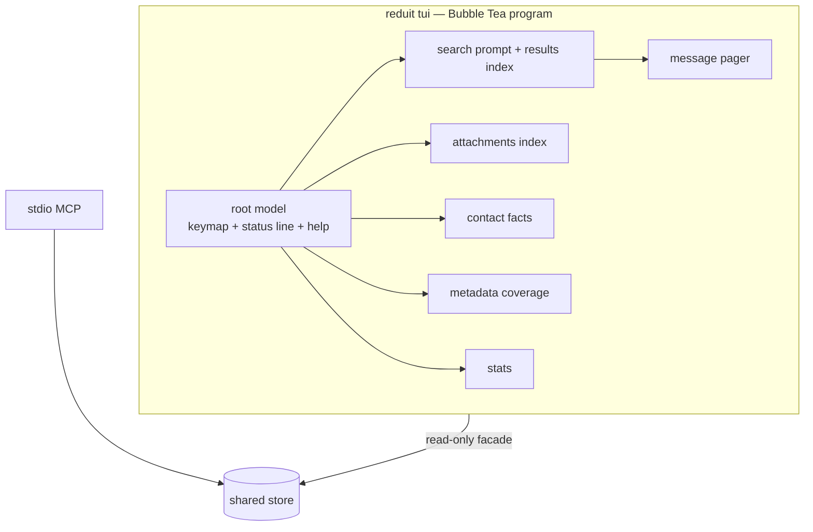

# Design: Local TUI (SPEC-0005)

> Rewritten 2026-07-03 per ADR-0025: the web UI is abandoned; the human
> surface is a Bubble Tea TUI in a mutt-inspired design language.

## Context

reduit already ships the charm stack: charmbracelet/log renders all logs
(ADR-0022) and bubbletea/bubbles/lipgloss arrived with the sync progress
bar (ADR-0023), which also established the house TTY discipline (gate on
a real terminal, clean teardown, never corrupt the exit-code contract).
The TUI extends that foundation into a full-screen application. mutt is
the design north star: information-dense, keyboard-only, instantly
legible to a terminal-native operator.

## Style reference

The normative visual/interaction reference is the owner's **Bubble Tea
design system** (Claude Design) — palette, typography-in-monospace
conventions, component idioms (index rows, status bar, help footer,
prompts), focus and spacing rules. *(Link to be embedded here when
shared; until then, mutt's own index/pager/status-bar layout is the
fallback reference.)* Where the design system and this spec conflict,
the spec's requirements win; the design system governs look and feel.

## Architecture

One Bubble Tea program (`reduit tui`), a root model routing among view
models (search index, message pager, attachments, contact facts,
metadata, stats). All data access goes through a thin read-only facade
over the shared `store` (ADR-0017 no-drift: the MCP and TUI call the
same methods; new aggregates land in `store` first).

## Key decisions

### Views are bubbles-composed models behind one keymap

**Choice**: each view is its own model composing bubbles components
(list, viewport, textinput, help); the root owns global keys (`?`, `q`,
view switching) and the status line; view models own local keys (`j/k`,
`/`, enter).
**Rationale**: matches the progress bar's established model-testing
pattern (Update/View unit tests, no terminal needed) and keeps the mutt
keymap coherent in one place.

### Search is FTS-only in v1

**Choice**: `/` runs the store's FTS5 keyword search; the results index
and pager read the cached plaintext.
**Rationale**: owner decision; semantic/hybrid joins when SPEC-0008
lands, as a new search mode behind the same prompt.

### Attachments hand off to the OS

**Choice**: opening an attachment writes/locates the cached file and
hands it to the platform opener; no in-terminal preview in v1.
**Rationale**: terminal image protocols (Kitty/iTerm2/Sixel) are
fragmented (Terminal.app: none). v2 MAY render images inline on
supporting terminals (ADR-0025); a future `serve` media companion is
another path. Executable-ish MIME types are never auto-opened without
confirmation.

### Hostile-string sanitation at the render boundary

**Choice**: one sanitizer strips C0/C1 controls and escape sequences
from every mail-derived string before it reaches lipgloss.
**Rationale**: the web UI's XSS budget becomes the TUI's
escape-injection budget; centralizing it makes it testable (the analog
of the old CSP grep-test).

### TTY discipline inherited from ADR-0023

**Choice**: refuse non-TTY with a clear error; alt-screen; restore on
exit/suspend/signal.
**Rationale**: same discipline the progress bar shipped; a TUI has no
meaningful non-TTY fallback (unlike sync, whose fallback is logs).

## Risks / Trade-offs

- **Bubble Tea full-screen apps are harder to test than handlers** →
  model-level Update/View tests (established pattern) + the sanitizer
  unit-tested exhaustively.
- **Large result sets/pagers** → store queries paginate; the viewport
  virtualizes; no unbounded loads.
- **Design-system drift** → the style reference is versioned in the
  design doc; visual changes cite it.

## Open questions

- Command name: `reduit tui` vs taking over bare `reduit`.
- Whether the message pager offers `v` to view a hit's thread siblings
  (nice mutt touch) in v1 or v2.
- Design-system link pending from the owner.

## References

- ADR-0025 (governing), ADR-0023 (Bubble Tea + TTY discipline),
  ADR-0022 (charm log), ADR-0017 (shared store), ADR-0012 (single-user),
  ADR-0006 (cache); SPEC-0002 (offline reads), SPEC-0008 (future
  semantic search), SPEC-0011 (facts read-only surface)
- mutt (design language); owner's Bubble Tea design system (pending link)
