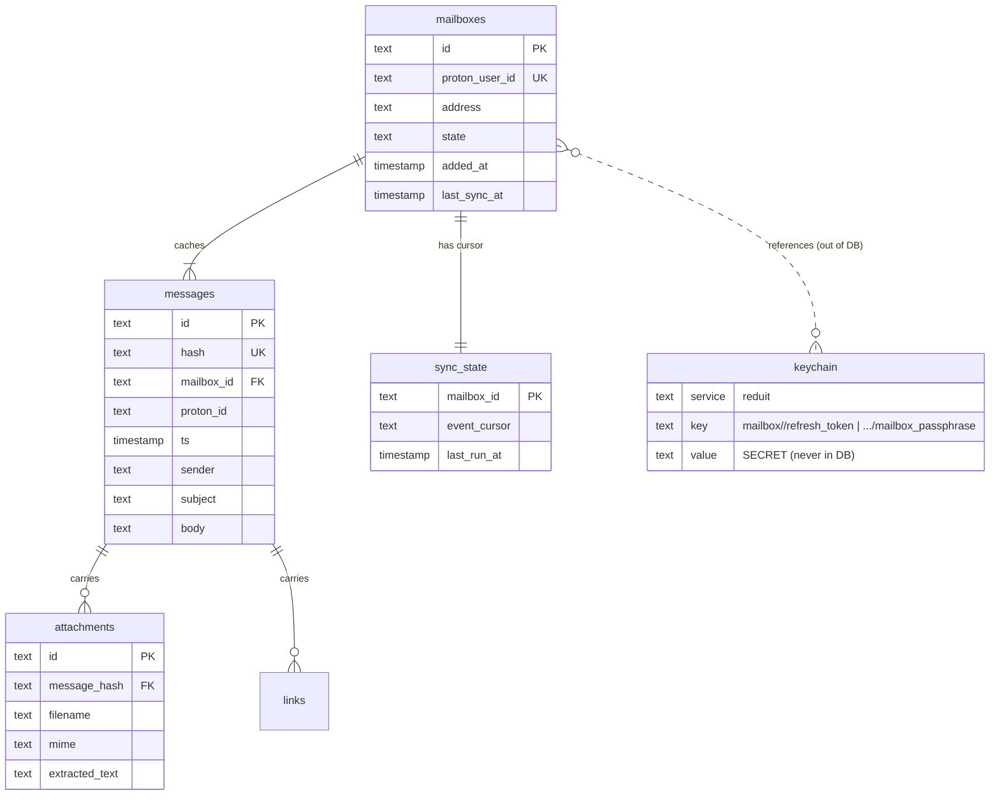

# Design: Mailbox Model (SPEC-0001)

## Architecture

The mailbox model has exactly one top-level entity — `mailboxes` — and
no identity layer above it. The OS user that runs the binary *is* the
identity (ADR-0012), so the old `users`/`accounts` split, the
`oidc_subject`, the admin allowlist, and the session store are all
gone. A `mailboxes` row is a local configuration record: an internal
UUIDv7 `id`, the `proton_user_id` recorded on first successful auth and
immutable thereafter, the mailbox `address`, and a lifecycle `state`.

The row holds no secret. The Proton refresh token and the mailbox
passphrase live in the OS keychain (ADR-0013) under service `reduit`,
keyed `mailbox/<id>/<kind>`; the database stores only the `mailbox_id`
that derives those keys. Every per-mailbox cache table (messages,
attachments, links, sync_state, contacts) carries a `mailbox_id`
foreign key, so per-mailbox scoping is a `WHERE` clause and a global
search simply omits it. Hash-keyed derived tables (`embeddings`,
`contact_facts`) are content-addressed and MAY be shared across
mailboxes with no `mailbox_id` and no FK to `messages`, so idempotent
re-sync (ADR-0014) never orphans them.



`mailboxes.proton_user_id` is `UNIQUE` (nullable until first auth) so
the same Proton account cannot be configured twice, while distinct
accounts add freely — the constraint enforces "no duplicate," never
"only one." `mailbox_id` on the cache tables has an `ON DELETE CASCADE`
FK to `mailboxes(id)`, so removing a mailbox tears down its derived
state in one operation; the keychain deletion is an explicit second
step the removal path performs (the keychain is outside the DB and not
covered by the FK cascade).

The `keychain` node in the diagram is **not** a table — it represents
the OS secret store. It is drawn only to make the reference boundary
explicit: the DB holds the `mailbox_id`, the keychain holds the secret.

## Rationale

- **One entity, not two.** With no authenticating human to model, a
  `users` table would be a row that always has exactly one logical
  value (the OS user) and buys nothing. Collapsing to `mailboxes`
  removes a join from every per-mailbox query and an entire class of
  ownership bugs.
- **`proton_user_id` as the dedupe key.** It is the only stable Proton-
  side identity for a mailbox; the local UUIDv7 `id` is what the rest
  of the system (and the keychain keys) reference, but uniqueness must
  be enforced on the Proton identity, hence `UNIQUE(proton_user_id)`.
- **Immutability over silent overwrite.** A mismatched `proton_user_id`
  on re-auth almost always means a wrong-account login; silently
  rebinding a mailbox to a different Proton account would corrupt every
  `mailbox_id`-scoped cache row. Erroring is the safe default.
- **References, not secrets.** Keeping secrets out of the DB means a
  leaked `reduit.db` backup discloses no credentials (ADR-0013); the
  cache plaintext is protected by OS full-disk encryption (ADR-0012),
  the secrets by the OS keychain unlock.

## Lifecycle

```
                 reduit auth
                     |
                     v
              pending_auth
                     |
            (auth succeeds;
         secrets -> keychain;
        proton_user_id recorded)
                     |
                     v
                  active <-----------------+
                     |                      |
        (refresh token invalid /     (reduit auth
              revoked)                  re-supplies
                     |                  credentials)
                     v                      |
              needs_reauth ----------------+
                     |
              (operator removes)
                     |
                     v
                  removed
        [cascade cache rows; delete keychain entries]
```

Transitions are driven by:

- `reduit auth` (`pending_auth` → `active`; `needs_reauth` → `active`)
- Sync/send observing an invalid refresh token (`active` →
  `needs_reauth`)
- Operator removal (`* → removed`, with cascade + keychain delete)

There is no `suspended`/`soft_deleted` retention machinery from the old
multi-tenant model: a single local user removing their own mailbox
wants it gone, and Proton remains the source of truth if they re-add it.

## Edge cases

- **Crash between keychain write and `active` transition.** The row may
  sit in `pending_auth` with secrets already in the keychain. Re-running
  `reduit auth` is idempotent: it overwrites the keychain entries and
  completes the transition. A `pending_auth` row whose secrets are
  missing is simply re-driven through auth.
- **`proton_user_id` collision on add.** The `UNIQUE` constraint
  rejects the insert; the CLI maps the constraint violation to "that
  Proton account is already configured" rather than surfacing a raw DB
  error.
- **Removal with keychain unavailable.** If the keychain delete fails
  (locked session, no secret service), the cache cascade still
  proceeds; the removal path SHOULD report the dangling keychain entries
  so the operator can clear them, rather than leaving the row half-
  removed.
- **Cross-mailbox derived data.** Because `embeddings` and
  `contact_facts` are hash-keyed with no `mailbox_id`, removing one
  mailbox does not delete derived rows still referenced by another
  mailbox's messages; they age out by content, not by mailbox.

## References

- ADR-0012 (single-user, local-first) — OS user is the identity; no
  `users`, no OIDC, multi-mailbox.
- ADR-0013 (secrets in OS keychain) — `reduit` service, `mailbox/<id>/
  <kind>` keys; no secret columns.
- ADR-0006 (SQLite store) — one file in `data_dir`; `mailbox_id`
  scoping; hash-keyed derived tables.
- ADR-0014 (sync-and-cache) — stable-hash keying for idempotent
  re-sync.
- SPEC-0011 (contact identity) — cross-mailbox person reconciliation.
