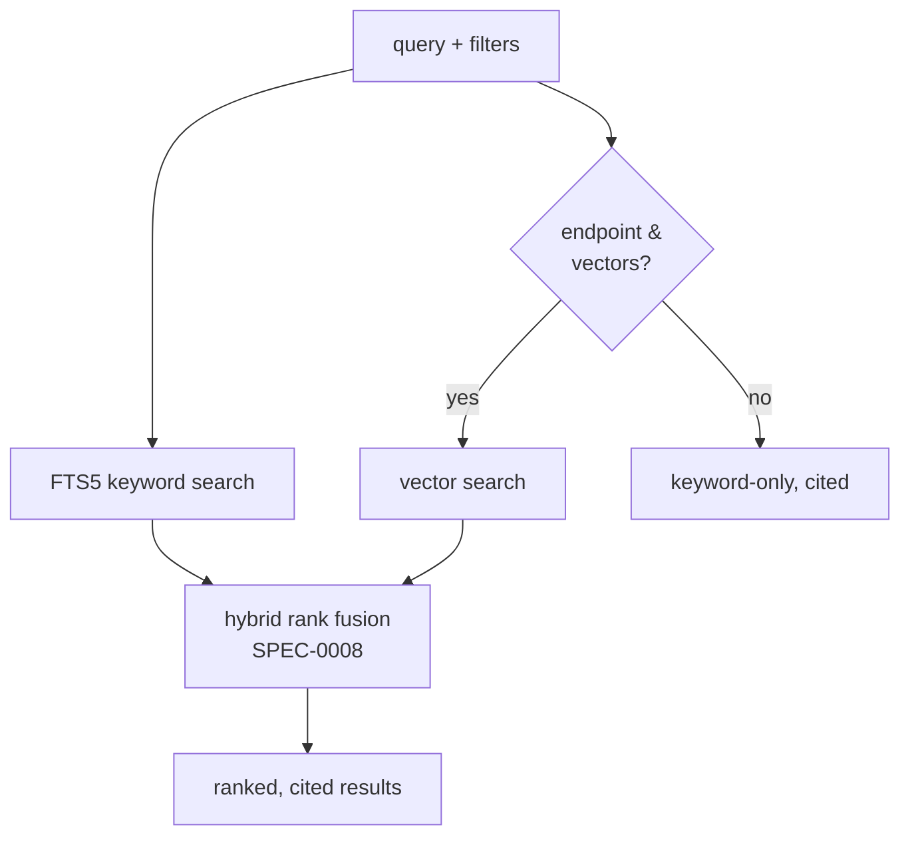

# Design: MCP Tool Surface (SPEC-0006)

## Architecture

`reduit mcp` is a stdio MCP server built on the official
`github.com/modelcontextprotocol/go-sdk`. The user's MCP client
(Claude Desktop/Code) launches it as a subprocess using the
`command`/`args` config it already understands; the two sides speak
JSON-RPC over the subprocess's stdin/stdout. There is no network
listener, no OIDC, no account record, and no auth middleware — the
process inherits the authority of the single local OS user (ADR-0012).
`log/slog` — backed by `github.com/charmbracelet/log` as an `slog.Handler`
(ADR-0022) — is wired to **stderr** so stdout carries only the protocol
stream.

Tools are typed: `AddTool[In, Out]` infers and validates each tool's
JSON Schema from its Go structs. Every handler is a thin wrapper over
the same `store` methods the local TUI uses (ADR-0025), so the MCP
surface and the TUI cannot diverge. Only `send` writes; it reaches
Proton through go-proton-api (ADR-0020). All other tools read the
local SQLite cache (ADR-0006 / SPEC-0002 (Sync & Local Cache)).

```mermaid
flowchart LR
    Client[Claude Desktop/Code]
    subgraph reduit mcp (subprocess)
      RPC[stdio JSON-RPC<br/>go-sdk server]
      Reg[Tool Registry<br/>AddTool In,Out]
      Store[store methods]
      LLM[internal/llm<br/>embed query]
    end
    DB[(SQLite cache)]
    Proton[go-proton-api]

    Client -- stdin/stdout --> RPC --> Reg --> Store
    Store --> DB
    Store -- send only --> Proton
    Reg -- search: embed query --> LLM
    Reg -. logs .-> Stderr[(stderr)]
```

The same `store` layer backs the TUI; the MCP registry adds no query
logic of its own. A future `sqlite-vec` backend (ADR-0015) changes
only `store` internals — the tools are unaffected.

## Transport and lifecycle

- **Launch.** `reduit mcp` (with `--data-dir`) is configured as the
  client's `command`/`args`. One spawned process serves one client
  session; concurrent multi-client access is a non-goal.
- **No auth.** No bearer, no token table, no handshake. The local user
  is the authority.
- **stdout discipline.** The go-sdk server owns stdout. `slog` (backed by
  charmbracelet/log, ADR-0022) and any panic/recover diagnostics go to
  stderr. A stray `fmt.Println` to
  stdout would corrupt JSON-RPC, so the codebase forbids it outside
  the protocol writer.
- **Optional loopback HTTP.** A streamable-HTTP mode MAY be added for
  clients that cannot spawn subprocesses; it is bound to loopback and
  is not the default.

## Citation contract

Retrieval results are shaped by a shared `Citation` struct embedded in
every result item. The server never returns a passage without it.

```go
type Citation struct {
    MessageID    string    `json:"message_id"`
    Hash         string    `json:"hash"`        // stable content hash
    Mailbox      string    `json:"mailbox"`
    Conversation string    `json:"conversation,omitempty"`
    Sender       string    `json:"sender"`
    Source       string    `json:"source"`      // body | attachment | fact | link
    Timestamp    time.Time `json:"timestamp"`
}
```

`hash` is the stable key used across the store (messages, embeddings
`PK (hash, model)`, attachment extraction, contact facts) so a
citation survives idempotent re-sync (ADR-0014) and resolves to a
message a human can open in the TUI. The mapping mirrors `msgbrowse`'s
ADR-0004 contract.

## Hybrid search and rank fusion

`search_messages` calls `store.SearchMessages` (FTS5) and, when
available, `store.SemanticSearch` (vector), then fuses the two ranked
lists with hybrid reciprocal-rank fusion. The fusion algorithm is
normatively defined in **SPEC-0008 (Hybrid Search & Ranking)** — this
tool conforms to it and does not redefine it; the one-line summary is
that the two rank lists are combined by reciprocal-rank fusion so
non-comparable bm25 and cosine scores need not be reconciled. The
vector pass is **best-effort**: the query is embedded once via
`internal/llm` (ADR-0018, local by default); if the endpoint is
unreachable or no vectors exist, the tool returns keyword-only results
rather than erroring. Filters (`mailbox`, `sender`, date range,
`has_attachment`, `has_link`) narrow the candidate set before fusion,
which also keeps the brute-force cosine pass (ADR-0015) over a
pre-filtered set.



## Tool registry

Tools are registered statically at startup. Each has a stable name, a
typed input schema, and a handler
`func(ctx, in In) (Out, error)` that calls one or more `store`
methods. The registry wraps panics into MCP tool errors. `send` is the
only handler with a write path.

| Tool | Input | Output | Citations |
|---|---|---|---|
| `search_messages` | `query`, `mailbox?`, `sender?`, `date_from?`, `date_to?`, `has_attachment?`, `has_link?`, `limit?` | ranked `results[]` (passage + `Citation`) | yes — per result |
| `get_message` | `message_id` | message body + headers + `Citation` | yes |
| `get_transcript` | `conversation`, `mailbox?` | ordered `messages[]` each with `Citation` | yes — per line |
| `get_context` | `message_id`, `before?`, `after?` | surrounding `messages[]` with `Citation` | yes — per line |
| `list_attachments` | `message_id` | `attachments[]` (id, name, mime, `Citation`) | yes |
| `get_attachment_text` | `message_id`, `attachment_id` | extracted text + `(message_hash, attachment_id)` | yes (SPEC-0009) |
| `list_links` | `message_id` | `links[]` (url, anchor, `Citation`) | yes |
| `get_contact_facts` | `contact` | deduped `facts[]` each with `source_message_hash` | yes (SPEC-0011) |
| `send` (mutating) | `from_mailbox`, `to[]`, `cc?`, `bcc?`, `subject`, `body`, `attachments?` | `{ message_id, mailbox, recipients[] }` | n/a (write) |

All read tools accept an optional `mailbox`; omitting it spans every
configured mailbox (ADR-0012).

### Sample handler shape

```go
type SearchIn struct {
    Query         string  `json:"query"`
    Mailbox       string  `json:"mailbox,omitempty"`
    Sender        string  `json:"sender,omitempty"`
    DateFrom      string  `json:"date_from,omitempty"`
    DateTo        string  `json:"date_to,omitempty"`
    HasAttachment *bool   `json:"has_attachment,omitempty"`
    HasLink       *bool   `json:"has_link,omitempty"`
    Limit         int     `json:"limit,omitempty"`
}

type SearchHit struct {
    Passage  string   `json:"passage"`
    Score    float64  `json:"score"`
    Citation Citation `json:"citation"`
}

func SearchMessages(ctx context.Context, in SearchIn) (SearchOut, error) {
    kw, err := store.SearchMessages(ctx, in.toFilter())   // FTS5, always works
    if err != nil { return SearchOut{}, err }
    vec, verr := store.SemanticSearch(ctx, in.Query, in.toFilter())
    if verr != nil { return SearchOut{Hits: cite(kw)}, nil } // degrade
    return SearchOut{Hits: rrf(kw, vec)}, nil                 // fuse
}
```

## The `send` tool (the only write)

`send` is the sole mutating tool. It calls the shared internal send
routine that the `reduit send` CLI verb also calls (ADR-0020), so CLI
and MCP behavior cannot diverge. Required fields — `from_mailbox`,
`to`, `subject`, `body` — are non-optional in the schema; a missing or
empty required field is a validation error and no mail is submitted.
Composition and OpenPGP/recipient-key handling are inherited from
go-proton-api; the mailbox passphrase (keychain, ADR-0013) unlocks the
signing keys. The sent message is reflected into the local cache so it
is searchable like received mail, reconciled by ADR-0014's idempotent
keying.

`send` is structurally incapable of firing implicitly: no read/search
handler holds a reference to it, and it is invoked only as its own
explicit tool call. This is the design counterpart to ADR-0020's
"explicit invocation only" guard.

## Thin adapter / no drift

There is exactly one `store` package. The TUI view models (ADR-0025)
and the MCP handlers both call its methods — `SearchMessages`,
`SemanticSearch`, `ConversationTranscript`, `GetContext`,
`ListAttachments`, `GetAttachmentText`, `ListLinks`, `ContactFacts`,
and the send routine. No tool issues its own SQL or its own Proton
call outside these methods, so keyword/semantic/media behavior is
identical on both surfaces.

## Error mapping

Tool errors are returned as MCP tool errors with a small symbolic set:

| Condition | Code | Retriable |
|---|---|---|
| Unknown `message_id`/`conversation`/`contact` | `not_found` | false |
| Missing required `send` field | `invalid_request` | false |
| Embedding endpoint unreachable | (no error — degrades to keyword) | n/a |
| go-proton-api send rejected (HV, key fetch, rate) | `send_failed` | per-cause |
| go-proton-api transient (5xx, network) | `proton_unavailable` | true |

Search never hard-fails on a missing LLM endpoint; it degrades. Only
`send` surfaces Proton write errors.

## Testing

`NewInMemoryTransports` wires a client and the real server in-process.
Round-trip tests call each tool exactly as a client would and assert
the typed, cited result — including that every retrieval result item
carries a complete `Citation`, that `search_messages` degrades to
keyword-only when the embed call is stubbed to fail, and that `send`
rejects calls missing required fields without touching Proton (a fake
send routine asserts no submission occurs).

## Open questions

- **Resource exposure for large bodies/attachments.** Very large
  message bodies or attachment text could be exposed as MCP
  `resources` (URIs) rather than inline tool output. v0.1 returns them
  inline; resource exposure is a later enhancement.
- **Streamable-HTTP loopback mode.** Whether any real client needs the
  optional loopback HTTP transport, or stdio suffices indefinitely.

## References

- ADR-0017 (stdio MCP + citation-faithful hybrid RAG)
- ADR-0012 (single-user local pivot)
- ADR-0025 (local TUI / shared store)
- ADR-0015 (embeddings and vector backend)
- ADR-0016 (attachment extraction and indexing)
- ADR-0018 (LLM access and single egress)
- ADR-0019 (sender/contact facts extraction)
- ADR-0020 (outbound send via go-proton-api)
- SPEC-0002 (Sync & Local Cache), SPEC-0008 (Hybrid Search & Ranking),
  SPEC-0009 (Attachment Extraction), SPEC-0010 (Outbound Send),
  SPEC-0011 (Contact Facts)
- [`modelcontextprotocol/go-sdk`](https://github.com/modelcontextprotocol/go-sdk)
- `msgbrowse` ADR-0004 (mirrored citation/RRF contract)
