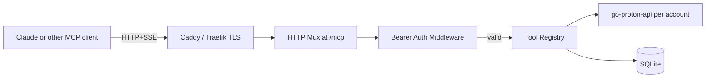
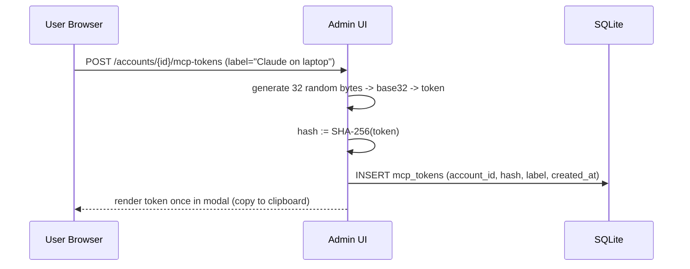

# Design: MCP Tool Surface (SPEC-0006)

## Architecture

The MCP server is mounted on the same HTTPS listener as the admin UI,
at `/mcp`. It uses HTTP+SSE Streamable HTTP transport (the canonical
modern MCP transport) and authenticates via bearer tokens. Tool
implementations are thin wrappers around shared services
(account-scoped Proton client, message store, label store) that the
sync worker and IMAP/SMTP backends also use.



## Auth flow

```mermaid
sequenceDiagram
    participant C as MCP Client
    participant M as Reduit /mcp
    participant Idp as OIDC IdP
    participant DB as SQLite

    alt OIDC bearer (JWT) + X-Reduit-Account selector
        C->>M: POST /mcp (Authorization: Bearer <jwt>, X-Reduit-Account: <id>)
        M->>Idp: Verify JWT signature (cached JWKS)
        M->>DB: Lookup account by id; verify owner_oidc_sub == jwt.sub
    else Per-account MCP token
        C->>M: POST /mcp (Authorization: Bearer <opaque>)
        M->>DB: SELECT mcp_tokens WHERE token_hash = sha256(opaque)
        M->>DB: Lookup account by token's account_id
    end
    M-->>C: tool result (scoped to account)
```

## Tool registry

Tools are registered statically (compile-time) with the
`modelcontextprotocol/go-sdk` server. Each tool:

- Has a stable name (matching SPEC-0006).
- Has a JSON schema for its input.
- Has a Go handler with signature
  `func(ctx context.Context, account *Account, in In) (Out, error)`.
- Wraps panics into MCP tool errors via a registry-level middleware.

### Sample handler shape

```go
type ListMessagesIn struct {
    Folder    string `json:"folder"`
    Query     string `json:"query,omitempty"`
    Page      int    `json:"page,omitempty"`
    PageSize  int    `json:"page_size,omitempty"`
}

type ListMessagesOut struct {
    Messages    []MessageMeta `json:"messages"`
    Page        int           `json:"page"`
    PageSize    int           `json:"page_size"`
    TotalCount  *int          `json:"total_count,omitempty"`
    HasMore     bool          `json:"has_more"`
}

func ListMessages(ctx context.Context, acct *Account, in ListMessagesIn) (ListMessagesOut, error) { ... }
```

## Folder-name resolution

Identical to the IMAP backend's mapping (SPEC-0003). The same code
path that turns `INBOX` / `Labels/Receipts` into Proton system-folder
flags or label IDs is shared between IMAP and MCP — there is one
"FolderResolver" service.

## Streaming for large payloads

`get_message(format=raw)` and `download_attachment` return
`mcp.Resource` results with content URIs that the MCP client can
fetch incrementally. Each URI is a short-lived per-request handle
backed by a streaming reader from `go-proton-api`'s
download/decrypt pipeline.

This avoids buffering full attachments in memory. The cap is enforced
by an `io.LimitReader` on the underlying reader; exceeding the cap
errors out cleanly.

## Idempotent mutation pattern

Each mutation tool reads current state first, computes the
no-op-or-mutate decision locally, performs the Proton call only when
needed:

```go
func AddLabel(ctx, acct, in) (Out, error) {
    msg, err := store.GetMessage(ctx, acct.ID, in.MessageID)
    if err != nil { return Out{}, err }
    if msg.HasLabel(in.LabelID) {
        return Out{Applied: false, AlreadyPresent: true}, nil
    }
    if err := proton.AddLabel(ctx, msg.ProtonID, in.LabelID); err != nil {
        return Out{}, mapError(err)
    }
    // Sync worker will materialize the local-state change via event stream.
    return Out{Applied: true, AlreadyPresent: false}, nil
}
```

This pattern keeps Proton API calls minimal and tool semantics
explicit.

## Error mapping

Proton-side errors are mapped to MCP tool errors with a small set of
symbolic codes:

| Proton error | MCP code | Retriable |
|---|---|---|
| 401 (refresh token revoked) | `auth_required` | false |
| 9001 (HV required) | `human_verification_required` | true (after HV) |
| 429 / Retry-After | `rate_limited` | true |
| 4xx (key lookup failure) | `recipient_key_unavailable` | false |
| 4xx (other) | `bad_request` | false |
| 5xx | `proton_unavailable` | true |
| `not_found` (message ID across accounts) | `not_found` | false |

The error response includes `code`, `message`, `retriable`,
`details`, and matches MCP's recommended error format.

## Per-account concurrency cap

A `chan struct{}` of capacity `MCP_PER_ACCOUNT_CONCURRENCY` per
account gates tool invocations. Acquired before the handler runs;
released on completion. Queue depth is a separate channel with
capacity 16; overflow returns `503` with `Retry-After: 5`.

## Token issuance



Subsequent revocation deletes the row by ID. Token expiry is
optional (column is nullable); a periodic sweep removes expired rows.

## Why HTTP+SSE only (no stdio)

Per ADR-0008, Reduit's deployment model is "daemon on a host", not
"subprocess of Claude Code on a laptop". HTTP+SSE matches that
model: any MCP client (Claude.ai web, Claude Code with HTTP
configuration, custom agents) can connect over the same TLS-fronted
HTTP that the admin UI already serves. Stdio is deferred — adding
later as a thin wrapper is straightforward if a use case appears.

## Open questions

- **Tool versioning**: when adding new tools, do we bump the MCP
  protocol version, or just expose them additively? Additively is
  the standard MCP pattern; protocol version bumps for breaking
  changes only.
- **Resources vs tools for message bodies**: large message bodies
  could be exposed as MCP `resources` (URIs) instead of tool
  outputs. v0.1 ships as tool outputs with size caps; resource
  exposure is a v0.2 enhancement.
- **Calendar/Drive in MCP**: explicitly out of scope; see ADR-0008.

## References

- ADR-0008 (embedded MCP server)
- ADR-0001 (go-proton-api)
- SPEC-0001 (Account Model)
- SPEC-0003 (IMAP — folder mapping shared)
- [MCP spec](https://modelcontextprotocol.io/specification/)
- [`modelcontextprotocol/go-sdk`](https://github.com/modelcontextprotocol/go-sdk)
