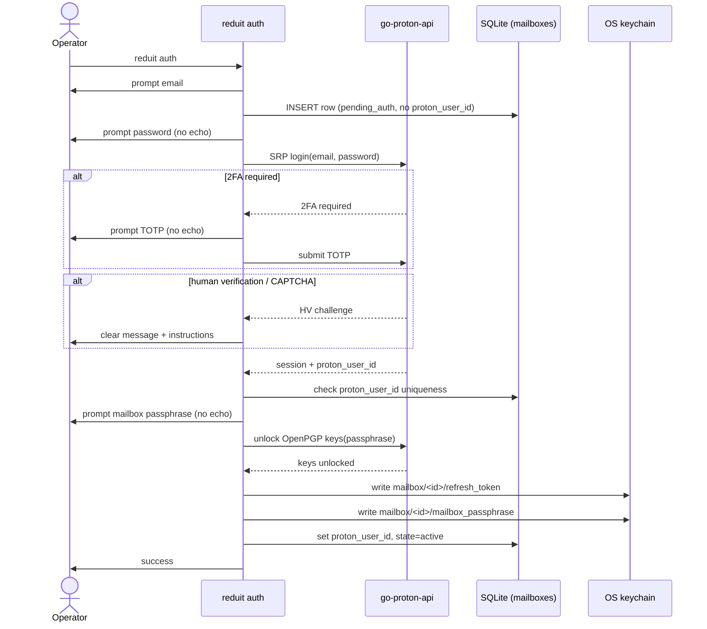

# Design: Onboarding & Proton Auth (SPEC-0007)

## Architecture

`reduit auth` is a Cobra command that orchestrates three actors: the
terminal (no-echo prompts), `go-proton-api` (all Proton-protocol work),
and two stores — the SQLite `mailboxes` row (state + `proton_user_id`)
and the OS keychain (the two live secrets). Reduit owns none of the
cryptography: SRP, TOTP submission, human-verification handling, and
OpenPGP key unlock are go-proton-api calls. Reduit owns ordering,
prompts, state transitions, and the rule that secrets only ever go to
the keychain.

The flow is transactional in spirit: a `mailboxes` row is created in
`pending_auth` *before* any network call, and only advances to `active`
once both keychain writes succeed. If any step fails or is cancelled,
the row stays `pending_auth` (a later run can resume or it can be
removed) and no half-written secret survives — the keychain writes are
the last thing the flow does.

## Flow stages

1. **Email + row creation.** Prompt for the address; insert a
   `pending_auth` row with a fresh UUIDv7 `id`. For a re-auth, resolve
   the existing row instead of inserting.
2. **SRP.** Prompt for the password with echo off; hand email+password
   to go-proton-api's SRP login. Reduit never sees a password hash it
   computes itself.
3. **2FA.** If go-proton-api signals 2FA-required, prompt for the TOTP
   code (no echo) and submit. Wrong codes re-prompt or abort with a
   concise message.
4. **Human verification.** If Proton returns an HV/CAPTCHA outcome,
   translate it into a clear CLI message. This path is rare for password
   logins but must not surface as an unhandled error or panic.
5. **Passphrase + key unlock.** Prompt for the mailbox passphrase (no
   echo); ask go-proton-api to unlock the OpenPGP private keys. Failure
   re-prompts or aborts.
6. **Persist.** Write refresh token and passphrase to the keychain,
   record `proton_user_id`, flip state to `active`. Keychain writes are
   last so a failure before them leaves nothing to clean up.

## Identity resolution and uniqueness

`proton_user_id` is unknown until go-proton-api returns the session, so
the duplicate check happens *after* SRP/2FA, before the keychain writes:

- **New add.** If the resolved `proton_user_id` matches no row, record
  it on the freshly-created row. The `UNIQUE(proton_user_id)` constraint
  (SPEC-0001) is the backstop; a race that slips past the pre-check still
  fails at insert with the same "already configured" message.
- **Re-auth.** The row already carries a `proton_user_id`; the resolved
  value MUST equal it. A mismatch (operator pointed re-auth at the wrong
  Proton account) is an error and never overwrites the stored value.

This is why `reduit auth` for an already-configured account is rejected
with guidance ("already configured" for `active`, "re-auth it" for
`needs_reauth`) rather than creating a second row.

## Secret handling

| Secret | Source | Destination | Never |
| --- | --- | --- | --- |
| Password | no-echo prompt | go-proton-api SRP only | disk, logs, DB, keychain |
| TOTP code | no-echo prompt | go-proton-api only | disk, logs, DB |
| Mailbox passphrase | no-echo prompt | go-proton-api unlock + `mailbox/<id>/mailbox_passphrase` | disk, logs, DB |
| Refresh token | go-proton-api session | `mailbox/<id>/refresh_token` | disk, logs, DB |

- **No flags, no env.** Password and passphrase are read only via
  no-echo terminal prompts (`golang.org/x/term`), never CLI flags or
  environment, so they cannot land in shell history or a process listing.
- **slog redaction.** Auth-path logging logs *structure* (which step,
  which mailbox id, success/failure), never secret values. Secret-bearing
  types carry a `LogValue()` that returns a redacted placeholder so an
  accidental `slog` of the struct cannot leak.
- **Keychain keys.** Service `reduit`; account keys
  `mailbox/<id>/refresh_token` and `mailbox/<id>/mailbox_passphrase`
  (ADR-0013). The DB stores only the `mailbox_id` reference.

## Re-auth and cache preservation

A `needs_reauth` mailbox arises when sync/send observes an invalid or
revoked refresh token (SPEC-0001 lifecycle). Re-auth is the same command
on the same row: it overwrites the two keychain entries and flips the
state back to `active`. It deliberately does **not** touch the
`mailbox_id`-scoped cache (messages, attachments, sync cursors, FTS5):
the credentials were stale, the derived data was not. Preserving the
cache means re-auth is cheap and does not trigger a full re-sync.

## Keyring availability

The keychain is a hard dependency, not a fallback. Two failure points:

- **At auth time**, the secret-write step needs a writable, unlocked
  keyring. If absent, abort with an actionable message; do not stash the
  secret elsewhere.
- **At runtime**, sync/send read the secrets non-interactively. This is
  what makes a headless host need an out-of-band unlocked Secret Service
  collection (ADR-0013) — there is no human at the terminal to prompt.

Per ADR-0013, Reduit documents the headless setup rather than
reintroducing an on-disk key file. A file-based secret store, if ever
needed, would be a new opt-in ADR, loudly caveated.

## Error surfaces

| Condition | Behavior |
| --- | --- |
| Wrong password / TOTP | concise "authentication failed"; no secret echoed; row stays `pending_auth`/`needs_reauth` |
| Human verification required | clear message + how to proceed; no raw payload dump |
| Passphrase fails to unlock keys | re-prompt or abort; never advance to `active` |
| Duplicate `proton_user_id` | "already configured" (or "re-auth it"); no second row |
| `proton_user_id` mismatch on re-auth | error; stored value untouched |
| Keyring unavailable/locked | abort with provisioning/unlock guidance; no fallback store |

## References

- ADR-0001 (go-proton-api as Proton client — SRP, 2FA, OpenPGP unlock)
- ADR-0012 (single-user, local-first — no web/OIDC/relay)
- ADR-0013 (secrets in the OS keychain — keying, headless unlock)
- SPEC-0001 (mailbox model — row, state machine, `proton_user_id`
  immutability and uniqueness)
