# Design: SMTP Submission Server (SPEC-0004)

## Architecture

The SMTP server is one TCP listener (port 465) terminating TLS,
running an `emersion/go-smtp` server with a Reduit-implemented
`Backend`. Authenticated messages are handed to a per-account
**outbox worker** that performs Proton-side encryption and submits
via `go-proton-api`.

```mermaid
flowchart LR
    Client[email client] -- SMTPS/465 --> Listener[TLS Listener]
    Listener -- accepted --> GoSMTP[go-smtp server]
    GoSMTP -- AUTH PLAIN --> Backend[Reduit Backend]
    Backend -- lookup user@host --> AcctSvc[Account Service]
    Backend -- session.Data() --> Outbox[Per-Account Outbox]
    Outbox -- recipient classification --> KeyLook[go-proton-api Key Lookup]
    KeyLook -- Proton key --> Encrypt[Encrypt to Recipient]
    KeyLook -- no key --> Plain[Skip body encryption]
    Encrypt --> Submit[go-proton-api Submit]
    Plain --> Submit
    Submit --> Proton[(Proton API)]
    Proton -.event stream.-> SyncWorker[Sync Worker]
    SyncWorker -.materialize.-> Sent[IMAP Sent folder]
```



## Per-account outbox

The outbox is a small in-process queue per account with bounded
concurrency (default 4). Each item:

```go
type OutboxItem struct {
    AccountID    string
    Envelope     *smtp.Envelope
    Body         []byte           // raw RFC 5322
    SubmittedAt  time.Time
    ResponseChan chan SubmitResult
}
```

The SMTP server's `session.Data()` does:

1. Read the body to memory (capped at `MAX_MESSAGE_BYTES`).
2. Push `OutboxItem` with a fresh `ResponseChan` onto the per-account
   outbox channel.
3. Block on `ResponseChan` with `SMTP_SUBMIT_TIMEOUT`.
4. Translate the result to SMTP response codes:
   - `nil` → `250 OK`
   - `*proton.APIError` 4xx → `4yz` SMTP transient
   - `*proton.APIError` permanent → `5yz` SMTP permanent
   - timeout → `451 4.4.7 Submission timed out`

## Encryption pipeline

For each `RCPT TO`:

1. **Classify recipient.** Look up address in Proton via
   `client.GetPublicKeys(ctx, address)`.
   - **Proton-internal hit**: returns Proton-managed public key.
   - **External with WKD**: returns key from WKD lookup (Proton does
     this lookup; we just consume the result).
   - **No key**: external recipient with no published key.
2. **Build per-recipient packets.** Proton's send API takes a
   message-package-set with one entry per (encryption-mode,
   recipient-key) tuple. We construct:
   - For Proton recipients: PGP-MIME with body encrypted to the
     recipient's primary key, signed by sender.
   - For WKD-external recipients (if account opts in): same as Proton
     recipients but to the external WKD key.
   - For plain external: a "plain" package telling Proton to relay
     in cleartext.
3. **Submit.** `go-proton-api`'s `SendDraft` (or analog) does the
   server-side fan-out. We collect per-recipient outcomes and surface
   them to the SMTP client.

`go-proton-api` already implements this pipeline for Bridge. Reduit
calls into it; we don't reimplement the message-package-set logic.

## Sender authorization (`MAIL FROM` validation)

Each account knows its set of valid Proton aliases (primary email
plus any configured aliases). `MAIL FROM` is validated against this
set; mismatch produces `553 5.7.1 Sender address rejected`.

For v0.1: only the primary email (`accounts.email`) is recognized.
Multi-alias support is deferred to v0.2 alongside an `aliases` table
populated from Proton's account-info call.

## Sent folder appearance

The outbox does NOT directly write to the IMAP `Sent` folder. Instead,
Proton's send API places the sent message in the user's Proton `Sent`
folder; the sync worker's next event-batch surfaces it as a normal
message addition.

This pattern means Sent appears with a slight latency (one event
poll) but avoids dual-source-of-truth bugs. The IMAP IDLE notification
on `Sent` arrives via the same pubsub as any other new-message
notification.

## Failure modes

| Failure | SMTP response | User experience |
|---|---|---|
| Auth fails | `535 5.7.8` | Email client prompts for password |
| Sender mismatch | `553 5.7.1` | Email client surfaces error |
| Recipient over limit | `452 4.5.3` | Email client retries later (or splits) |
| Message too large | `552 5.3.4` | Email client surfaces error |
| Proton 5xx (transient) | `451 4.7.0` | Email client retries later |
| Proton key lookup fails on Proton recipient | `451 4.4.4` | Email client retries; sender's MTA backs off until Proton's key endpoint recovers |
| Submission timeout | `451 4.4.7` | Outbox keeps retrying in background; appears in Sent eventually |
| HV / CAPTCHA required | `554 5.7.0 Human verification required` | User must clear HV via web UI; deferred to v0.3 with a richer flow |

### Rationale: 451 4.4.4 (transient) for Proton-recipient key lookup

Earlier drafts of this design specified `554 5.7.5` (permanent) for the
"Proton key lookup fails on Proton recipient" case. Implementation
experience and the SPEC-0004 hostile review (B3) reversed this choice:

- Key-lookup failures observed in practice are dominated by transient
  `/core/v4/keys` outages (a Proton API hiccup, partial Cloudflare
  edge issue, or rate-limit blip), not genuinely missing keys for a
  real Proton account. A real Proton account always has at least one
  active address key.
- `451 4.4.4` invites the sender's MTA to retry, which recovers
  cleanly when the upstream returns. A `554` permanent rejection
  would force the user to re-send manually for a server-side hiccup
  that resolves on its own — the worst UX outcome for the most likely
  cause.
- The implementation MUST still log a structured event
  (`outbox_encryption_decision` with `ok=false` and the wrapped
  upstream cause) so operators can distinguish recurring lookup
  failures from one-off blips. A persistent failure should surface
  via the operator UI, not via permanent SMTP rejections to the user.

Cross-reference: SPEC-0004 REQ "Encryption Pipeline" (fail-closed on
key-lookup error; do NOT silently downgrade to cleartext).

## Why synchronous submission

Standard SMTP submission patterns split into "queue + relay" with
async DSN delivery for failures. We chose **synchronous** because:

- The user's email client is on-line at submit time; surfacing
  "couldn't send" in real time is the right UX.
- Proton's send API is itself synchronous — there's no benefit to
  artificially decoupling.
- Background retry covers the transient-failure case via
  `451 / 4xx` retries from the client.
- Reduit doesn't need its own DSN-from-Proton logic (Proton sends
  DSNs, which arrive via the sync worker as new inbox messages).

## Open questions

- **DSN handling**: when Proton itself bounces a message, we receive
  the DSN as a new inbox message via the sync worker. The user sees
  it like any other email. Is that good enough, or should we
  proactively annotate the originating message in `Sent` with
  bounce status? v0.2+.
- **Message encoding**: clients submit RFC 5322; Proton's API
  expects MIME-tree-decomposed input. `go-proton-api` provides
  `BuildRFC822` / `EncryptRFC822`; the inverse (parse to tree) is in
  `emersion/go-message`. Confirm the round-trip preserves quoted-
  printable and base64 attachments correctly. Implementation
  validation task in v0.1 build phase.

## References

- ADR-0001 (go-proton-api)
- ADR-0007 (emersion/go-smtp)
- ADR-0009 (TLS via disk)
- SPEC-0002 (sync worker — Sent folder materializes here)
- SPEC-0003 (IMAP server — same auth model)
