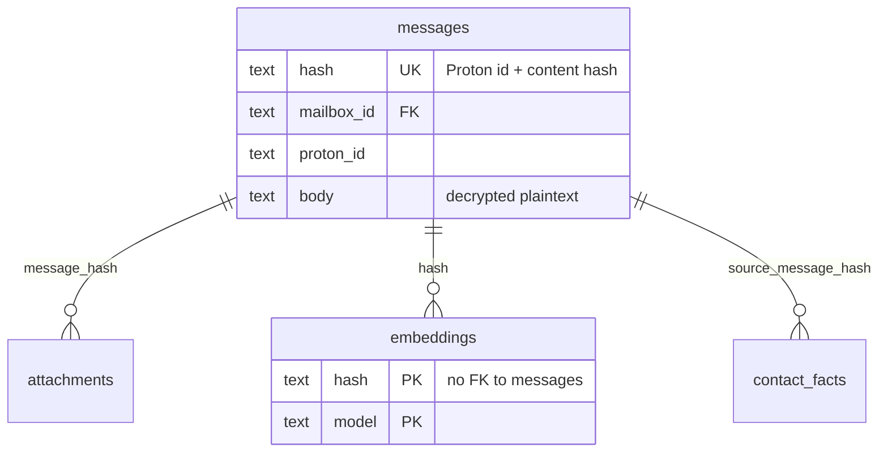

# Design: Sync & Local Cache (SPEC-0002)

## Architecture

Sync is a **triggered pipeline**, not a daemon. A single `reduit sync`
invocation fans out one **mailbox syncer** per selected active mailbox.
Each syncer owns its Proton client session, its keychain-derived
passphrase, and its own `sync_state` cursor. Syncers are isolated: a
panic or error in one is recovered and recorded against that mailbox,
and the others run to completion. A shared semaphore caps total
in-flight Proton requests across all syncers so the process does not
surge Proton's API.

Each syncer is a small state machine: decide **bootstrap** (no cursor)
vs **tail** (cursor present), pull from Proton, decrypt, and apply the
delta to SQLite transactionally — advancing the cursor in the *same*
transaction as the cache writes so a crash can only ever leave
fully-committed work behind.

```mermaid
sequenceDiagram
    participant CLI as reduit sync
    participant Sup as Syncer Supervisor
    participant S as Mailbox Syncer
    participant KC as OS Keychain
    participant Pr as Proton (go-proton-api)
    participant DB as SQLite cache

    CLI->>Sup: run(selected mailboxes)
    Sup->>S: start(mailbox_id) [one per mailbox, sem-bounded]
    S->>KC: get refresh_token + mailbox_passphrase
    S->>DB: read sync_state.event_cursor
    alt no cursor (bootstrap)
        S->>Pr: paginated history fetch (bounded window)
    else cursor (tail)
        S->>Pr: GetEvent(cursor)
    end
    Pr-->>S: messages / event delta (encrypted)
    S->>S: decrypt body + attachment metadata
    loop per message / conversation
        S->>DB: BEGIN TX
        S->>DB: upsert messages (keyed by stable hash)
        S->>DB: upsert attachments / links (by message_hash)
        S->>DB: upsert contacts / contact_identifiers
        S->>DB: UPDATE sync_state cursor + counts
        S->>DB: COMMIT TX
        Note over DB: triggers keep messages_fts current
    end
    S-->>Sup: run summary (added/updated/deleted, errors)
    Sup-->>CLI: per-mailbox summaries; exit
```

## Bootstrap vs tail

A syncer's first decision is whether `sync_state` holds a cursor for
this mailbox.

- **Bootstrap (no cursor).** Paginate Proton's message metadata over the
  configured window — a time bound (e.g. last N months) or the whole
  mailbox when the operator chooses full. Bodies are fetched and
  decrypted as messages are materialized. When the backfill completes,
  the syncer records Proton's *current* event cursor as the resume
  point. Backfill is bounded by Proton's rate limits and can be slow on
  a large mailbox; it is the one-time cost.
- **Tail (cursor present).** Call Proton's event endpoint from the
  cursor, receive a delta of creates / updates / deletes, apply it, and
  persist the advanced cursor. This is the steady state and the carried-
  forward core of the original SPEC-0002 — only the *sink* changed, from
  "materialize IMAP UID state" to "materialize a RAG cache."

`--full` forces a re-run of the bounded backfill. Because writes are
idempotent (below), re-applying messages that already exist updates them
in place rather than duplicating.

## Idempotent stable-hash keying

The cache's idempotency rests on a **stable content identity**: the
Proton message id plus a content hash. `messages.hash` is the convergence
key — sync upserts by it, so re-import and overlapping bootstrap/tail
windows resolve to exactly one row.

Crucially, the derived indexes hang off the *same* hash, not off a
message row id, and carry **no foreign key** back to `messages`
(ADR-0006):

- `embeddings` — PK `(hash, model)` (ADR-0015)
- `contact_facts` — keyed via `source_message_hash` (ADR-0019)
- `attachments.extracted_text` — keyed by `message_hash` (ADR-0016)

This is what lets re-sync be safe: re-importing a message whose content
is unchanged leaves its hash unchanged, so the expensive derived data
(vectors, extracted text, facts) is untouched. Sync never deletes
derived rows as a side effect of re-importing their source message.



## Contact materialization and link extraction

Two derived surfaces are materialized **during** sync, inside the same
per-message transaction as the message upsert, so they converge with the
idempotent stable-hash model rather than living in a separate pass:

- **Contacts.** Every distinct sender / recipient email address the
  pipeline sees is upserted into `contact_identifiers`. An address with
  no existing contact creates a fresh `contacts` row with a UUIDv7
  identity; a known address reuses its contact. This is the contact layer
  SPEC-0011 (contact facts) and the UI read from — sync owns the
  *materialization* of identifiers and bare contact rows; SPEC-0011 owns
  the *facts* over them and the manual `reduit contacts merge`. Re-sync
  upserts and never cascade-wipes these rows.
- **Links.** URLs in a decrypted body are parsed into the `links` table,
  each row keyed to its message by the message's stable hash and upserted
  so the link set survives re-sync without duplicating. SPEC-0006's
  `list_links` tool and `has_link` filter only *read* this table; sync is
  its sole producer. A body with no URLs simply yields no `links` rows
  and never fails the message.

Both follow the same rule as the other derived indexes: keyed off the
stable hash, upserted, never orphaned or cascade-wiped by a re-import of
their source message.

## Decryption in the pipeline

Decryption is part of sync, not a separate stage, because the cache must
hold plaintext for the embed/FTS/RAG passes to work at all.

1. The syncer fetches the mailbox's `refresh_token` and
   `mailbox_passphrase` from the OS keychain
   (`reduit / mailbox/<mailbox_id>/<kind>`, ADR-0013).
2. go-proton-api (ADR-0001) authenticates with the refresh token and
   unlocks the mailbox's OpenPGP private keys with the passphrase.
3. Each message body and its attachment metadata are decrypted; the
   decrypted bytes are what get written to the cache.

A single message that fails to decrypt is logged with its Proton id,
skipped (no partial row), and the run continues — one bad message must
not wedge a mailbox. A missing or rejected passphrase / refresh token is
a per-mailbox failure: it fails *that* mailbox's run and leaves siblings
alone.

## Transactional application and crash-safety

The cache is written in small atomic units — per message, or per
conversation where a batch belongs together. Each unit's cache writes
**and** the `sync_state` cursor advance commit in one SQLite
transaction (WAL, `synchronous=NORMAL`). Consequences:

- A crash mid-run can only leave fully-committed units behind; there is
  no half-written message and no cursor ahead of the data it implies.
- The next run reads the persisted cursor and resumes from exactly
  where the last committed unit left off — already-applied events are
  not re-processed.
- Because writes are upserts keyed by stable hash, even a re-processed
  overlap (e.g. a window that re-covers the boundary) converges rather
  than duplicating, so "resume" never has to be exact to be correct.

## Rate-limit and concurrency strategy

Sync is incremental by construction: tail fetches only events past the
cursor. Within a run:

- **Backoff.** Transient errors (network, 5xx, 429) back off before
  retry. `go-proton-api`'s transport already honors `Retry-After`; the
  syncer does not bypass it. This is the same full-jitter exponential
  backoff pattern proven in the original SPEC-0002.
- **Global concurrency cap.** Despite per-mailbox syncers, the *sum* of
  in-flight Proton requests is bounded by a shared semaphore acquired
  before each API call, so N mailboxes do not multiply into N× the
  request rate.
- **No full re-fetch.** Only `--full` re-reads the backfill window;
  ordinary runs never do.

## FTS upkeep

`messages_fts` is an FTS5 external-content index (ADR-0006). It is kept
current by `AFTER INSERT / UPDATE / DELETE` triggers on `messages`, so
the moment a message row commits it is keyword-searchable and a deleted
message leaves no stale FTS row. Sync writes `messages`; the triggers do
the index maintenance — sync owns no FTS logic of its own.

## Triggered execution model

There is no always-on network service (ADR-0012). Sync is a CLI verb:

```
reduit sync                       # all active mailboxes, incremental
reduit sync --mailbox <id|addr>   # one mailbox
reduit sync --full                # re-run bounded backfill
```

This is what cron / systemd-timer / launchd schedule. An optional
**foreground watch loop** re-runs sync on an interval in the foreground
and stops on signal — it opens no listener and forks no daemon. The
cadence is the operator's, bounded to respect Proton's limits; "live" is
"as of last sync."

## Bookkeeping

Per mailbox, `sync_state` holds the `event_cursor` and `last_run_at`.
Each run also persists a summary — messages added / updated / deleted,
attachments processed, error count — so the operator can see what each
run did and spot a mailbox that is failing or falling behind. The cursor
is persisted transactionally with the data; the summary is persisted at
run end.

## Offline behavior

The cache is the read surface for every other Reduit feature, and it is
fully local. With no network:

- Browse, FTS keyword search, and semantic search over already-computed
  embeddings all work — they touch only SQLite.
- `reduit sync` fails its network fetch cleanly, makes no cache or
  cursor changes, and reports the failure. A failed sync degrades to
  "stale cache," never to "corrupt cache."

## What carries forward from the old SPEC-0002

The original SPEC-0002 (Sync Worker) solved the genuinely hard part —
consuming Proton's event stream with a persisted, atomically-advanced
cursor, with backoff and per-account isolation. That logic survives
intact. What was removed: the IMAP sink (UID/UIDVALIDITY
materialization, IDLE pubsub, EXISTS/EXPUNGE/FETCH notifications) and
the multi-tenant/account framing. What was added: bounded bootstrap
backfill, in-pipeline decryption to plaintext, stable-hash keying for an
idempotent RAG cache, and the CLI-triggered (not daemonized) execution
model.

## References

- ADR-0014 (local sync-and-cache) — the governing decision.
- ADR-0001 (go-proton-api) — event stream, decrypt, `Retry-After`.
- ADR-0006 (SQLite store) — schema, stable-hash keying, FTS triggers,
  derived data with no FK.
- ADR-0013 (secrets in OS keychain) — per-mailbox passphrase / token.
- ADR-0015 (embeddings), ADR-0016 (attachments), ADR-0019 (contact
  facts) — downstream passes keyed by the same stable hash.
- SPEC-0001 (Mailbox Model) — `mailboxes` / `sync_state` columns.
- SPEC-0008 (embeddings), SPEC-0010 (send) — out of scope here.
