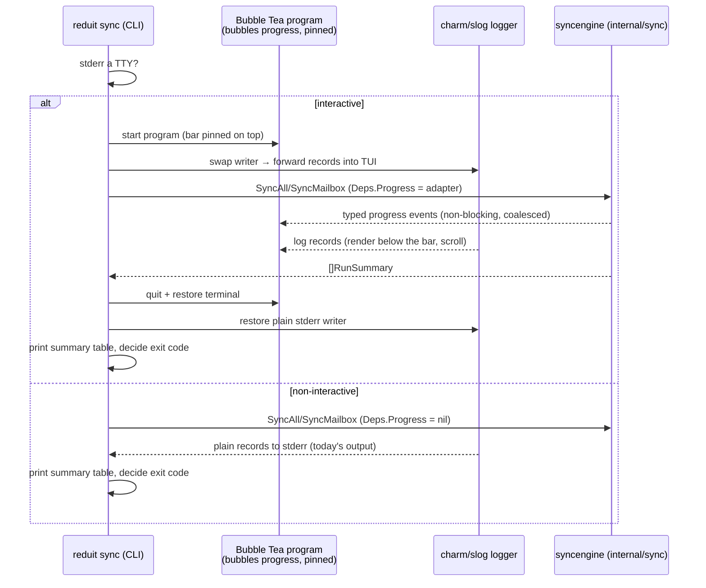

# Design: Sync Progress UI (SPEC-0012)

## Context

A first `reduit sync` backfill runs for minutes (metadata paging + per-message
decrypt — SPEC-0002), and until now its only feedback was heartbeat log lines.
ADR-0023 decides the remedy: a charmbracelet/bubbles progress bar rendered by
a Bubble Tea program, pinned at the top of the terminal, with the run's log
stream scrolling beneath it. reduit already renders logs through
charmbracelet/log as an slog handler (ADR-0022), and the charm libraries are
designed to compose: while a Bubble Tea program owns the screen, external
writers are injected into the program rather than racing it.

Constraints inherited from the codebase: the sync engine (`internal/sync`,
package `syncengine`) is presentation-agnostic and must stay that way; the
build is pure-Go `CGO_ENABLED=0` (ADR-0006); cron/CI runs must be
byte-identical to today; the exit-code contract and final summary table of
SPEC-0002 "Triggered Execution" are load-bearing.

## Goals / Non-Goals

### Goals

- At-a-glance progress for interactive syncs: a pinned bubbles bar with
  determinate backfill progress and an indeterminate tail indicator.
- Log lines remain fully visible, scrolling below the bar, untorn.
- Zero behavior change for non-interactive runs.
- A typed, reusable progress seam on the engine that future surfaces (MCP
  observability #117, a local UI) can consume.

### Non-Goals

- No progress UI for other commands (labels, auth) — sync only, for now.
- No persistent progress state — the seam is in-memory, per-run; persisted
  bookkeeping stays in `sync_runs` (SPEC-0002).
- No interactivity beyond display (no keybindings, pause/resume, or scrollback
  navigation) in this iteration.
- No TUI in the MCP server path (it speaks JSON-RPC on stdout; sync is a CLI
  verb).

## Decisions

### Progress seam: typed events on Deps, non-blocking

**Choice**: add a small `ProgressReporter` seam to the engine's `Deps` — a
consumer receiving typed events (`BackfillEnumerated{Total}`,
`MessageApplied{Done, Total}`, `TailBatchApplied{Events}`,
`MailboxDone{Summary}`), each tagged with the mailbox. Nil reporter = no-op.
Delivery is non-blocking: the CLI adapter behind the seam coalesces into the
Bubble Tea program's message queue, and if the consumer lags, intermediate
progress events are dropped (display is lossy; bookkeeping is not — counts
live in `RunSummary`/`sync_runs`).

**Rationale**: keeps `internal/sync` free of any UI import (SPEC-0012
"Engine Presentation Isolation"), testable with a recording fake, and immune
to a slow terminal stalling decryption (SPEC-0012 "Concurrency Safety").

**Alternatives considered**:
- Parse the engine's log records in the CLI to infer progress: fragile
  (coupling to log text), and inverts the dependency direction.
- A channel exposed directly on the engine: pushes buffering/drop policy into
  the engine; the callback seam keeps that policy in the presentation layer.

### Screen composition: Bubble Tea owns the terminal; logs are injected

**Choice**: one Bubble Tea program renders a two-region layout — the pinned
header (bubbles `progress` bar + current mailbox/phase line) and the log
region below. While the program runs, the charm/slog logger's writer is
swapped to a writer that forwards each rendered record into the program
(`tea.Println`-style message), so records print above the managed area and
scroll naturally; the bar re-renders pinned. On teardown the logger's writer
reverts to plain stderr.

**Rationale**: the pinned-bar-plus-scrolling-logs layout is exactly what a
screen-owning event loop is for; any design where the logger and the bar write
to the terminal independently tears (ADR-0023, option 3's failure mode).

**Alternatives considered**:
- A viewport component holding the log lines inside the TUI: heavier, adds
  scrollback state, and loses the "logs are still just the log stream"
  property; `tea.Println` keeps records in the terminal's native scrollback.
- Writing the bar with raw ANSI around the log stream: rejected in ADR-0023.

### TTY gate: detect once, choose a mode, never mix

**Choice**: at command start, `reduit sync` checks whether stderr is a
terminal (the same class of check charm uses for color). Terminal → start the
Bubble Tea program and swap the log writer; not a terminal → run exactly
today's path (no TUI code activated). `--watch` applies the same decision once
at startup; iterations reuse it.

**Rationale**: SPEC-0012 "TTY Gate" requires the non-interactive path to be
byte-identical; gating once avoids mid-run mode flips.

### Teardown: the TUI is a display, never the owner of results

**Choice**: the run's `RunSummary`/error flow is unchanged; the Bubble Tea
program is started before the engine runs and shut down (and the log writer
restored) before the summary table prints and the exit code is decided.
SIGINT/SIGTERM cancels the run's context (existing `signal.NotifyContext`),
which both stops the engine (SPEC-0002) and quits the program.

**Rationale**: SPEC-0012 "Clean Teardown" — the summary table and exit-code
contract are load-bearing operator surfaces; the TUI must be strictly
additive.

## Architecture

## Risks / Trade-offs

- **Event-loop integration bugs (deadlock between engine and TUI)** → the seam
  is non-blocking by contract (drop/coalesce), cancellation crosses it via the
  run context, and race-detected tests cover the slow-consumer and
  cancel-mid-run paths.
- **Log-writer swap leaks ANSI into a non-TTY on a mode mistake** → the gate is
  decided once at startup from the actual fd; a pipe test asserts byte-clean
  output (SPEC-0012 "TTY Gate").
- **Dependency weight (bubbletea + bubbles + transitive charm)** → accepted in
  ADR-0023; pure-Go, `CGO_ENABLED=0` verified in the gate.
- **Multi-mailbox display ambiguity (concurrent mailboxes racing one bar)** →
  the pinned region renders per-mailbox lines (current mailbox + phase) rather
  than one aggregate bar lying about heterogeneous progress.

## Migration Plan

Greenfield presentation layer over the existing engine; no schema or config
migration. Ships dark for non-interactive users by construction (the gate).
Rollback = removing the TUI wiring; the engine seam is inert without a
consumer.

## Open Questions

- Should the determinate bar also render a global (all-mailbox) aggregate when
  Concurrency > 1, or is per-mailbox the only honest display? (Current answer:
  per-mailbox only.)
- Should `--watch` clear the log region between iterations or let history
  accumulate in scrollback? (Current answer: accumulate — native scrollback.)
