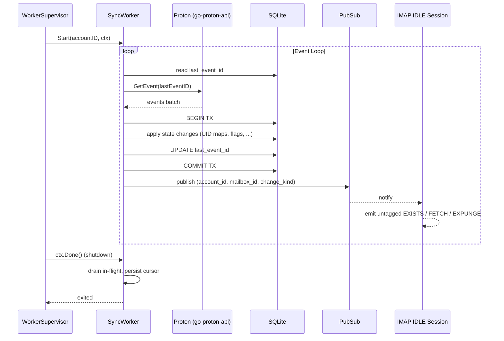

# Design: Sync Worker (SPEC-0002)

## Architecture

A **sync worker** is a long-lived goroutine bound 1:1 to an active
account. Workers are managed by a top-level **WorkerSupervisor** that
listens to account-state-change events and starts/stops workers
accordingly.



## Worker lifecycle

```
[start] --(account active)--> RUNNING
RUNNING --(transient err)--> BACKOFF --(retry)--> RUNNING
RUNNING --(panic recovered)--> CRASHED  (manual reset required)
RUNNING --(account state change)--> DRAIN --(work flushed)--> EXITED
RUNNING --(SIGTERM)--> DRAIN --(deadline)--> EXITED
RUNNING --(refresh-token revoked)--> account → pending_proton_setup; EXITED
```

## Proton event consumption

`go-proton-api` exposes events via a long-poll endpoint that returns
either:

- A batch of events newer than the cursor, OR
- A "no events; here's the same cursor" response after the long-poll
  timeout.

The worker's loop:

1. Fetch with current cursor (long-poll).
2. If empty, loop without delay (Proton's long-poll already provides
   pacing).
3. If non-empty, transactionally apply changes and persist new
   cursor.
4. Notify pubsub for any IDLE sessions.

The Proton response includes the new cursor regardless; we persist
it even on no-op responses to maintain "I've seen up to here" state.

## Pubsub for IMAP IDLE

IMAP IDLE clients subscribe to a channel keyed by
`(account_id, mailbox_id)`. Workers publish `Update{kind, message_id,
flags?}` events after committing a batch. The IDLE session's
goroutine receives, formats untagged responses, writes them to the
client's TCP connection.

The pubsub MUST be in-process (single Reduit binary). A simple
`map[string]chan Update` with read/write mutex is sufficient; no
need for an external broker. Capacity: bounded buffer per channel
(64 events); on overflow, drop oldest with a warning log (clients
will RESYNC on reconnect, which is the IMAP-correct fallback).

## Backoff strategy

Full-jitter exponential backoff:

```
delay = uniform(0, min(maxDelay, base * 2^attempt))
```

with `base = 1s`, `maxDelay = 5min`. The attempt counter resets to
zero on a successful event-fetch. This pattern is well-understood and
matches AWS / Google guidance.

Special cases:

- `Retry-After` from Proton (29x rate-limit, 5xx) — handled by
  `go-proton-api`'s transport layer; the worker just sees a delayed
  response.
- Refresh-token-revoked — returned as a specific error type; the
  worker stops, transitions account to `pending_proton_setup`, and
  the user must re-run the wizard.
- Proton API contract violation (unknown event type, schema mismatch)
  — log at ERROR with the raw event JSON, increment a metric, skip
  the offending event, advance the cursor. Better to lose one event
  than wedge the worker.

## Why one worker per account, not a pool

- **Cursor semantics**: Proton events are per-account; cursor advance
  requires serial processing. A pool would need per-account locking,
  which collapses to per-account workers anyway.
- **Backoff isolation**: an account with auth issues backs off
  independently. A pool's shared backoff would slow healthy accounts.
- **Resource cost**: a goroutine + a small HTTP client is cheap.
  ≤50 accounts × ≤1MB per worker = trivial.

## Concurrency limit (global)

Despite per-account workers, the SUM of in-flight Proton requests is
capped to avoid surging Proton's API. The cap is enforced via a
shared semaphore that workers acquire before issuing API calls. Cap
default: 8 — small enough that Proton won't rate-limit, large enough
that ≤50 accounts make progress.

## Open questions

- **First-sync backfill**: v0.1 starts each account's worker from the
  current Proton event cursor and only materializes changes from
  there. This means existing messages (sent before account
  configuration) are NOT visible via IMAP at v0.1. Backfill is a
  significant feature and is deferred — likely v0.2 with a paginated
  fetch of message metadata + on-demand body fetch.
- **Worker restart on crash**: v0.1 deliberately requires manual
  reset for crashed workers (operator visibility into crash patterns
  during early operation). Auto-restart with exponential backoff is
  v0.5+.

## References

- ADR-0001 (go-proton-api event API)
- SPEC-0001 (Account Model — `state`, `last_event_id` columns)
- SPEC-0003 (IMAP Server — IDLE consumes pubsub)
